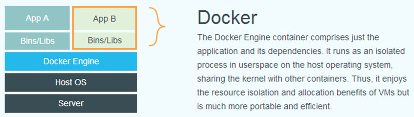
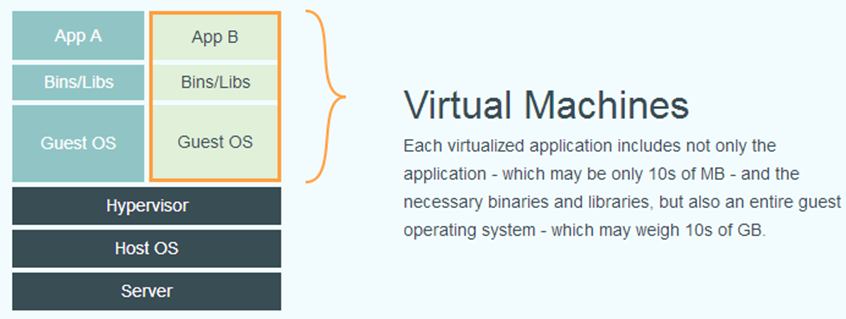

# Docker

1. [**Docker**](https://docs.docker.com/engine/docker-overview/) 是一种[操作系统层面的虚拟化技术](https://en.wikipedia.org/wiki/Operating-system-level_virtualization)，基于 `Linux` 内核的 [cgroup](https://zh.wikipedia.org/wiki/Cgroups)，[namespace](https://en.wikipedia.org/wiki/Linux_namespaces)，以及 [OverlayFS](https://docs.docker.com/storage/storagedriver/overlayfs-driver/) 类的 [Union FS](https://en.wikipedia.org/wiki/Union_mount) 等技术对进程进行封装隔离 。
<!-- more -->
2. Docker是 C/S（客户端/服务器）架构。
3. Docker客户端与Docker守护进程通信，后者负责构建，运行和分发Docker容器。
4. Docker客户端和守护程序使用REST API，通过UNIX套接字或网络接口进行通信。


## 为什么使用Docker

> - **更高效的利用系统资源**
> - **更快速的启动时间**
> - **一致的运行环境**
> - **持续交付和部署**
> - **更轻松的迁移**
> - **更轻松的维护和扩展**


由于容器不需要进行硬件虚拟以及运行完整操作系统等额外开销，Docker对系统资源的利用率更高。无论是应用执行速度、内存损耗或者文件存储速度，都要比传统虚拟机技术更高效。因此，相比虚拟机技术，一个相同配置的主机，往往可以运行更多数量的应用。

传统的虚拟机技术启动应用服务往往需要数分钟，而 Docker容器应用，由于直接运行于宿主内核，无需启动完整的操作系统，因此可以做到秒级、甚至毫秒级的启动时间。大大的节约了开发、测试、部署的时间。

Docker的镜像提供了除内核外完整的运行时环境，确保了应用运行环境一致性。一次创建、配置，任意地方正常运行。

`Docker` 使用的分层存储以及镜像的技术，使得应用重复部分的复用更为容易，也使得应用的维护更新更加简单，基于基础镜像进一步扩展镜像也变得非常简单。


## Docker 与 VM 比较

      


| 特性       | 容器                                              | 虚拟机      |
| ---------- | ------------------------------------------------- | ----------- |
| 启动       | 秒级                                              | 分钟级      |
| 硬盘使用   | 一般为 `MB`（有的小到仅几百KB，如K8s的pause镜像） | 一般为 `GB` |
| 性能       | 接近原生                                          | 弱于        |
| 系统支持量 | 单机支持上千个容器                                | 一般几十个  |


# 基本概念

## 镜像

1. **Docker 镜像是一个特殊的文件系统**，除了提供容器运行时所需的程序、库、资源、配置等文件外，还包含了一些为运行时准备的一些配置参数（如匿名卷、环境变量、用户等）。镜像不包含任何动态数据，其内容在构建之后也不会被改变。
2. 镜像采用分层存储，实际体现并非由一个文件组成，而是由一组文件系统组成，或者说，由多层文件系统联合组成。这个特点也使得镜像的复用、定制变的更为容易
3. 镜像在构建时，会一层层构建，前一层是后一层的基础。每一层构建完就不会再发生改变，后一层上的任何改变只发生在自己这一层。


## 容器

1. 镜像（`Image`）和容器（`Container`）的关系，好比面向对象程序设计中的 `类` 和 `实例` 。
2. 容器的实质是进程，但与直接在宿主执行的进程不同，容器进程运行于属于自己的独立的 [命名空间](https://en.wikipedia.org/wiki/Linux_namespaces)。
3. 每一个容器运行时，是以镜像为基础层，在其上创建一个当前容器的存储层，这个为容器运行时读写而准备的存储层叫 **容器存储层**。
4. 容器存储层的生存周期和容器一样。
5. 不随容器销毁的数据的读写，应该使用 **数据卷**（Volume）、或者绑定宿主目录。


## 仓库

仓库是镜像的版本库，不同的镜像标签代表该镜像的不同版本。Docker提供了**Docker Registry**作为镜像仓库管理服务，由于没有图形界面等原因，一般会使用Docker Hub （外部个人环境）或 Harbor（私服）托管Docker镜像。


# 常用命令

当前使用的docker版本：

```sh
[root@VM_0_13_centos ~]# docker version
Client:
 Version:           18.09.6
 API version:       1.39
 Go version:        go1.10.8
 Git commit:        481bc77156
 Built:             Sat May  4 02:34:58 2019
 OS/Arch:           linux/amd64
 Experimental:      false

Server: Docker Engine - Community
 Engine:
  Version:          18.09.6
  API version:      1.39 (minimum version 1.12)
  Go version:       go1.10.8
  Git commit:       481bc77
  Built:            Sat May  4 02:02:43 2019
  OS/Arch:          linux/amd64
  Experimental:     false
```


## 镜像操作

| 功能         | 命令                                                         |
| ------------ | ------------------------------------------------------------ |
| 拉取镜像     | `docker pull [选项] [仓库地址[:端口号]/]仓库名[:标签]`       |
| 列出镜像     | `docker images` 或者 `docker image ls`                       |
| 构建         | docker build  -t  <镜像名称]>  .   [-f Dockerfile路径]       |
| 重命名       | docker tag   <原镜像>   <新镜像>                             |
| 推送         | docker push   <镜像>                                         |
| 删除镜像     | `docker image rm [选项] <镜像1> [<镜像2> ...]` 或 `docker rmi ...` |
| 查看镜像信息 | `docker inspect  <镜像>`                                     |


部分示例如下：

```sh
# docker pull alpine:latest
# docker image ls
# docker inspect alpine:latest |jq ".[0].RootFS"
# docker rmi alpine:latest
```


## 容器操作

| 功能             | 命令                              |
| ---------------- | --------------------------------- |
| 运行容器         | `docker run [选项] <镜像> [命令]` |
| 停止容器         | `docker stop <容器>`              |
| 列出运行中的容器 | `docker ps`                       |
| 删除容器         | `docker  rm  <容器>`              |


部分示例如下：

```sh
# docker run -it --rm --name test_a  alpine:3 sh   # -i交互，-t终端，--rm退出即删除
/ # ls
/ # exit
# 在exit之前，另开一个ssh窗口查看
# docker ps |grep test_a
# 退出后再查看，上面这个容器已消失
```


## 磁盘空间管理

`docker system` 命令用于管理磁盘空间。


### 查看docker磁盘占用

```sh
# docker system df
```


### 清理docker磁盘空间

`docker system prune` 命令可以用于清理磁盘，删除关闭的容器、无用的数据卷和网络，以及dangling镜像(即无tag的镜像)。
`docker system prune -a` 命令清理得更加彻底，可以将没有容器使用Docker镜像都删掉。
注意，这两个命令会把你暂时关闭的容器，以及暂时没有用到的Docker镜像都删掉。

```sh
# docker system prune 
WARNING! This will remove:
        - all stopped containers
        - all networks not used by at least one container
        - all dangling images
        - all dangling build cache
Are you sure you want to continue? [y/N] y
Deleted Containers:
（略）
Deleted Networks:
（略）
Total reclaimed space: 2.627GB
```


# Dockerfile

Dockerfile 是一个描述如何构建镜像的文本文件，其中包含多条**指令(Instruction)**，每条指令构建一层镜像。
部分常用指令：
- FROM：指定基础镜像，如 `FROM apline:latest`，alpine是一个精简的Linux系统镜像。
- MAINTAINER：设置镜像的维护者信息
- ARG：参数设置
- ENV：环境变量设置
- ADD：添加构建上下文，ADD添加tar.gz包会自动解压。
- COPY：复制文件
- RUN：编写一些shell命令
- EXPOSE：暴露容器需监听的端口
- CMD：容器启动后执行的命令
- ENTRYPOINT：入口指令


<font color=red>问题：有了 `CMD` 后，为什么还要有 `ENTRYPOINT` ？</font>

当存在 `ENTRYPOINT` 后，`CMD` 的内容将会作为参数传给 `ENTRYPOINT`

示例：

```sh
[root@VM_0_13_centos demo]# cat Dockerfile-curl
FROM alpine:latest

RUN apk add curl --no-cache
CMD ["curl", "-s", "https://baidu.com/"]

[root@VM_0_13_centos demo]# cat Dockerfile-curl2 
FROM alpine:latest

RUN apk add curl --no-cache
ENTRYPOINT ["curl", "-s", "https://baidu.com/"]
```


加CMD参数 `-I` 时，只有 mycurl2 支持：


有些时候，启动主进程前，需要一些准备工作，这些准备工作是和容器 `CMD` 无关的，无论 `CMD` 为什么，都需要事先进行一个预处理的工作。这种情况下，可以写一个脚本，然后放入 `ENTRYPOINT` 中去执行，而这个脚本会将接到的参数（也就是CMD）作为命令，在脚本最后执行。

示例：

```sh
[root@VM_0_13_centos demo]# cat start.sh
#!/bin/sh

# begin: do sth
echo "do sth ..."
# end: do sth

cmd="curl -s https://baidu.com/"
if which "$1" 1>/dev/null 2>&1; then
    echo "exec 1:"
    exec $@
else
    echo "exec 2:"
    exec $cmd $@
fi
echo "end."

#########################################################
[root@VM_0_13_centos demo]# cat Dockerfile-curl3
FROM alpine:latest

WORKDIR /opt
ADD start.sh start.sh
RUN chmod +x start.sh && apk add curl --no-cache

ENTRYPOINT ["/opt/start.sh"]
CMD ["curl", "-s", "https://baidu.com/"]
```


- VOLUME指令

  可以通过 `docker run` 命令的 `-v` 参数创建 volume 挂载点。如果通过 dockerfile 的 VOLUME 指令可以在镜像中创建挂载点，那么通过该镜像创建容器时不指定 -v 参数时，会在宿主机上随机生成一个数据目录绑定到 VOLUME 所指定的容器内目录。
  
  以Wordpress的volume为例：

**wordpress**

缺省情况下，wordpress容器内的/var/www/html目录会被随机挂载到宿主机docker数据目录下。


**wordpress mysql**


## Dockerfile示例

### 示例 -- nginx

假设nginx没有提供docker镜像，使用精简的Linux系统镜像alpine来制作nginx容器：

```sh
FROM alpine:latest
MAINTAINER  tom  tom@abc.com
 
# install nginx
RUN apk --update add nginx

EXPOSE 80
 
CMD [ "nginx" ,  "-g" ,  "daemon off;" ]
```


### 示例 -- myweb

```sh
FROM python:2.7-alpine


ARG APP_HOME
ENV APP_HOME=${APP_HOME:-/opt/apps}

WORKDIR $APP_HOME
COPY ./myweb  myweb

RUN echo "https://mirror.tuna.tsinghua.edu.cn/alpine/v3.11/main/" > /etc/apk/repositories && \
    echo "https://mirror.tuna.tsinghua.edu.cn/alpine/v3.11/community/" >> /etc/apk/repositories && \
    apk add gcc g++ make mysql-dev --no-cache && \
    pip config set global.index-url https://pypi.tuna.tsinghua.edu.cn/simple && \
    pip install -U pip && \
    pip install supervisor==4.2.0 && \
    /usr/local/bin/echo_supervisord_conf > /etc/supervisord.conf && \
    mkdir /etc/supervisord.d && \
    echo "[include]" >> /etc/supervisord.conf && \
    echo "files = supervisord.d/*.conf" >> /etc/supervisord.conf && \
    pip install -r $APP_HOME/myweb/requirements.txt && \
    cp $APP_HOME/myweb/myweb_supervisord.conf  /etc/supervisord.d/

EXPOSE $PORT
CMD ["supervisord", "-n", "-c", "/etc/supervisord.conf"]
```


## 构建、运行

> 发出 `docker build` 命令时，当前工作目录称为build context。默认情况下，Dockerfile假定位于此处，但可以使用文件标志（-f）指定其他位置。不管Dockerfile实际位于何处，当前目录中文件和目录的所有递归内容都将作为构建上下文发送到Docker守护进程。


### 示例 -- nginx


可以看出 nginx:tom 比官方提供的 nginx:alpine 还更小。


### 示例 -- myweb

Dockerfile文件名称不是 `Dockerfile` 时，需通过 `-f` 参数指定，点号 `.` 表示当前目录作为构建上下文。如果在demo的上一级目录执行构建，则命令可以这样写：

`docker build -f demo/Dockerfile-myweb -t myweb:0.1 demo`


构建时打印的内容：

```sh
[root@VM_0_13_centos demo]# docker build -f Dockerfile-myweb -t myweb:0.1 .
Sending build context to Docker daemon  1.117MB
Step 1/9 : FROM python:2.7-alpine
 ---> 8579e446340f
Step 2/9 : ARG APP_HOME
 ---> Using cache
 ---> 9c173fd3707d
Step 3/9 : ENV APP_HOME=${APP_HOME:-/opt/apps}
 ---> Using cache
 ---> 721207dba6e7
Step 4/9 : WORKDIR $APP_HOME
 ---> Using cache
 ---> 99a3b8ce16a1
Step 5/9 : COPY ./myweb  myweb
 ---> 2e9790a1fa90
Step 6/9 : VOLUME ["$APP_HOME/myweb"]
 ---> Running in 1e647a4987d7
Removing intermediate container 1e647a4987d7
 ---> dd03f21e2aa6
############### 第7步 构建RUN命令，更新软件源，更新软件，安装软件及其依赖等，步骤最多
Step 7/9 : RUN echo "https://mirror.tuna.tsinghua.edu.cn/alpine/v3.11/main/" > /etc/apk/repositories &&     echo "https://mirror.tuna.tsinghua.edu.cn/alpine/v3.11/community/" >> /etc/apk/repositories &&     apk add gcc g++ make mysql-dev --no-cache &&     pip config set global.index-url https://pypi.tuna.tsinghua.edu.cn/simple &&     pip install -U pip &&     pip install supervisor==4.2.0 &&     /usr/local/bin/echo_supervisord_conf > /etc/supervisord.conf &&     mkdir /etc/supervisord.d &&     echo "[include]" >> /etc/supervisord.conf &&     echo "files = supervisord.d/*.conf" >> /etc/supervisord.conf &&     cd $APP_HOME/myweb &&     pip install -r requirements.txt &&     cp $APP_HOME/myweb/myweb_supervisord.conf  /etc/supervisord.d/
 ---> Running in 3b58653054de
fetch https://mirror.tuna.tsinghua.edu.cn/alpine/v3.11/main/x86_64/APKINDEX.tar.gz
fetch https://mirror.tuna.tsinghua.edu.cn/alpine/v3.11/community/x86_64/APKINDEX.tar.gz
(1/27) Upgrading libcrypto1.1 (1.1.1d-r3 -> 1.1.1g-r0)
（此处省略若干行）
(27/27) Installing mariadb-dev (10.4.15-r0)
Executing busybox-1.31.1-r9.trigger
Executing ca-certificates-20191127-r1.trigger
OK: 206 MiB in 57 packages
Writing to /root/.config/pip/pip.conf
（此处省略若干行）
Successfully installed pip-20.2.4
（此处省略若干行）
Successfully installed supervisor-4.2.0
（此处省略若干行）
Successfully built mysqlclient
Installing collected packages: pytz, django, mysqlclient
Successfully installed django-1.11 mysqlclient-1.3.12 pytz-2020.4
Removing intermediate container 3b58653054de
 ---> 74221bc92419
############### 第8步 暴露监听端口
Step 8/9 : EXPOSE $PORT
 ---> Running in bc109d388ec3
Removing intermediate container bc109d388ec3
 ---> 7f45f5e2be2c
Step 9/9 : CMD ["supervisord", "-n", "-c", "/etc/supervisord.conf"]
 ---> Running in f0f4f867b879
Removing intermediate container f0f4f867b879
 ---> 4eede34e1dad
Successfully built 4eede34e1dad
Successfully tagged myweb:0.1
```


**运行myweb**

```sh
[root@VM_0_13_centos opt]# docker run -d --name myweb -p 8009:8000 myweb:0.1 
```


**查看容器进程**

```sh
[root@VM_0_13_centos demo]# docker ps |grep myweb
```


**查看volume**

```sh
# docker inspect 9ad3a7949611 |jq ".[0].Mounts"
或者
# docker inspect myweb |jq ".[0].Mounts"
```


**查看env**

```sh
[root@VM_0_13_centos demo]# docker inspect myweb |jq ".[0].Config.Env"
```


**进入容器查看**

```sh
[root@VM_0_13_centos demo]# docker exec -it myweb sh
/opt/apps # hostname
/opt/apps # env
/opt/apps # ps -ef 
```


## Dockerfile最佳实践

精简Docker镜像的好处：
1. 减少构建时间
2. 减少磁盘使用量
3. 减少下载时间
4. 因为包含文件少，攻击面减小，提高了安全性
5. 提高部署速度


### 选择合适的基础镜像

`alpine` 是一个精简的Linux发行版，只有5MB左右。各开发语言和框架一般都有基于alpine的镜像版本，如 `python:3-alpine`，可优先考虑使用alpine版本的镜像。

`scratch` 是一个空镜像。

对于 Linux 下静态编译的程序来说，并不需要有操作系统提供运行时支持，所需的一切库都已经在可执行文件里了，因此直接 `FROM scratch` 会让镜像体积更加小巧。使用Go语言开发的应用很多会使用这种方式来制作镜像。

Google K8s的 `pause` 镜像正是使用了scratch作为基础镜像：

```sh
FROM scratch
ARG ARCH
ADD bin/pause-${ARCH} /pause
ENTRYPOINT ["/pause"]
```

其大小不到1MB。

如果希望镜像里可以包含一些常用的Linux工具，可以使用 `busybox`。


### 多阶段构建

使用多阶段构建，可以在Dockerfile中使用多个FROM语句，每条FROM指令可以使用不同的基础镜像，然后选择性地将服务组件从一个阶段COPY到另一个阶段，在最终镜像中只保留需要的内容。结合以下

```sh
FROM <base_image> AS <tmp_image>
COPY --from=<tmp_image> <src> <dest>
```
两条语句来使用多阶段构建。假设有一个springboot demo：

```sh
FROM maven:3.5-jdk-8-alpine AS builder
WORKDIR /opt
COPY . /opt/
RUN mvn clean package

FROM java:8-alpine AS filnal
WORKDIR /opt
COPY --from=builder /opt/target/demo.jar .
EXPOSE 8080
CMD ["java", "-jar", "demo.jar"]
```


### 其它建议

- 可以在执行 `apt-get install -y` 时增加选项 `--no-install-recommends` ，不安装建议性（非必须）的依赖。
- 可以在执行 `apk add` 时添加选项 `--no-cache`。
- Ubuntu或Debian可以使用 `rm -rf /var/lib/apt/lists/*` 清理镜像中缓存文件。
- CentOS等系统使用 `yum clean all` 命令清理。


# docker-compose

Compose 项目是 Docker 官方的开源项目，负责实现对 Docker 容器集群的快速编排。
Compose用于定义和运行多个 Docker 容器的应用（Defining and running multi-container Docker applications）。

Compose 中有两个重要的概念：
- 服务 (`service`)：一个应用的容器，实际上可以包括若干运行相同镜像的容器实例。
- 项目 (`project`)：由一组关联的应用容器组成的一个完整业务单元，在 `docker-compose.yml` 文件中定义。

Compose 的默认管理对象是**项目**，通过**子命令**对项目中的一组容器进行便捷地生命周期管理。


## 安装

```sh
$ sudo curl -L https://github.com/docker/compose/releases/download/1.25.5/docker-compose-`uname -s`-`uname -m` > /usr/local/bin/docker-compose

$ sudo chmod +x /usr/local/bin/docker-compose
```


或者通过pip安装

```sh
$ sudo pip install -U docker-compose
```


## docker-compose示例 —— WordPress

docker-compose.yml

```yaml
version: "3"
services:

   db:
     image: mysql:8.0
     command:
      - --default_authentication_plugin=mysql_native_password
      - --character-set-server=utf8mb4
      - --collation-server=utf8mb4_unicode_ci     
     volumes:
       - db_data:/var/lib/mysql
     restart: always
     environment:
       MYSQL_ROOT_PASSWORD: somewordpress
       MYSQL_DATABASE: wordpress
       MYSQL_USER: wordpress
       MYSQL_PASSWORD: wordpress

   wordpress:
     depends_on:
       - db
     image: wordpress:latest
     ports:
       - "8020:80"
     restart: always
     environment:
       WORDPRESS_DB_HOST: db:3306
       WORDPRESS_DB_USER: wordpress
       WORDPRESS_DB_PASSWORD: wordpress
volumes:
  db_data:
```


**启动**

```sh
[root@VM_0_13_centos wordpress-demo]# docker-compose up -d		# 保持在后台运行
[root@VM_0_13_centos wordpress-demo]# docker-compose ps			# 查看容器组状态
[root@VM_0_13_centos wordpress-demo]# docker-compose down		# 删除容器组
```


**查看db数据卷**

```sh
[root@VM_0_13_centos wordpress-demo]# docker inspect wordpress-demo_db_1 |jq ".[0].Mounts"
```


**进入容器查看**

```sh
[root@VM_0_13_centos wordpress-demo]# docker-compose exec db sh
# ls
# hostname
# env
# which mysqld
# ls /var/lib/mysql
```


# 参考

- <https://docs.docker.com/engine/docker-overview/>
- <https://yeasy.gitbook.io/docker_practice>