> *[Kubernetes (K8s)](https://kubernetes.io/docs/concepts/overview/what-is-kubernetes/) is an open-source system for automating deployment, scaling, and management of containerized applications.*
>
> [**Kubernetes (K8s)**](https://kubernetes.io/docs/concepts/overview/what-is-kubernetes/) 是一个开源容器编排引擎，用于自动化容器化应用程序的部署，扩展和管理。

<!-- more -->


*应用部署方式的演变历史：物理机部署  => 虚拟机部署  => 容器化部署*


早期的应用是直接部署在物理机的，资源使用率不高。

举例来说，比如200qps，包含100个请求静态资源的请求和100个动态资源的请求，假设静态请求占用2M内存，动态请求占用10M内存，那么200qps占用内存约1200MB。如果服务器内存是4GB，那最高可以600qps左右，如果考虑CPU、带宽及其他资源的占用，可能实际最多支持300qps，按300qps的话，实际内存利用率就不高了。

虚拟机技术的出现，可以将高规格的物理服务器隔离成多个小规格的虚拟机，能更好地利用系统资源。而且，虚拟机之间有严格的隔离，为不同的应用提供了相对独立的运行环境，仅通过网络相互访问，安全性也更高了。

容器技术，是一种更加轻量级的虚拟化技术。尽管在资源隔离上不如虚拟机严格，但其它方面的优势也很明显。

容器可以运行在虚拟机里面。

似乎可以这么理解，以OpenStack为代表的云计算技术产生了公有云，而以K8s为代表的容器云技术则在公有云提供的基础设施之上构建出了容器云。


架构简图：

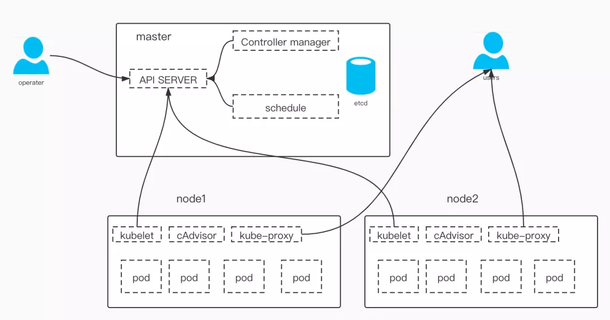


master节点包含的组件：

**API Server**：是k8s最核心的组件，统一的资源操作入口，包括提供认证、授权、访问控制、API注册和 发现等机制，其他的组件运行依赖于api server，通过api接口可以对k8s资源对象进行curd以及监控，也能进行健康，日志等监控。

**Scheduler**：属于调度器的角色，负责决策pod按照哪种算法调度到哪个node上，它会把决策的信息通过ap iserver发送给kubelet，让kubelet执行。

**Controller-Manger**：为了管理集群中不同的资源，k8s为不同的资源建立了对应的controller。k8s中分了8个controller,不同的 Controller 负责对不同资源的监控和管理。

**ETCD** 一般也部署在master节点上，是k8s的key-value数据库，集群的状态信息都持久化存储在ETCD中。


worker节点包含的组件：

**kubelet**：真正的容器管理和维护者，它根据master节点上shcedule的调度决策去真正控制节点上的容器，维护 Container 的生命周期，同时也负责存储（CSI）和网络（CNI）的管理。

**kube-proxy**：集群内部通过kube-proxy访问其他pod,其主要功能是提供集群内部的服务发现和负载均衡功能。


# 安装K8s

尝试过以下四种安装方式：kubeadm，rancher，rke 及 kubespray。


## kubeadm

官网提供的方法。大致过程是：

- 初始化环境，安装docker

- 先在各个节点yum安装kubelet、kubeadm、kubectl

- 在一个master节点kubeadm init 获得kubeadm join集群的命令
- 在其它节点上执行kubeadm join命令加入集群


## rancher

先通过docker启动一个rancher管理界面，然后从管理界面复制添加节点的命令，在待加入集群的节点上执行命令，逐个添加节点创建K8s集群。界面如下：


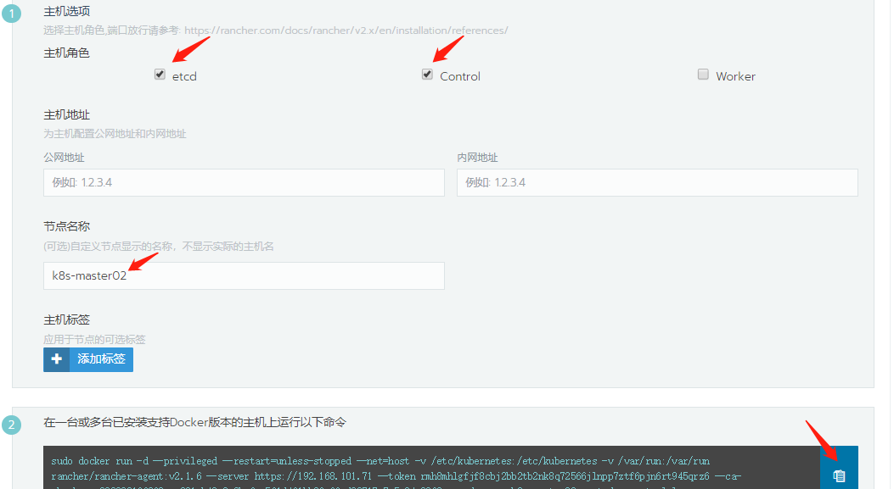


## rke

rancher官方提供的一个安装工具，通过一个节点配置文件描述集群各个节点信息。

例如：

```yaml
nodes:
  - address: 192.168.100.79
    user: rancher
    role: [controlplane,worker,etcd]
  - address: 192.168.100.80
    user: rancher
    role: [controlplane,worker,etcd]
  - address: 192.168.100.81
    user: rancher
    role: [controlplane,etcd]
```

执行：

```sh
rke up --config  <节点配置文件>
```

即可完成集群的初步安装，相比其它方式更快捷，但能安装的版本滞后于官网，最新的K8s版本可能尚未被rancher支持。


rancher集群管理界面类似下图：


3个master、etcd + 3个node:

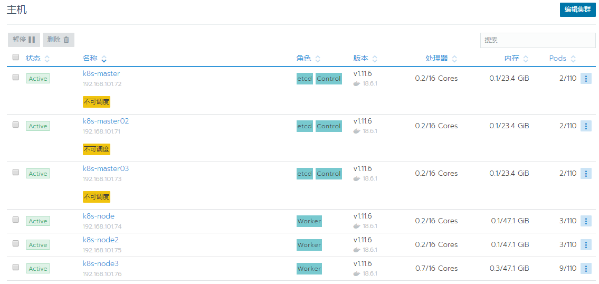


## kubespray

> 官方github:  <https://github.com/kubernetes-sigs/kubespray/tree/release-2.14>


这是一种通过ansible-playbook自动安装K8s的方式。默认和kubeadm一样需要能访问国外网站，否则有点镜像或二进制文件获取不到。也可自行修改相关地址，主要涉及以下几个文件：

- roles/download/defaults/main.yml
- inventory/sample/group_vars/k8s-cluster/k8s-cluster.yml

- roles/kubespray-defaults/defaults/main.yaml

修改其中的地址，替换成国内能访问到的镜像源，安装应该就能顺利进行了。默认会一并安装dashboard。


其主机清单（inventory）文件格式如下：

```yaml
[all]
m01    ansible_host=192.168.19.135 ip=192.168.19.135
m02    ansible_host=192.168.19.136 ip=192.168.19.136
m03    ansible_host=192.168.19.137 ip=192.168.19.137
n01    ansible_host=192.168.19.138 ip=192.168.19.138
n02    ansible_host=192.168.19.139 ip=192.168.19.139
n03    ansible_host=192.168.19.140 ip=192.168.19.140

[kube-master]
m01
m02
m03

[etcd]
m01
m02
m03

[kube-node]
n01
n02
n03

[calico-rr]

[k8s-cluster:children]
kube-master
kube-node
```

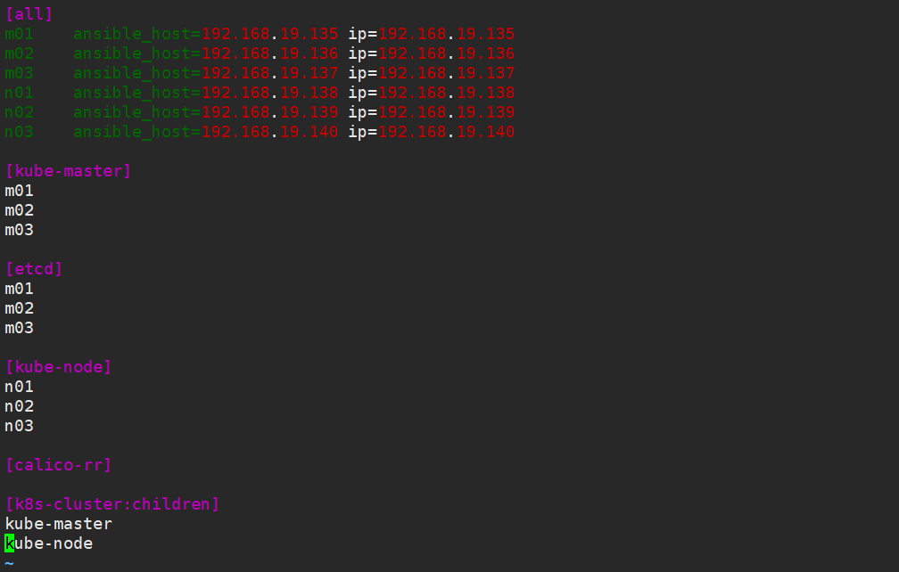


安装命令

```sh
[root@localhost opt]# cd kubespray
[root@localhost kubespray]# cp -r inventory/sample inventory/mycluster
(修改某些无法获取到的镜像地址)
[root@localhost kubespray]# pip install -U pip
[root@localhost kubespray]# pip install -r requirements.txt
[root@localhost kubespray]# ansible-playbook -i inventory/mycluster/hosts.ini --become --become-user=root cluster.yml
```


# 安装 kubernetes dashboard

> 参考官方文档：<https://kubernetes.io/docs/tasks/access-application-cluster/web-ui-dashboard/>


在集群已经安装成功的前提下：

```sh
kubectl apply -f https://raw.githubusercontent.com/kubernetes/dashboard/v2.0.0/aio/deploy/recommended.yaml
```


获取登录令牌

```sh
kubectl -n kube-system describe secret $(kubectl -n kube-system get secret | grep kubernetes-dashboard-token|awk '{print $1}')|grep token:|awk '{print $2}'
```


访问

```sh
https://<master节点ip>:6443/api/v1/namespaces/kube-system/services/https:kubernetes-dashboard:/proxy/
```

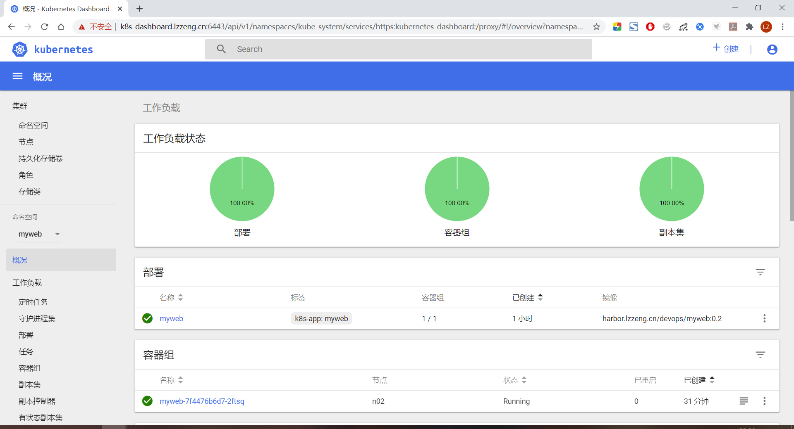


或者绑定域名访问（涉及ingress）

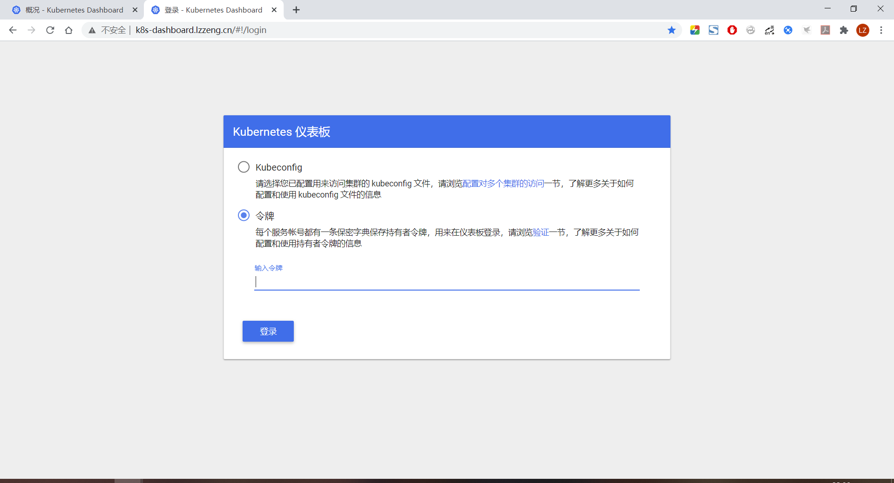


首页

---

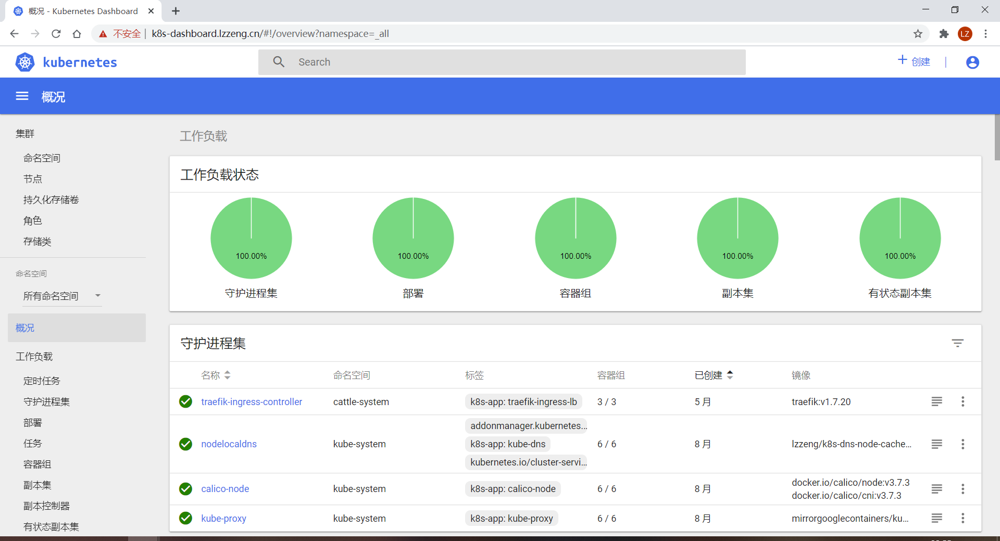


myweb名称空间


# K8s基础

本文涉及K8s操作的部分是在如下K8s环境中进行的：

```sh
[root@m01 ~]# kubectl get nodes
[root@m01 ~]# kubectl get nodes -o wide
```

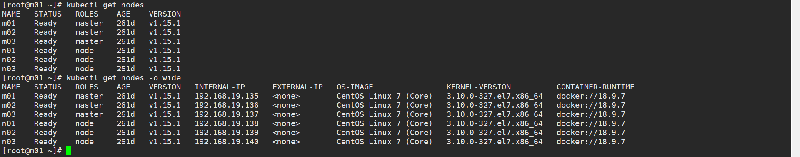


## 基础概念

Kubernetes里的所有资源对象都可以采用YAML或者JSON格式的文件来定义或描述。


### Pod

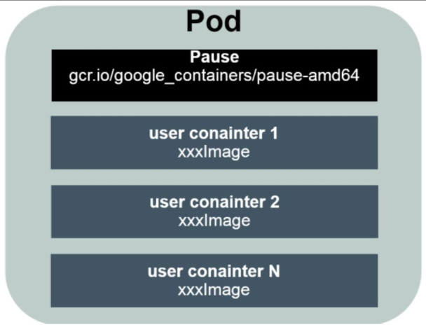


Pod是Kubernetes最重要的基本概念。

每个Pod都有一个特殊的被称为“根容器”的Pause容器。Pause容器对应的镜像属于Kubernetes平台的一部分，除了Pause容器，每个Pod还包含一个或多个紧密相关的用户业务容器。

在初始化每一个pod容器的时候，都会生成一个pause容器。这个容器使得pod里面的子容器能够共享网络和存储，方便内部容器之间的调用。

<font color=red>为什么Kubernetes把Pod设计成这样的特殊结构？</font>

- 在一组容器作为一个单元的情况下，我们难以简单地对“整体”进行判断及有效地行动。比如，一个容器死亡了，此时算是整体死亡么？是N/M的死亡率么？引入业务无关并且不易死亡的Pause容器作为Pod的根容器，以它的状态代表整个容器组的状态，就简单、巧妙地解决了这个难题。

- Pod里的多个业务容器共享Pause容器的IP，共享Pause容器挂接的Volume，这样既简化了密切关联的业务容器之间的通信问题，也很好地解决了它们之间的文件共享问题。


在Kubernetes系统中对长时间运行容器的要求是：其主程序需要一直在前台执行。对于无法改造为前台执行的应用，也可以使用开源工具Supervisor辅助进行前台运行的功能。Supervisor提供了一种可以同时启动多个后台应用，并保持Supervisor自身在前台执行的机制，可以满足Kubernetes对容器的启动要求。


Pod IP

Kubernetes为每个Pod都分配了唯一的IP地址，称之为Pod IP，一个Pod里的多个容器共享Pod IP地址。Kubernetes要求底层网络支持集群内任意两个Pod之间的TCP/IP直接通信，这通常采用虚拟二层网络技术来实现，例如Flannel、Open vSwitch等，因此在Kubernetes里一个Pod里的容器与另外主机上的Pod容器能够直接通信。


Pod事件

Event是一个事件的记录，记录了事件的最早产生时间、最后重现时间、重复次数、发起者、类型，以及导致此事件的原因等众多信息。


Pod资源配额

Kubernetes里通常以千分之一的CPU配额为最小单位，用m来表示。通常一个容器的CPU配额被定义为100～300m，即占用0.1～0.3个CPU。


在Kubernetes里，一个计算资源进行配额限定时需要设定以下两个参数：

- Requests：该资源的最小申请量，系统必须满足要求。
- Limits：该资源最大允许使用的量，不能被突破，当容器试图使用超过这个量的资源时，可能会被Kubernetes“杀掉”并重启。


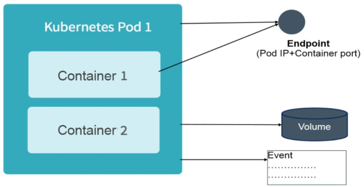


普通Pod

Pod其实有两种类型：普通的Pod及静态Pod（Static Pod）。后者比较特殊，它并没被存放在Kubernetes的etcd存储里，而是被存放在某个具体的Node上的一个具体文件中，并且只在此Node上启动、运行。而普通的Pod一旦被创建，就会被放入etcd中存储，随后会被Kubernetes Master调度到某个具体的Node上并进行绑定（Binding），随后该Pod被对应的Node上的kubelet进程实例化成一组相关的Docker容器并启动。在默认情况下，当Pod里的某个容器停止时，Kubernetes会自动检测到这个问题并且重新启动这个Pod（重启Pod里的所有容器），如果Pod所在的Node宕机，就会将这个Node上的所有Pod重新调度到其他节点上。

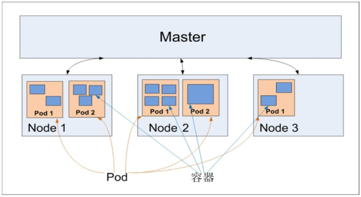


静态Pod

> 静态Pod是由kubelet进行管理的仅存在于特定Node上的Pod。它们不能通过API Server进行管理，无法与ReplicationController、Deployment或者DaemonSet进行关联，并且kubelet无法对它们进行健康检查。静态Pod总是由kubelet创建的，并且总在kubelet所在的Node上运行。
>
> 创建静态Pod有两种方式：配置文件方式和HTTP方式。


Pod内的存储与通信

属于同一个Pod的多个容器应用之间相互访问时仅需要通过localhost就可以通信。

同一个Pod中的多个容器能够共享Pod级别的存储卷Volume。

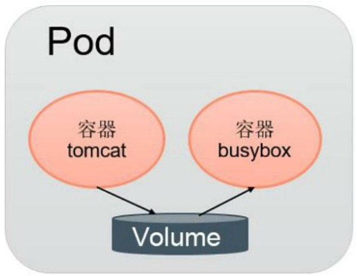


Pod的几种状态

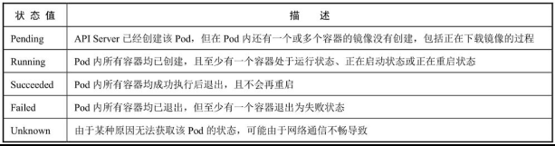


Pod的重启策略包括Always、OnFailure 和 Never，默认值为Always。

- Always：当容器失效时，由kubelet自动重启该容器。
- OnFailure：当容器终止运行且退出码不为0时，由kubelet自动重启该容器。
- Never：不论容器运行状态如何，kubelet都不会重启该容器。


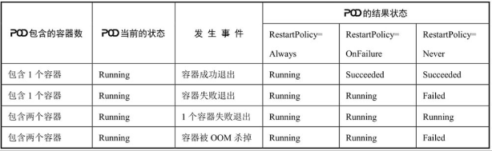


每种控制器对Pod的重启策略要求如下：

- RC和DaemonSet：必须设置为Always，需要保证该容器持续运行。

- Job：OnFailure或Never，确保容器执行完成后不再重启。
- kubelet（管理静态pod时）：在Pod失效时自动重启它，不论将RestartPolicy设置为什么值，也不会对Pod进行健康检查。


Pod的健康状态可以通过两类探针来检查： LivenessProbe和ReadinessProbe，kubelet定期执行这两类探针来诊断容器的健康状况。

（1）LivenessProbe探针：用于判断容器是否存活（Running状态），如果LivenessProbe探针探测到容器不健康，则kubelet将杀掉该容器，并根据容器的重启策略做相应的处理。如果一个容器不包含LivenessProbe探针，那么kubelet认为该容器的LivenessProbe探针返回的值永远是Success。

（2）ReadinessProbe探针：用于判断容器服务是否可用（Ready状态），达到Ready状态的Pod才可以接收请求。


对于被Service管理的Pod，Service与Pod Endpoint的关联关系也将基于Pod是否Ready进行设置。如果在运行过程中Ready状态变为False，则系统自动将其从Service的后端Endpoint列表中隔离出去，后续再把恢复到Ready状态的Pod加回后端Endpoint列表。这样就能保证客户端在访问Service时不会被转发到服务不可用的Pod实例上。


LivenessProbe和ReadinessProbe均可配置以下三种实现方式。

（1）ExecAction：在容器内部执行一个命令，如果该命令的返回码为0，则表明容器健康。

```yaml
livenessProbe:
  exec:
    command:
    - cat
    - /tmp/health
    initialDelaySeconds: 30
    timeoutSeconds: 1
```


（2）TCPSocketAction：通过容器的IP地址和端口号执行TCP检查，如果能够建立TCP连接，则表明容器健康。

```yaml
livenessProbe:
  tcpSocket:
	port: 80
  initialDelaySeconds: 30
  timeoutSeconds: 1
```


（3）HTTPGetAction：通过容器的IP地址、端口号及路径调用HTTP Get方法，如果响应的状态码大于等于200且小于400，则认为容器健康。

```yaml
livenessProbe:
  httpGet:
    path: /_status/healthz
    port: 80
  initialDelaySeconds: 30
  timeoutSeconds: 1
```


对于每种探测方式，都需要设置initialDelaySeconds和timeoutSeconds两个参数：

- initialDelaySeconds：启动容器后进行首次健康检查的等待时间，单位为s。
- timeoutSeconds：健康检查发送请求后等待响应的超时时间，单位为s。当超时发生时，kubelet会认为容器已经无法提供服务，将会重启该容器。

Kubernetes的ReadinessProbe机制可能无法满足某些复杂应用对容器内服务可用状态的判断。

通过Pod Readiness Gates机制，用户可以将自定义的ReadinessProbe探测方式设置在Pod上，辅助Kubernetes设置Pod何时达到服务可用状态（Ready）。为了使自定义的ReadinessProbe生效，用户需要提供一个外部的控制器（Controller）来设置相应的Condition状态。


### Namespace

Namespace（命名空间）是Kubernetes系统中的另一个非常重要的概念，Namespace在很多情况下用于实现多租户的资源隔离。如果不特别指明Namespace，则用户创建的Pod、RC、Service都将被系统创建到这个默认的名为default的Namespace中。


### Label

Label（标签）也是Kubernetes系统中一个核心概念。

一个Label是一个key=value的键值对，其中key与value由用户自己指定。Label可以被附加到各种资源对象上，例如Node、Pod、Service、RC等，一个资源对象可以定义任意数量的Label，同一个Label也可以被添加到任意数量的资源对象上。

```yaml
apiVersion: v1
kind: Pod
metadata:
  name: myweb
  labels:
    app: myweb
```


给某个资源对象定义一个Label，就相当于给它打了一个标签，随后可以通过Label Selector（标签选择器）查询和筛选拥有某些Label的资源对象。一些具体的例子：

- name = redis-slave：匹配所有具有标签name=redis-slave的资源对象。
- env != production：匹配所有不具有标签env=production的资源对象，比如env=test就是满足此条件的标签之一。
- name in（redis-master, redis-slave）：匹配所有具有标签name=redis-master或者name= redis-slave的资源对象。
- name not in（php-frontend）：匹配所有不具有标签name=php-frontend的资源对象。


管理对象RC和Service则通过Selector字段设置需要关联Pod的Label，其他管理对象如Deployment、ReplicaSet、DaemonSet和Job则可以在Selector中使用基于集合的筛选条件定义。


基于集合的筛选示例：

```yaml
selector:
  matchLabels:
    app: myweb
  matchExpressions:
    - {key: tier, operator: In, values: [frontend]}
    - {key: environment, operator: NotIn, values: [dev]}
```

如果同时设置了matchLabels和matchExpressions，则两组条件为AND关系。


Label Selector在Kubernetes中的重要使用场景如下。

- kube-controller进程通过在资源对象RC上定义的Label Selector来筛选要监控的Pod副本数量，使Pod副本数量始终符合预期设定的全自动控制流程。
- kube-proxy进程通过Service的Label Selector来选择对应的Pod，自动建立每个Service到对应Pod的请求转发路由表，从而实现Service的智能负载均衡机制。
- 通过对某些Node定义特定的Label，并且在Pod定义文件中使用NodeSelector这种标签调度策略，kube-scheduler进程可以实现Pod定向调度的特性。


### Service

Kubernetes里的每个Service其实就是我们经常提起的微服务架构中的一个微服务。


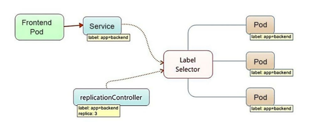

Kubernetes的Service定义了一个服务的访问入口地址，前端的应用（Pod）通过这个入口地址访问其背后的一组由Pod副本组成的集群实例，Service与其后端Pod副本集群之间则是通过Label Selector来实现无缝对接的。

RC的作用实际上是保证Service的服务能力和服务质量始终符合预期标准。

运行在每个Node上的kube-proxy进程其实就是一个智能的软件负载均衡器，负责把对Service的请求转发到后端的某个Pod实例上，并在内部实现服务的负载均衡与会话保持机制。但Kubernetes发明了一种很巧妙又影响深远的设计：Service没有共用一个负载均衡器的IP地址，每个Service都被分配了一个全局唯一的虚拟IP地址，这个虚拟IP被称为Cluster IP。这样一来，每个服务就变成了具备唯一IP地址的通信节点，服务调用就变成了最基础的TCP网络通信问题。

Service一旦被创建，Kubernetes就会自动为它分配一个可用的Cluster IP，而且在Service的整个生命周期内，它的Cluster IP不会发生改变。

```yaml
apiVersion: v1
kind: Service
metadata:
  name: tomcat-service
spec:
  ports:
  - port: 8080
  selector:
	tier: frontend
```


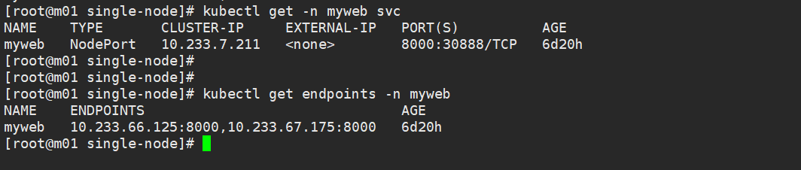


在spec.ports的定义中，targetPort属性用来确定提供该服务的容器所暴露（EXPOSE）的端口号，即具体业务进程在容器内的targetPort上提供TCP/IP接入；port属性则定义了Service的虚端口。前面定义Tomcat服务时没有指定targetPort，则默认targetPort与port相同。

Kubernetes Service支持多个Endpoint，在存在多个Endpoint的情况下，要求每个Endpoint都定义一个名称来区分。

```yaml
apiVersion: v1
kind: Service
metadata:
  name: tomcat-service
spec:
  ports:
  - port: 8080
  name: service-port
  - port: 8005
  name: shutdown-port
  selector:
	tier: frontend
```


<font color=red>多端口为什么需要给每个端口都命名呢？</font>

这就涉及Kubernetes的服务发现机制，Kubernetes通过Add-On增值包引入了DNS系统，把服务名作为DNS域名，这样程序就可以直接使用服务名来建立通信连接了。


**外部系统访问Service的问题**

为了更深入地理解和掌握Kubernetes，我们需要弄明白Kubernetes里的3种IP，这3种IP分别如下。

- Node IP：Node的IP地址
- Pod IP：Pod的IP地址
- Cluster IP：Service的IP地址


Node IP是Kubernetes集群中每个节点的物理网卡的IP地址。

Pod IP是每个Pod的IP地址，它是Docker Engine根据docker0网桥的IP地址段进行分配的，通常是一个虚拟的二层网络。所以Kubernetes里一个Pod里的容器访问另外一个Pod里的容器时，就是通过Pod IP所在的**虚拟二层网络**进行通信的，而真实的TCP/IP流量是通过Node IP所在的物理网卡流出的。

Cluster IP，它也是一种虚拟的IP，但更像一个“伪造”的IP网络。

- Cluster IP仅仅作用于Kubernetes Service这个对象，并由Kubernetes管理和分配IP地址。
- Cluster IP无法被Ping，因为没有一个“实体网络对象”来响应。
- Cluster IP只能结合Service Port组成一个具体的通信端口，单独的Cluster IP不具备TCP/IP通信的基础，并且它们属于Kubernetes集群这样一个封闭的空间。


Service的Cluster IP属于Kubernetes集群内部的地址，无法在集群外部直接使用这个地址。


<font color=red>外部的应用或者用户怎么访问service？</font>

采用NodePort是解决上述问题的最直接、有效的常见做法。

```yaml
apiVersion: v1
kind: Service
metadata:
  name: myweb
  namespace: myweb
spec:
  ports:
  - nodePort: 30888
    port: 8000
    protocol: TCP
    targetPort: ui
  selector:
    k8s-app: myweb
  type: NodePort
```


NodePort的实现方式是在Kubernetes集群里的每个Node上都为需要外部访问的Service开启一个对应的TCP监听端口，外部系统只要用任意一个Node的IP地址+具体的NodePort端口号即可访问此服务。

NodePort还没有完全解决外部访问Service的所有问题，比如负载均衡问题。

如果我们的集群运行在公有云上，那么只要把Service的type=NodePort改为type=LoadBalancer，Kubernetes就会自动创建一个对应的Load balancer实例并返回它的IP地址供外部客户端使用。


### Replication Controller

Replication Controller（简称RC）是Kubernetes系统中的核心概念之一，简单来说，它其实定义了一个期望的场景，即声明某种Pod的副本数量在任意时刻都符合某个预期值，所以RC的定义包括如下几个部分：

- Pod期待的副本数量
- 用于筛选目标Pod的Label Selector
- 当Pod的副本数量小于预期数量时，用于创建新Pod的Pod模板（template）

```yaml
apiVersion: v1
kind: ReplicationController
metadata:
  name: frontend
spec:
  replicas: 1
  selector:
	tier: frontend
  template:
	metadata:
	  labels:
	  app: app-demo
	  tier: frontend
	spec:
	  containers:
	  - name: tomcat-demo
	  image: tomcat
	  imagePullPolicy: IfNotPresent
	  env:
	  - name: GET_HOSTS_FROM
		value: dns
	  ports:
	  - containerPort: 80
```


在定义一个RC并将其提交到Kubernetes集群中后，Master上的Controller Manager组件就得到通知，定期巡检系统中当前存活的目标Pod，并确保目标Pod实例的数量刚好等于此RC的期望值，如果有过多的Pod副本在运行，系统就会停掉一些Pod，否则系统会再自动创建一些Pod。


可以通过执行 kubectl scale 命令来实现Pod的动态缩放（Scaling）。删除RC并不会影响通过该RC已创建好的Pod。为了删除所有Pod，可以设置replicas的值为0，然后更新该RC。通过RC机制，Kubernetes很容易就实现了这种高级实用的特性，被称为“滚动升级” 。


RC目前已升级为另外一个新概念——Replica Set，官方解释其为“下一代的RC”。Replica Set与RC当前的唯一区别是，Replica Sets支持基于集合的Label selector（Set-based selector），而RC只支持基于等式的Label Selector（equality-based selector），这使得Replica Set的功能更强。


### Deployment

Deployment是Kubernetes在1.2版本中引入的新概念，用于更好地解决Pod的编排问题。为此，Deployment在内部使用了Replica Set来实现目的，无论从Deployment的作用与目的、YAML定义，还是从它的具体命令行操作来看，我们都可以把它看作RC的一次升级，两者的相似度超过90%。

Deployment相对于RC的一个最大升级是我们可以随时知道当前Pod“部署”的进度。实际上由于一个Pod的创建、调度、绑定节点及在目标Node上启动对应的容器这一完整过程需要一定的时间，所以我们期待系统启动N个Pod副本的目标状态，实际上是一个连续变化的“部署过程”导致的最终状态。

Deployment的典型使用场景有以下几个：

- 创建一个Deployment对象来生成对应的Replica Set并完成Pod副本的创建
- 检查Deployment的状态来看部署动作是否完成（Pod副本数量是否达到预期的值）
- 更新Deployment以创建新的Pod（比如镜像升级）
- 如果当前Deployment不稳定，则回滚到一个早先的Deployment版本
- 暂停Deployment以便于一次性修改多个PodTemplateSpec的配置项，之后再恢复Deployment，进行新的发布
- 扩展Deployment以应对高负载
- 查看Deployment的状态，以此作为发布是否成功的指标

- 清理不再需要的旧版本ReplicaSets


除了API声明与Kind类型等有所区别，Deployment的定义与Replica Set的定义很类似：

```yaml
apiVersion: extensions/v1beta1
kind: Deployment
metadata:
  name: frontend
spec:
  replicas: 1
  selector:
	matchLabels:
	  tier: frontend
	matchExpressions:
	  - {key: tier, operator: In, values: [frontend]}
  template:
	metadata:
	  labels:
		app: app-demo
		tier: frontend
	spec:
	  containers:
	  - name: tomcat-demo
		image: tomcat
		imagePullPolicy: IfNotPresent
		ports:
		- containerPort: 8080
```


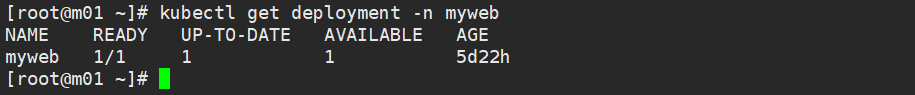

对上述输出中涉及的数量解释如下：

- DESIRED：Pod副本数量的期望值，即在Deployment里定义的Replica
- CURRENT：当前Replica的值，实际上是Deployment创建的Replica Set里的Replica值，这个值不断增加，直到达到DESIRED为止，表明整个部署过程完成
- UP-TO-DATE：最新版本的Pod的副本数量，用于指示在滚动升级的过程中，有多少个Pod副本已经成功升级
- AVAILABLE：当前集群中可用的Pod副本数量，即集群中当前存活的Pod数量


#### 演示 —— Deployment 扩容


扩容 myweb 为2个副本：

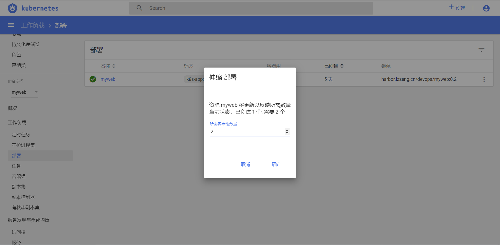


扩容中 ...

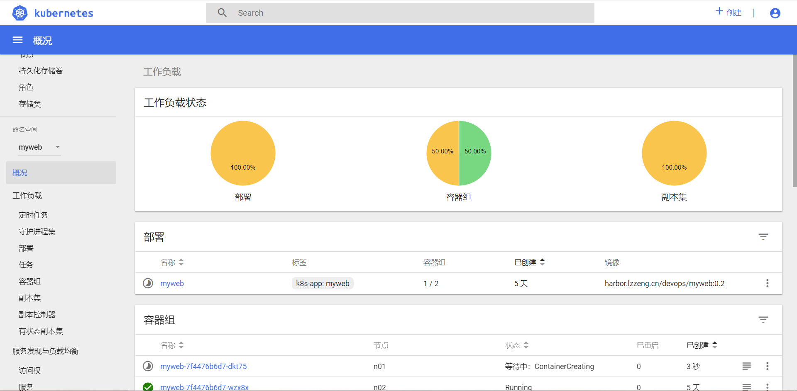


扩容完成

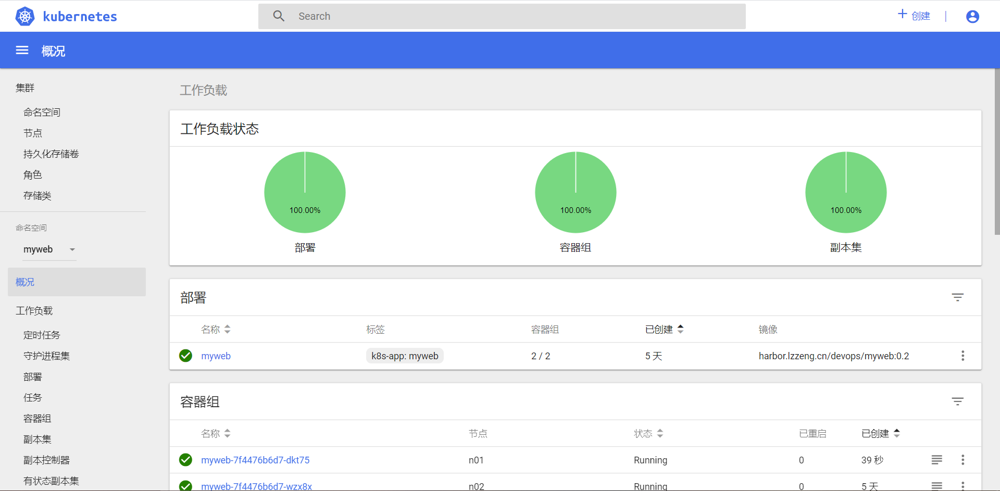


为了区分访问的是哪个pod，可以进入容器修改 `myweb` 的html源码，比如可以将其中之一的 `h1` 标题增加 `(2)` 字样，保存后即可生效：

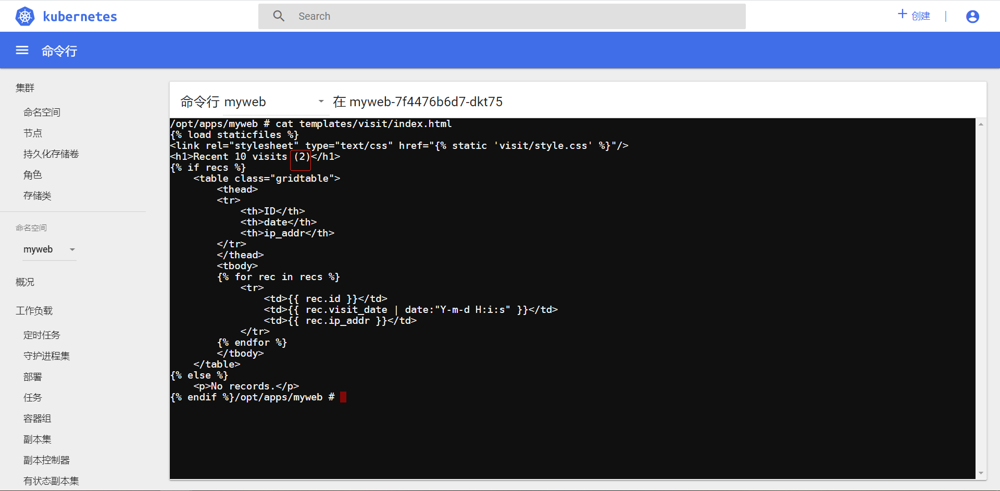


开2个窗口，多次刷新，会发现有时访问到的是**修改版**（右），有时访问到的是**未修改版**（左），说明扩容后的2个pod都能提供服务；并且被访问的几率差不多，这是service的负载均衡特性。这些符合预期。

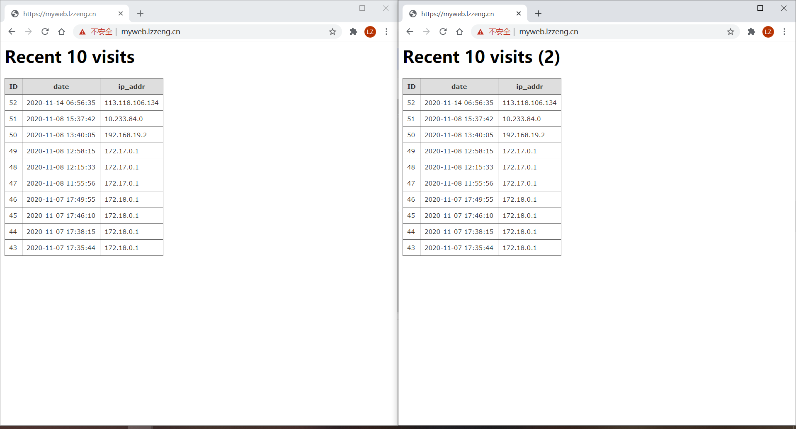


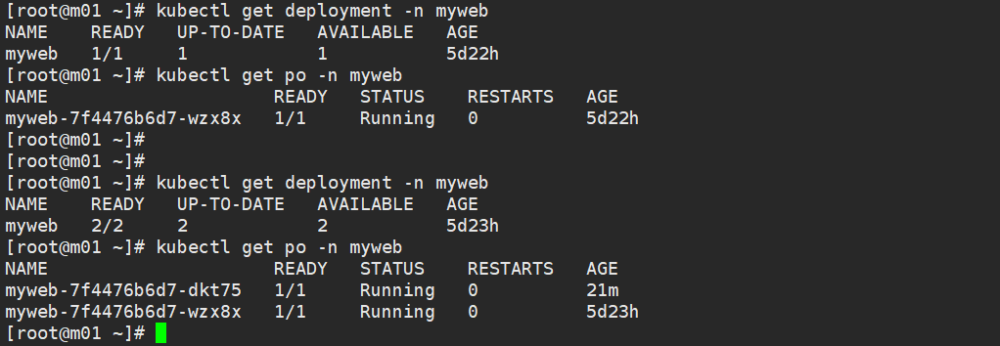


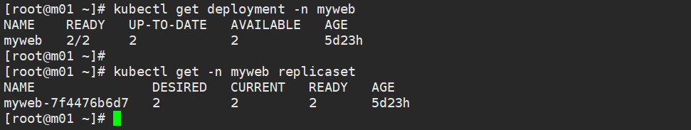


### Horizontal Pod Autoscaler

通过手工执行 kubectl scale 命令，我们可以实现Pod扩容或缩容。如果仅仅到此为止，显然不符合谷歌对Kubernetes的定位目标——自动化、智能化。

Kubernetes从1.6版本开始，增强了根据应用自定义的指标进行自动扩容和缩容的功能，API版本为autoscaling/v2alpha1，并不断演进。

HPA与之前的RC、Deployment一样，也属于一种Kubernetes资源对象。

通过追踪分析指定RC控制的所有目标Pod的负载变化情况，来确定是否需要有针对性地调整目标Pod的副本数量，这是HPA的实现原理。当前，HPA有以下两种方式作为Pod负载的度量指标。

- CPUUtilizationPercentage
- 应用程序自定义的度量指标，比如服务在每秒内的相应请求数（TPS或QPS）


CPUUtilizationPercentage 是一个算术平均值，即目标Pod所有副本自身的CPU利用率的平均值。

一个Pod自身的CPU利用率是该Pod当前CPU的使用量除以它的Pod Request的值。

在CPUUtilizationPercentage计算过程中使用到的Pod的CPU使用量通常是1min内的平均值。

如果目标Pod没有定义Pod Request的值，则无法使用CPUUtilizationPercentage实现Pod横向自动扩容。


Kubernetes从1.2版本开始也在尝试支持应用程序自定义的度量指标。


HPA示例：

```yaml
apiVersion: autoscaling/v1
kind: HorizontalPodAutoscaler
metadata:
  name: php-apache
  namespace: default
spec:
  maxReplicas: 10
  minReplicas: 1
  scaleTargetRef:
	kind: Deployment
	name: php-apache
  targetCPUUtilizationPercentage: 90
```

等价于

```sh
kubectl autoscale deployment php-apache --cpu-percent=90--min=1--max=10
```


### StatefulSet

在Kubernetes系统中，Pod的管理对象RC、Deployment、DaemonSet和Job都面向无状态的服务。但现实中有很多服务是有状态的，特别是一些复杂的中间件集群，例如MySQL集群、MongoDB集群、Akka集群、ZooKeeper集群等，这些应用集群有4个共同点：

- 每个节点都有固定的身份ID，通过这个ID，集群中的成员可以相互发现并通信。
- 集群的规模是比较固定的，集群规模不能随意变动。
- 集群中的每个节点都是有状态的，通常会持久化数据到永久存储中。
- 如果磁盘损坏，则集群里的某个节点无法正常运行，集群功能受损。

如果通过RC或Deployment控制Pod副本数量来实现上述有状态的集群，就会发现第1点是无法满足的，因为Pod的名称是随机产生的，Pod的IP地址也是在运行期才确定且可能有变动的，我们事先无法为每个Pod都确定唯一不变的ID。


StatefulSet从本质上来说，可以看作Deployment/RC的一个特殊变种，它有如下特性：

- StatefulSet里的每个Pod都有稳定、唯一的网络标识，可以用来发现集群内的其他成员。假设StatefulSet的名称为kafka，那么第1个Pod叫kafka-0，第2个叫kafka-1，以此类推。

- StatefulSet控制的Pod副本的启停顺序是受控的，操作第n个Pod时，前n-1个Pod已经是运行且准备好的状态。
- StatefulSet里的Pod采用稳定的持久化存储卷，通过PV或PVC来实现，删除Pod时默认不会删除与StatefulSet相关的存储卷（为了保证数据的安全）。


### DaemonSet

在每个Node上都调度一个Pod。
DaemonSet 用于管理在集群中每个Node上仅运行一份Pod的副本实例。

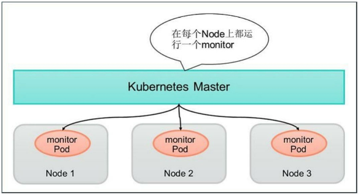

使用场景：

- 在每个Node上都运行一个GlusterFS存储或者Ceph存储的Daemon进程。
- 在每个Node上都运行一个日志采集程序，例如Fluentd或者Logstach。
- 在每个Node上都运行一个性能监控程序，采集该Node的运行性能数据，例如Prometheus Node Exporter、collectd、New Relic agent或者Ganglia gmond等。


### Job

批处理任务通常并行（或者串行）启动多个计算进程去处理一批工作项（work item），在处理完成后，整个批处理任务结束。

与RC、Deployment、ReplicaSet、DaemonSet类似，Job也控制一组Pod容器。从这个角度来看，Job也是一种特殊的Pod副本自动控制器。

（1）Job所控制的Pod副本是短暂运行的，可以将其视为一组Docker容器，其中的每个Docker容器都仅仅运行一次

（2）Job所控制的Pod副本的工作模式能够多实例并行计算


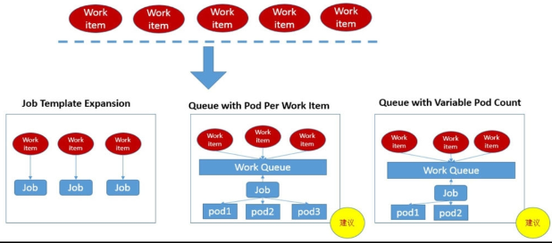


### Volume

Volume（存储卷）是Pod中能够被多个容器访问的共享目录。

Kubernetes中的Volume与Pod的生命周期相同，但与容器的生命周期不相关，当容器终止或者重启时，Volume中的数据也不会丢失。

Volume的使用也比较简单，在大多数情况下，我们先在Pod上声明一个Volume，然后在容器里引用该Volume并挂载（Mount）到容器里的某个目录上。


Kubernetes提供了非常丰富的Volume类型，下面逐一进行说明：

1．emptyDir

一个emptyDir Volume是在Pod分配到Node时创建的。从它的名称就可以看出，它的初始内容为空，并且无须指定宿主机上对应的目录文件，因为这是Kubernetes自动分配的一个目录，当Pod从Node上移除时，emptyDir中的数据也会被永久删除。

emptyDir的一些用途如下：

- 临时空间，例如用于某些应用程序运行时所需的临时目录，且无须永久保留。
- 长时间任务的中间过程CheckPoint的临时保存目录。
- 一个容器需要从另一个容器中获取数据的目录（多容器共享目录）。

```yaml
spec:
  volumes:
	- name: datavol
	emptyDir: {}
```


2．hostPath

hostPath为在Pod上挂载宿主机上的文件或目录，它通常可以用于以下几方面：

- 容器应用程序生成的日志文件需要永久保存时，可以使用宿主机的高速文件系统进行存储。
- 需要访问宿主机上Docker引擎内部数据结构的容器应用时，可以通过定义hostPath为宿主机/var/lib/docker目录，使容器内部应用可以直接访问Docker的文件系统。

```yaml
volumes:
- name: "persistent-storage"
  hostPath:
    path: "/data"
```


需要注意以下几点：

- 在不同的Node上具有相同配置的Pod，可能会因为宿主机上的目录和文件不同而导致对Volume上目录和文件的访问结果不一致。
- 如果使用了资源配额管理，则Kubernetes无法将hostPath在宿主机上使用的资源纳入管理。


3．NFS

使用NFS网络文件系统提供的共享目录存储数据时，我们需要在系统中部署一个NFS Server。

```yaml
volumes:
- name: nfs
  nfs:
	server: nfs服务器ip
	path: "/"
```


另外，configmap 和 secret 也可以volume来使用。


### Persistent Volume

之前提到的Volume是被定义在Pod上的，属于计算资源的一部分，而实际上，网络存储是相对独立于计算资源而存在的一种实体资源。

PV可以被理解成Kubernetes集群中的某个网络存储对应的一块存储，它与Volume类似，但有以下区别。

- PV只能是网络存储，不属于任何Node，但可以在每个Node上访问。

- PV并不是被定义在Pod上的，而是独立于Pod之外定义的。
- PV目前支持的类型包括：gcePersistentDisk、AWSElasticBlockStore、AzureFile、AzureDisk、FC（Fibre Channel）、Flocker、NFS、iSCSI、RBD（Rados Block Device）、CephFS、Cinder、GlusterFS、VsphereVolume、Quobyte Volumes、VMware Photon、Portworx Volumes、ScaleIO Volumes和HostPath（仅供单机测试）。


NFS PV示例：

```yaml
apiVersion: v1
  kind: PersistentVolume
metadata:
  name: pv0003
spec:
  capacity:
	storage: 5Gi
  accessModes:
	- ReadWriteOnce
  nfs:
	path: /somepath
	server: 172.17.0.2
```


PV的accessModes属性，目前有以下类型：

- ReadWriteOnce：读写权限，并且只能被单个Node挂载。
- ReadOnlyMany：只读权限，允许被多个Node挂载。
- ReadWriteMany：读写权限，允许被多个Node挂载。


### Persistent Volume Claim

如果某个Pod想申请某种类型的PV，则首先需要定义一个PersistentVolumeClaim对象：

```yaml
kind: PersistentVolumeClaim
apiVersion: v1
metadata:
  name: myclaim
spec:
  accessModes:
	- ReadWriteOnce
  resources:
	requests:
	  storage: 8Gi
```


然后，在Pod的Volume定义中引用上述PVC

```yaml
volumes:
- name: mypd
  persistentVolumeClaim:
    claimName: myclaim
```


PV是有状态的对象，它的状态有以下几种：

- Available：空闲状态
- Bound：已经绑定到某个PVC上
- Released：对应的PVC已经被删除，但资源还没有被集群收回
- Failed：PV自动回收失败。


### Annotation

Annotation（注解）与Label类似，也使用key/value键值对的形式进行定义。

不同的是Label具有严格的命名规则，它定义的是Kubernetes对象的元数据（Metadata），并且用于Label Selector。Annotation则是用户任意定义的附加信息，以便于外部工具查找。在很多时候，Kubernetes的模块自身会通过Annotation标记资源对象的一些特殊信息。


### ConfigMap

我们知道，Docker通过将程序、依赖库、数据及配置文件“打包固化”到一个不变的镜像文件中的做法，解决了应用的部署的难题，但这同时带来了棘手的问题，即配置文件中的参数在运行期如何修改的问题。

为了解决这个问题，Docker提供了两种方式：

- 在运行时通过容器的环境变量来传递参数
- 通过Docker Volume将容器外的配置文件映射到容器内


我们都希望能集中管理系统的配置参数，而不是管理一堆配置文件。

K8s把所有的配置项都当作key-value字符串，这些配置项可以作为Map表中的一个项，整个Map的数据可以被持久化存储在Kubernetes的etcd数据库中，然后提供API以方便Kubernetes相关组件或客户应用CRUD操作这些数据，上述专门用来保存配置参数的Map就是Kubernetes ConfigMap资源对象。

Kubernetes提供了一种内建机制，将存储在etcd中的ConfigMap通过Volume映射的方式变成目标Pod内的配置文件。

不管目标Pod被调度到哪台服务器上，都会完成自动映射。

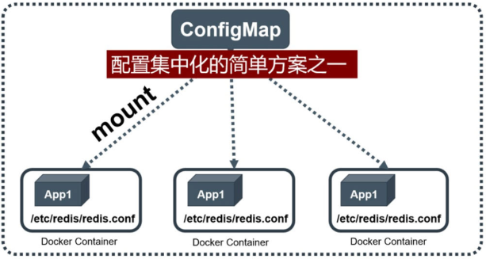


ConfigMap供容器使用的典型用途如下：

- 生成为容器内的环境变量
- 设置容器启动命令的启动参数（需设置为环境变量）
- 以Volume的形式挂载为容器内部的文件或目录


容器应用对ConfigMap的使用有以下两种方法：

- 通过环境变量获取ConfigMap中的内容
- 通过Volume挂载的方式将ConfigMap中的内容挂载为容器内部的文件或目录

```yaml
spec:
  containers:
  - name: cm-test
    image: busybox
    command: [ "/bin/sh", "-c", "env | grep APP" ]
    env:
    - name: APPLOGLEVEL
      valueFrom:
        configMapKeyRef:
          name: cm-appvars
          key: apploglevel
```


使用ConfigMap的限制条件如下：

- ConfigMap必须在Pod之前创建。

- ConfigMap受Namespace限制，只有处于相同Namespace中的Pod才可以引用它。
- ConfigMap中的配额管理还未能实现。
- kubelet只支持可以被API Server管理的Pod使用ConfigMap。kubelet在本Node上通过--manifest-url或--config自动创建的静态Pod将无法引用ConfigMap。
- 在Pod对ConfigMap进行挂载（volumeMount）操作时，在容器内部只能挂载为“目录”，无法挂载为“文件”。


### RBAC

Role-Based Access Control，基于角色的访问控制。

RBAC引入了4个新的顶级资源对象： Role 、 ClusterRole 、 RoleBinding和ClusterRoleBinding。

1）角色（Role）
一个角色就是一组权限的集合，这里的权限都是许可形式的，不存在拒绝的规则。在一个命名空间中，可以用角色来定义一个角色，如果是集群级别的，就需要使用ClusterRole了。

2）集群角色（ClusterRole）
集群角色除了具有和角色一致的命名空间内资源的管理能力，因其集群级别的范围，还可以用于以下特殊元素的授权：

- 集群范围的资源，例如Node
- 非资源型的路径，例如“/healthz”
- 包含全部命名空间的资源，例如pods（用于kubectl get pods --all-namespaces这样的操作授权）

3）角色绑定（RoleBinding）和集群角色绑定（ClusterRoleBinding）
角色绑定或集群角色绑定用来把一个角色绑定到一个目标上，绑定目标可以是User（用户）、Group（组）或者Service Account。使用RoleBinding为某个命名空间授权，使用ClusterRoleBinding为集群范围内授权。


RoleBinding可以引用Role进行授权。

RoleBinding也可以引用ClusterRole，对属于同一命名空间内ClusterRole定义的资源主体进行授权。


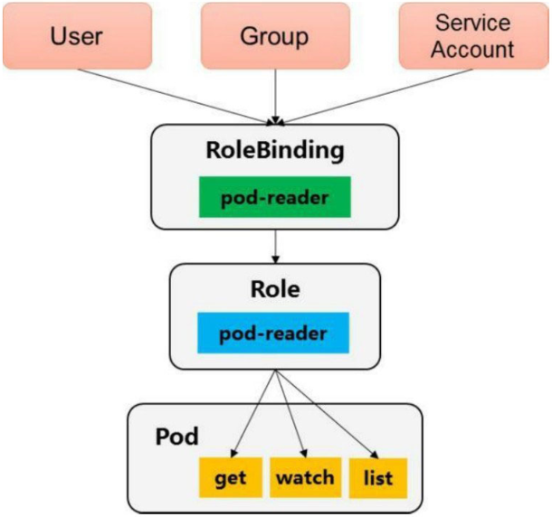


```yaml
apiVersion: rbac.authorization.k8s.io/v1
kind: ClusterRoleBinding
metadata:
  name: kubernetes-dashboard-minimal
  namespace: kube-system
roleRef:
  apiGroup: rbac.authorization.k8s.io
  kind: ClusterRole
  name: cluster-admin
subjects:
- kind: ServiceAccount
  name: kubernetes-dashboard
  namespace: kube-system
```


绑定cluster-admin意味着具有超级用户权限。

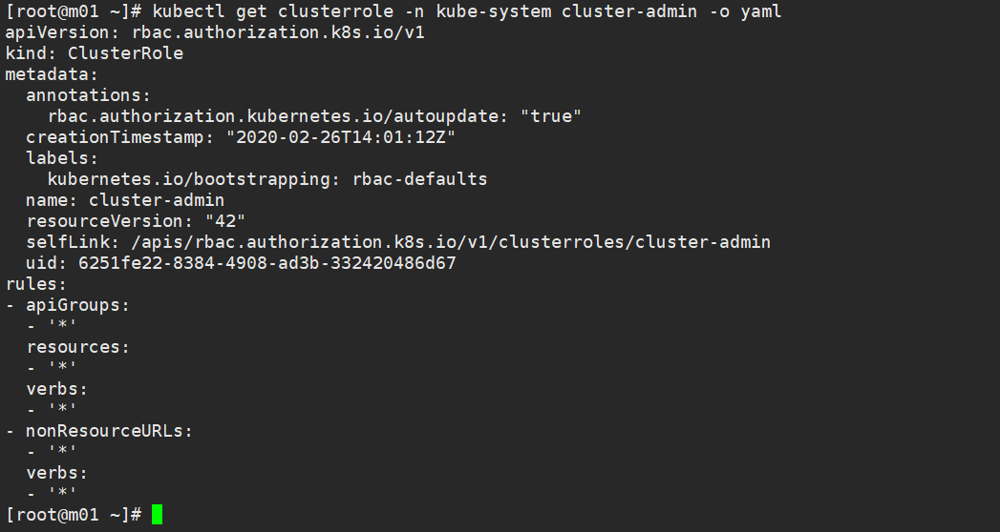


### ingress

用于将不同URL的访问请求转发到后端不同的Service，以实现**HTTP层**的业务路由机制

Kubernetes使用了一个Ingress策略定义和一个具体的Ingress Controller，两者结合并实现了一个完整的Ingress负载均衡器。

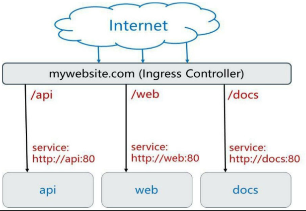


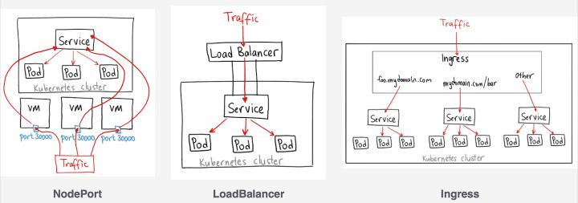


为使用Ingress，需要创建Ingress Controller（带一个默认backend服务）和Ingress策略设置来共同完成。

Ingress Controller有多种：

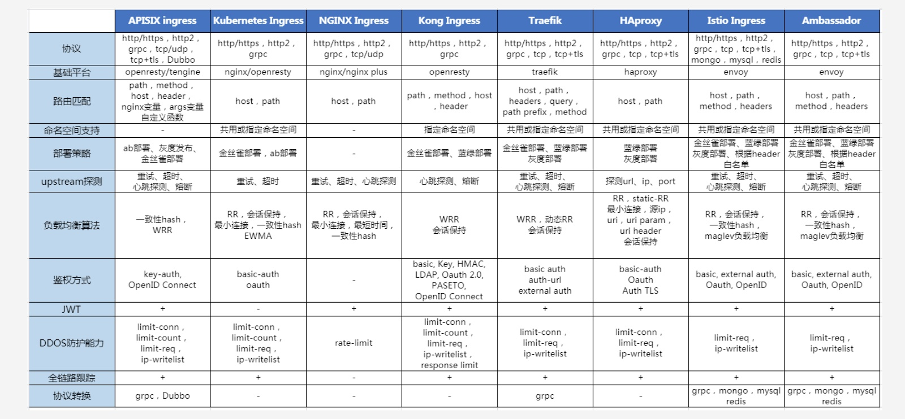


helm 安装 ingress-nginx

```sh
helm repo add ingress-nginx https://kubernetes.github.io/ingress-nginx
helm install my-release ingress-nginx/ingress-nginx
```


traefik ingress 界面效果图

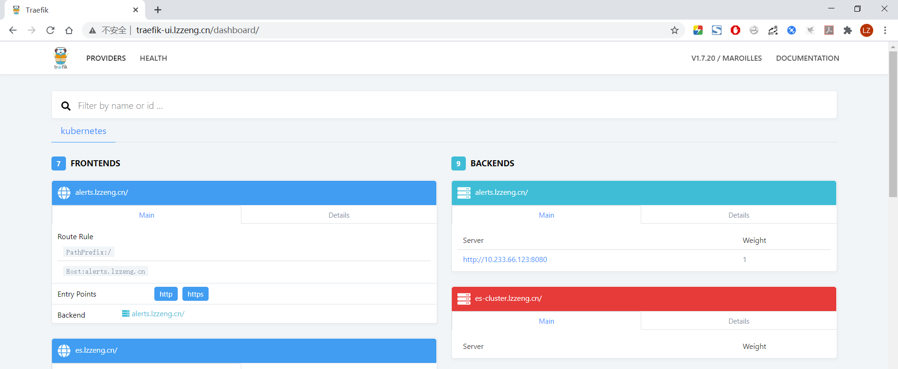


### secret

一个Secret Volume用于为Pod提供加密的信息，你可以将定义在Kubernetes中的Secret直接挂载为文件让Pod访问。Secret Volume是通过TMFS（内存文件系统）实现的，这种类型的Volume不会被持久化。


## 组件

在Master上运行着以下关键进程：

- Kubernetes API Server（kube-apiserver）：提供了HTTP Rest接口的关键服务进程，是Kubernetes里所有资源的增、删、改、查等操作的唯一入口，也是集群控制的入口进程。
- Kubernetes Controller Manager（kube-controller-manager）：Kubernetes里所有资源对象的自动化控制中心，可以将其理解为资源对象的“大总管”。
- Kubernetes Scheduler（kube-scheduler）：负责资源调度（Pod调度）的进程，相当于公交公司的“调度室”。
- ETCD：etcd服务通常部署在master节点上，Kubernetes里的所有资源对象的数据都被保存在etcd。


在每个Node上都运行着以下关键进程：

- kubelet：负责Pod对应的容器的创建、启停等任务，同时与Master密切协作，实现集群管理的基本功能。-
- kube-proxy：实现Kubernetes Service的通信与负载均衡机制的重要组件。
- Docker Engine（docker）：Docker引擎，负责本机的容器创建和管理工作。


### API Server

Kubernetes API Server的核心功能是提供Kubernetes各类资源对象（如Pod、RC、Service等）的增、删、改、查及Watch等HTTP Rest接口，成为集群内各个功能模块之间数据交互和通信的中心枢纽，是整个系统的数据总线和数据中心。

除此之外，它还有以下一些功能特性：
（1）是集群管理的API入口。
（2）是资源配额控制的入口。
（3）提供了完备的集群安全机制。


通过命令行工具kubectl来与Kubernetes API Server交互，它们之间的接口是RESTful API。


**API Server架构解析**

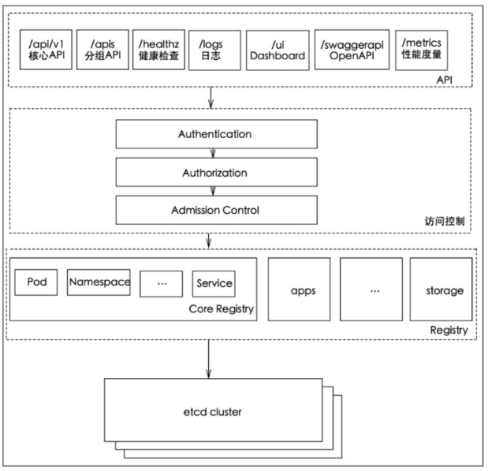


（1）API层：主要以REST方式提供各种API接口，除了有Kubernetes资源对象的CRUD和Watch等主要API，还有健康检查、UI、日志、性能指标等运维监控相关的API。Kubernetes从1.11版本开始废弃Heapster监控组件，转而使用Metrics Server提供Metrics API接口，进一步完善了自身的监控能力。
（2）访问控制层：当客户端访问API接口时，访问控制层负责对用户身份鉴权，验明用户身份，核准用户对Kubernetes资源对象的访问权限，然后根据配置的各种资源访问许可逻辑（Admission Control），判断是否允许访问。
（3）注册表层：Kubernetes把所有资源对象都保存在注册表（Registry）中，针对注册表中的各种资源对象都定义了：资源对象的类型、如何创建资源对象、如何转换资源的不同版本，以及如何将资源编码和解码为JSON或ProtoBuf格式进行存储。
（4）etcd数据库：用于持久化存储Kubernetes资源对象的KV数据库。etcd的watch API接口对于API Server来说至关重要，因为通过这个接口，API Server创新性地设计了List-Watch这种高性能的资源对象实时同步机制，使Kubernetes可以管理超大规模的集群，及时响应和快速处理集群中的各种事件。


### Controller Manager

一般来说，智能系统和自动系统通常会通过一个“操作系统”来不断修正系统的工作状态。在Kubernetes集群中，每个Controller都是这样的一个“操作系统”，它们通过API Server提供的（List-Watch）接口实时监控集群中特定资源的状态变化，当发生各种故障导致某资源对象的状态发生变化时，Controller会尝试将其状态调整为期望的状态。比如当某个Node意外宕机时，Node Controller会及时发现此故障并执行自动化修复流程，确保集群始终处于预期的工作状态。Controller Manager是Kubernetes中各种操作系统的管理者，是集群内部的管理控制中心，也是Kubernetes自动化功能的核心。

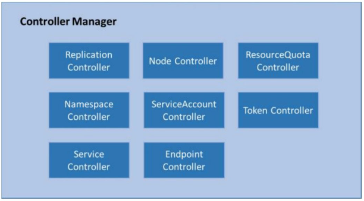


### Scheduler

前面深入分析了Controller Manager及它所包含的各个组件的运行机制，本节将继续对Kubernetes中负责Pod调度的重要功能模块——Kubernetes Scheduler的工作原理和运行机制做深入分析。

Kubernetes Scheduler在整个系统中承担了“承上启下”的重要功能，“承上”是指它负责接收Controller Manager创建的新Pod，为其安排一个落脚的“家”——目标Node；“启下”是指安置工作完成后，目标Node上的kubelet服务进程接管后继工作，负责Pod生命周期中的“下半生”。

具体来说，Kubernetes Scheduler的作用是将待调度的Pod（API新创建的Pod、Controller Manager为补足副本而创建的Pod等）按照特定的调度算法和调度策略绑定（Binding）到集群中某个合适的Node上，并将绑定信息写入etcd中。在整个调度过程中涉及三个对象，分别是待调度Pod列表、可用Node列表，以及调度算法和策略。简单地说，就是通过调度算法调度为待调度Pod列表中的每个Pod从Node列表中选择一个最适合的Node。

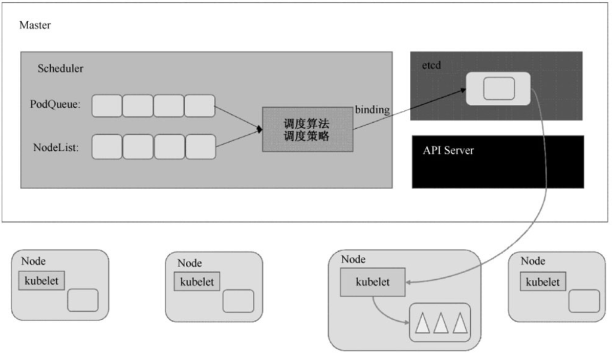


随后，目标节点上的kubelet通过API Server监听到Kubernetes Scheduler产生的Pod绑定事件，然后获取对应的Pod清单，下载Image镜像并启动容器。

Kubernetes Scheduler当前提供的默认调度流程分为以下两步：
（1）预选调度过程，即遍历所有目标Node，筛选出符合要求的候选节点。为此，Kubernetes内置了多种预选策略（xxx Predicates）供用户选择。
（2）确定最优节点，在第1步的基础上，采用优选策略（xxx Priority）计算出每个候选节点的积分，积分最高者胜出。


### kubelet

在Kubernetes集群中，在每个Node（又称Minion）上都会启动一个kubelet服务进程。该进程用于处理Master下发到本节点的任务，管理Pod及Pod中的容器。每个kubelet进程都会在API Server上注册节点自身的信息，定期向Master汇报节点资源的使用情况，并通过cAdvisor监控容器和节点资源。


### kube-proxy

我们在前面已经了解到，为了支持集群的水平扩展、高可用性，Kubernetes抽象出了Service的概念。Service是对一组Pod的抽象，它会根据访问策略（如负载均衡策略）来访问这组Pod。

Kubernetes在创建服务时会为服务分配一个虚拟的IP地址，客户端通过访问这个虚拟的IP地址来访问服务，服务则负责将请求转发到后端的Pod上。这不就是一个反向代理吗？没错，这就是一个反向代理。但是，它和普通的反向代理有一些不同：首先，它的IP地址是虚拟的，想从外面访问还需要一些技巧；其次，它的部署和启停是由Kubernetes统一自动管理的。

在很多情况下，Service只是一个概念，而真正将Service的作用落实的是它背后的kube-proxy服务进程。只有理解了kube-proxy的原理和机制，我们才能真正理解Service背后的实现逻辑。

在Kubernetes集群的每个Node上都会运行一个kube-proxy服务进程，我们可以把这个进程看作Service的透明代理兼负载均衡器，其核心功能是将到某个Service的访问请求转发到后端的多个Pod实例上。此外，Service的Cluster IP与NodePort等概念是kube-proxy服务通过iptables的NAT转换实现的，kube-proxy在运行过程中动态创建与Service相关的iptables规则，这些规则实现了将访问服务（Cluster IP或NodePort）的请求负载分发到后端Pod的功能。由于iptables机制针对的是本地的kube-proxy端口，所以在每个Node上都要运行kube-proxy组件，这样一来，在Kubernetes集群内部，我们可以在任意Node上发起对Service的访问请求。综上所述，由于kube-proxy的作用，在Service的调用过程中客户端无须关心后端有几个Pod，中间过程的通信、负载均衡及故障恢复都是透明的。

起初，kube-proxy进程是一个真实的TCP/UDP代理，类似HA Proxy，负责从Service到Pod的访问流量的转发，这种模式被称为userspace（用户空间代理）模式。如图5.13所示，当某个Pod以Cluster IP方式访问某个Service的时候，这个流量会被Pod所在本机的iptables转发到本机的kube-proxy进程，然后由kube-proxy建立起到后端Pod的TCP/UDP连接，随后将请求转发到某个后端Pod上，并在这个过程中实现负载均衡功能。


图：Service的负载均衡转发规则

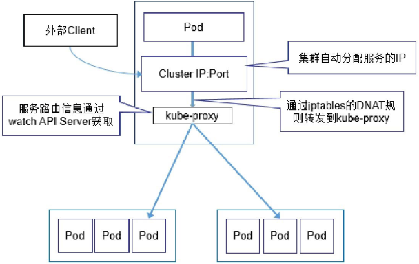


# 案例 —— 部署myweb至K8s


## 重制镜像

之前我们是使用docker运行myweb这个demo的，并且为了简单，将mysql的用户名、密码写死在settings.py里了。

现在改成如下，让name, user, password, host, port分别从环境变量DB_NAME, DB_USER, DB_PASSWORD, DB_HOST, DB_PORT 获取。

```sh
DATABASES = { 
    'default': {
        'ENGINE': 'django.db.backends.mysql',
        'NAME': os.environ.get('DB_NAME'),
        'USER': os.environ.get('DB_USER')
        'PASSWORD': os.environ.get('DB_PASSWORD'),
        'HOST': os.environ.get('DB_HOST'),
        'PORT': os.environ.get('DB_PORT'),
        'OPTIONS': {}
    }
}
```


重新制作镜像 myweb:0.2，并上传至 harbor。

涉及到环境变量的传递，可以通过docker-compose验证一下新镜像是否正常。

docker-compose.yml

```yaml
[root@localhost demo]# cat docker-compose.yml 
db:
    image: myweb:0.2
    environment:
      DB_NAME: "testpv"
      DB_USER: "root"
      DB_PASSWORD: "mysql"
      DB_HOST: 172.17.0.13
      DB_PORT: 3306
    restart: always
    #command: ['']
    volumes:
      - /opt/log:/var/log
    ports:
      - 8009:8000
```


测试没问题：

```sh
[root@localhost demo]# docker-compose up -d
Creating demo_db_1 ... done
[root@localhost demo]# docker-compose ps
  Name                 Command               State           Ports         
---------------------------------------------------------------------------
demo_db_1   supervisord -n -c /etc/sup ...   Up      0.0.0.0:8009->8000/tcp
[root@localhost demo]# curl http://localhost:8009/visit/add/

<link rel="stylesheet" type="text/css" href="/static/visit/style.css"/>
<div>
    <table class="gridtable">
        <thead>
        <tr>
            <th>ID</th>
            <th>date</th>
            <th>ip_addr</th>
        </tr>
        </thead>
        <tbody>
        <tr>
            <td>47</td>
            <td>2020-11-08 11:55:56</td>
            <td>172.17.0.1</td>
        </tr>
        </tbody>
    </table>
</div>
```


另外，也可以直接通过docker run启动，--env-file加载环境变量：

```sh
[root@localhost demo]# cat env
DB_NAME=testpv
DB_USER=root
DB_PASSWORD=mysql
DB_HOST=172.17.0.13
DB_PORT=3306
[root@localhost demo]# docker run -d --name myweb -p 8009:8000 --env-file=env myweb:0.2
```


## 推送镜像至harbor

```sh
[root@localhost demo]# docker tag myweb:0.2 harbor.lzzeng.cn/devops/myweb:0.2
[root@localhost demo]# docker image ls myweb
REPOSITORY          TAG                 IMAGE ID            CREATED             SIZE
myweb               0.2                 0245c29d6060        25 minutes ago      325MB
[root@localhost demo]# docker image ls |grep myweb
myweb                            0.2                              0245c29d6060        25 minutes ago      325MB
harbor.lzzeng.cn/devops/myweb    0.2                              0245c29d6060        25 minutes ago      325MB
[root@localhost demo]# 
[root@localhost demo]# docker push harbor.lzzeng.cn/devops/myweb:0.2
The push refers to repository [harbor.lzzeng.cn/devops/myweb]
7615e9027750: Pushed 
8daa36f6b1b1: Pushed 
c4b9879e46c2: Pushed 
879c0d8666e3: Mounted from devops/alerts 
20a7b70bdf2f: Mounted from devops/alerts 
3fc750b41be7: Mounted from devops/alerts 
beee9f30bc1f: Mounted from devops/alerts 
0.2: digest: sha256:4a74959ea51a5834436ecda47f9e9d461d4ec43a68ff1976c555dc6ba2878842 size: 1788
```


在Harbor上可以看到：

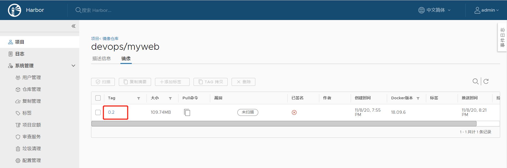


## 创建K8s资源对象


假设我们仍使用已经独立部署好的mysql，现在只需要写myweb的k8s部署文件。


### namespace

先来创建一个namespace

```sh
[root@m01 myweb]# kubectl create ns myweb
namespace/myweb created
```


### configmap

由于用到了supervisor，将其配置文件创建为一个configmap

```sh
[root@m01 myweb]# ls
myweb_supervisord.conf
[root@m01 myweb]# 
[root@m01 myweb]# #创建configmap
[root@m01 myweb]# 
[root@m01 myweb]# kubectl create -n myweb configmap myweb-supervisord-conf --from-file=myweb_supervisord.conf
configmap/myweb-supervisord-conf created
[root@m01 myweb]# 
[root@m01 myweb]# kubectl get cm -n myweb
NAME                     DATA   AGE
myweb-supervisord-conf   1      7s
[root@m01 myweb]#
```


通过--from-file参数创建的myweb-supervisord-conf内容如下：

```sh
# Please edit the object below. Lines beginning with a '#' will be ignored,
# and an empty file will abort the edit. If an error occurs while saving this file will be
# reopened with the relevant failures.
#
apiVersion: v1
data:
  myweb_supervisord.conf: |
    [program:myweb]
    command=/usr/local/bin/python manage.py runserver 0.0.0.0:8000
    directory=/opt/apps/myweb
    user=root
    startsecs=3
    redirect_stderr=true
    stdout_logfile_maxbytes=20MB
    stdout_logfile_backups=3
    stdout_logfile=/var/log/myweb_supervisor.log
kind: ConfigMap
metadata:
  creationTimestamp: "2020-11-08T10:11:46Z"
  name: myweb-supervisord-conf
  namespace: myweb
  resourceVersion: "1135081"
  selfLink: /api/v1/namespaces/myweb/configmaps/myweb-supervisord-conf
  uid: 42cd4d5c-48c4-4845-b1a9-102eb78f591a
```


也可以直接写一个yaml文件：

myweb-supervisord-conf.yml

```yaml
apiVersion: v1
data:
  myweb_supervisord.conf: |
    [program:myweb]
    command=/usr/local/bin/python manage.py runserver 0.0.0.0:8000
    directory=/opt/apps/myweb
    user=root
    startsecs=3
    redirect_stderr=true
    stdout_logfile_maxbytes=20MB
    stdout_logfile_backups=3
    stdout_logfile=/var/log/myweb_supervisor.log
```


然后

```sh
kubectl create -n myweb configmap myweb-supervisord-conf -f myweb-supervisord-conf.yml
```


### secret

假设mysql连接参数如下：

```sh
user=root
password=mysql
host=192.168.100.200
port=3306
name=testpv
```


可以通过命令行带参数的方式创建一个secret

```sh
[root@m01 myweb]# kubectl create -n myweb secret generic db-secret --from-literal=name=testpv --from-literal=user=root --from-literal=host=192.168.100.200 --from-literal=port=3306 --from-literal=password=mysql
secret/db-secret created
```


也可以先编写一个secret文件（data字段采用base64编码），再创建secret

```yaml
apiVersion: v1
kind: Secret
metadata:
  name: db-secret
  namespace: myweb
data:
  host: MTkyLjE2OC4xMDAuMjAwCg==
  name: dGVzdHB2
  password: bXlzcWwK
  port: MzMwNg==
  user: cm9vdA==
type: Opaque
```


从dashboard可以看到创建的保密字典db-secret内容：

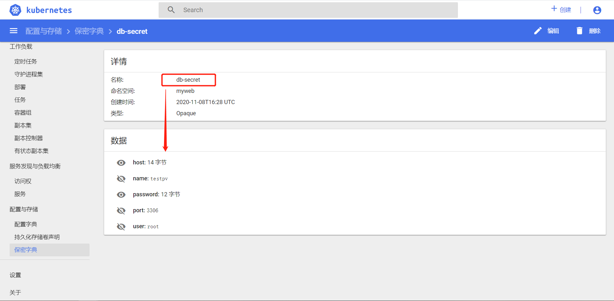


### deployment、service和ingress

myweb-dep.yml

```yaml
apiVersion: apps/v1
kind: Deployment
metadata:
  name: myweb
  namespace: myweb
  labels:
    k8s-app: myweb
spec:
  replicas: 1
  selector:
    matchLabels:
      k8s-app: myweb
  template:
    metadata:
      labels:
        k8s-app: myweb
    spec:
      containers:
      - name: myweb
        image: harbor.lzzeng.cn/devops/myweb:0.2
        resources:
          limits:
            cpu: 1
            memory: 1000Mi
          requests:
            cpu: 0.5 
            memory: 500Mi
        env:
          - name: DB_NAME
            valueFrom:
              secretKeyRef:
                name: db-secret
                key: name
          - name: DB_USER
            valueFrom:
              secretKeyRef:
                name: db-secret
                key: user
          - name: DB_PASSWORD
            valueFrom:
              secretKeyRef:
                name: db-secret
                key: password
          - name: DB_HOST
            valueFrom:
              secretKeyRef:
                name: db-secret
                key: host
          - name: DB_PORT
            valueFrom:
              secretKeyRef:
                name: db-secret
                key: port
        ports:
        - containerPort: 8000
          name: ui
          protocol: TCP
```


myweb-svc.yml

```yaml
apiVersion: v1
kind: Service
metadata:
  name: myweb
  namespace: myweb
spec:
  type: NodePort
  ports:
  - port: 8000
    protocol: TCP
    targetPort: ui
    nodePort: 30888
  selector:
    k8s-app: myweb
```


myweb-ing.yml

```yaml
apiVersion: extensions/v1beta1
kind: Ingress
metadata:
  name: myweb
  namespace: myweb
spec:
  rules:
  - host: myweb.lzzeng.cn
    http:
      paths:
      - path: /
        backend:
          serviceName: myweb
          servicePort: 8000
```


### kubectl create

```sh
kubectl create -n myweb -f myweb-def.yml
kubectl create -n myweb -f myweb-svc.yml
kubectl create -n myweb -f myweb-ing.yml
```

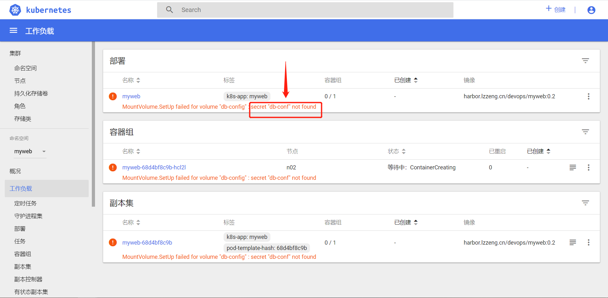


是deployment文件中secret名称写错了，修改myweb-dep.yml，更新后正常：

```sh
kubectl apply -n myweb -f myweb-def.yml
```

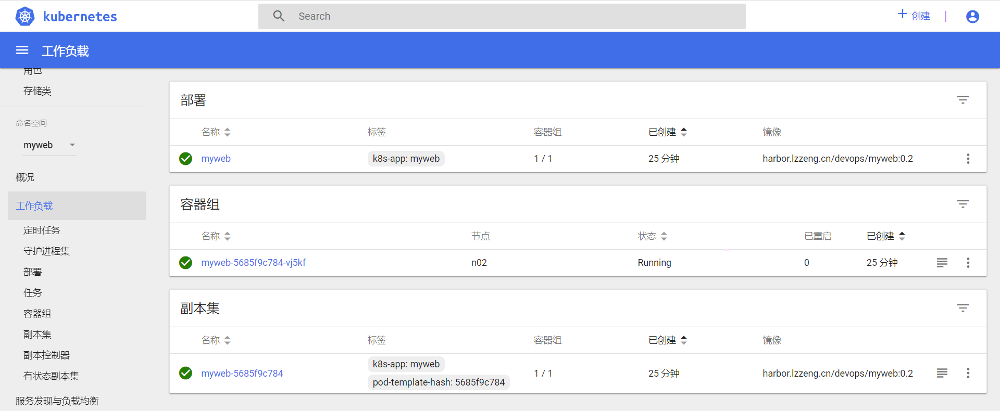


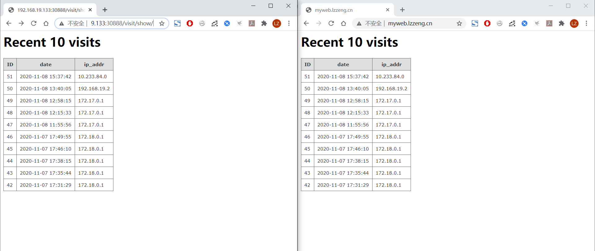


# 使用 helm 与 harbor

helm是K8s的chart管理工具, harbor是docker镜像、helm charts托管平台。


## 使用helm

helm安装prometheus

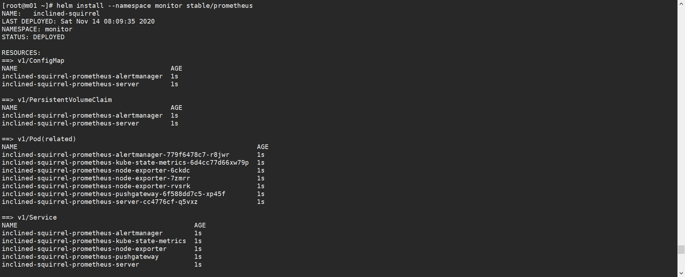


grafana效果图

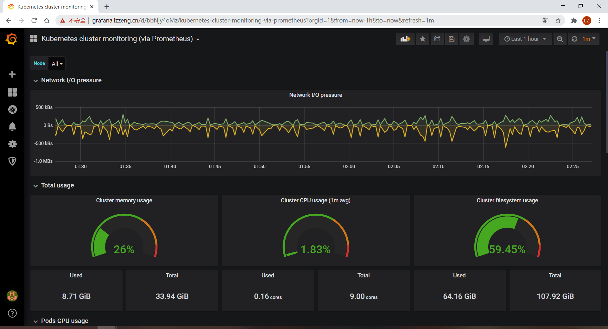


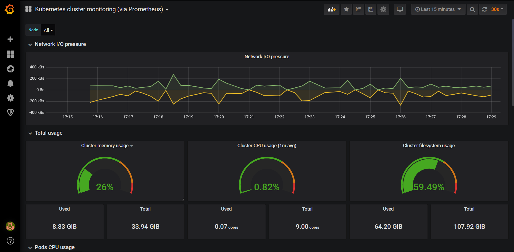


编写helm chart，推送至harbor命令：

```sh
helm create mychart
# 编写...
helm push -u xxx -p xxxxxx  ./  <上传至chart项目地址>
```


helm部署ELK

```sh
helm install elastic/elasticsearch -n elk-es --namespace elk
```


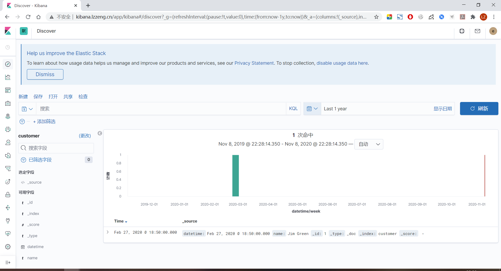


## 使用harbor


> 官方github：<https://github.com/goharbor/harbor>
>
> 官方文档：<https://goharbor.io/docs/2.0.0/install-config/>


创建自签名证书（一年期）：

```sh
openssl req -x509 -nodes -days 365 -newkey rsa:2048 -keyout ./tls.key -out ./tls.crt -subj "/CN=你的自定义harbor域名"
```


harbor.yml配置示例：

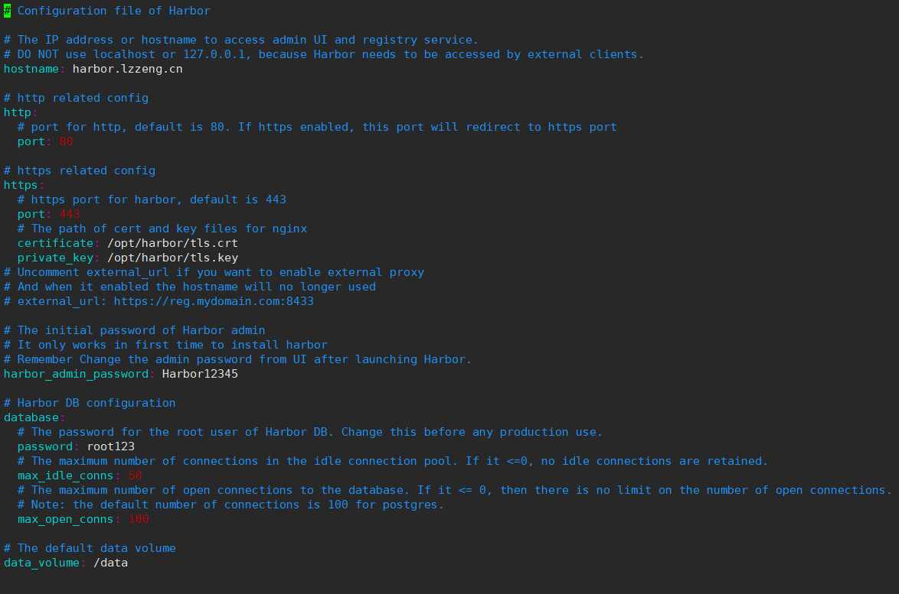


Harbor要启用helm charts管理功能，在安装时要添加`--with-chartmuseum`参数：

```sh
./install.sh --with-chartmuseum
```


Harbor的charts管理界面：

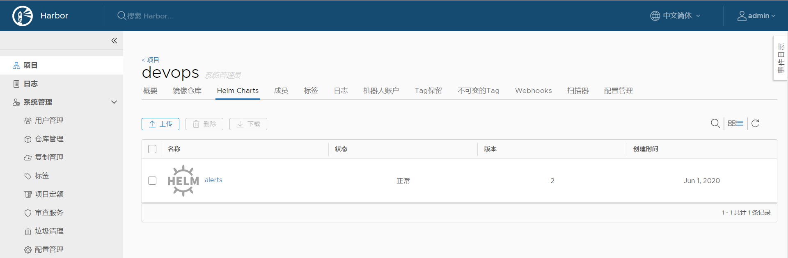

可以通过web界面上传打包好的chart，也可以使用helm push命令推送。


在使用时：

```sh
# 1. 添加repo
helm repo add --ca-file <ca file> --cert-file <cert file> --key-file <key file>     --username <username> --password <password> <repo name> https://<harbor地址>/chartrepo/<项目名称>

# 2. 获取chart包
# helm fetch <项目名称>/<chart名称>

# 2. 直接使用chart安装部署至K8s
helm install --name <自定义部署名> --namespace <指定部署到哪个名称空间> [其它选项] <项目名称>/<chart名称>
```


Harbor的镜像仓库管理界面：

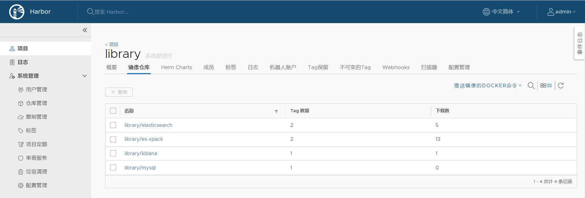


# 参考

1. <https://kubernetes.io/docs/concepts/overview/what-is-kubernetes/>

2. <https://kubernetes.io/docs/tasks/access-application-cluster/web-ui-dashboard/>

3. <https://github.com/goharbor/harbor>

4. <https://doc.traefik.io/traefik/>

5. <https://rancher.com/docs/rancher/v2.x/en/>

6. <https://github.com/kubernetes-sigs>

7. <https://zhuanlan.zhihu.com/p/109458069>

8. <https://kubernetes.github.io/ingress-nginx/deploy/>


---

End
