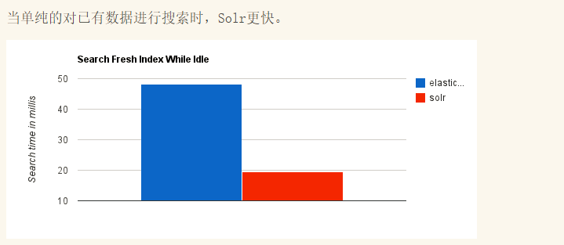

**Elasticsearch**是一个实时分布式搜索和分析引擎。它让你以前所未有的速度处理大数据成为可能。Elasticsearch是一个基于Apache Lucene(TM)的开源搜索引擎。无论在开源还是专有领域，Lucene可以被认为是迄今为止最先进、性能最好的、功能最全的搜索引擎库。Elasticsearch也使用Java开发并使用Lucene作为其核心来实现所有索引和搜索的功能，但是它的目的是通过简单的 RESTful API 来隐藏Lucene的复杂性，从而让全文搜索变得简单。

<!-- more -->

*StackOverflow结合全文搜索与地理位置查询，以及more-like-this功能来找到相关的问题和答案。Github使用Elasticsearch检索千亿行代码。*

**Solr**是Apache下的一个顶级开源项目，采用Java开发，它是基于Lucene的全文搜索服务器。Solr提供了比Lucene更为丰富的查询语言，同时实现了可配置、可扩展，并对索引、搜索性能进行了优化。

Solr可以独立运行，运行在Jetty、Tomcat等这些Servlet容器中，Solr 索引的实现方法很简单，用 POST 方法向 Solr 服务器发送一个描述 Field 及其内容的 XML 文档，Solr根据xml文档添加、删除、更新索引 。Solr 搜索只需要发送 HTTP GET 请求，然后对 Solr 返回Xml、json等格式的查询结果进行解析，组织页面布局。Solr不提供构建UI的功能，Solr提供了一个管理界面，通过管理界面可以查询Solr的配置和运行情况。

**ES和Solr的部分区别：**

Solr 利用 Zookeeper 进行分布式管理；Elasticsearch内置Zen，需要专用的主节点才能进行分裂脑保护。solr一般部署到web服务器上，比如tomcat，solr的本质是一个动态web项目。

Solr 支持更多格式的数据(JSON/XML/CSV)，Elasticsearch 仅支持json文件格式。

Solr 官方提供的功能更多，而 Elasticsearch 本身更注重于核心功能，高级功能多有第三方插件提供，例如图形化界面需要kibana友好支撑。

Solr 查询快，但更新索引时慢（即插入删除慢），用于电商等查询多的应用；ES建立索引快（即查询慢），即实时性查询快。Solr是传统搜索应用的有力解决方案，但 Elasticsearch 更适用于新兴的实时搜索应用。

Solr拥有更大，更成熟的用户，开发者和贡献者社区。ES拥有的规模较小但活跃的用户社区以及不断增长的贡献者社区。

Solr更加面向文本搜索，Elasticsearch通常用于过滤和分组 - 分析查询工作负载 - 而不一定是文本搜索。

**Lucene**曾经是Apache Jakarta项目（Jakarta has been retired on 2011/12/21）的一个子项目（Maven, POI也是），是一个开放源代码的全文检索引擎工具包，但它不是一个完整的全文检索引擎，而是一个**全文检索引擎的架构**，提供了完整的查询引擎和索引引擎，部分文本分析引擎（英文与德文两种西方语言）。Lucene的目的是为软件开发人员提供一个简单易用的工具包，以方便在目标系统中实现全文检索的功能，或者是以此为基础建立起完整的全文检索引擎。

数据总体分为两种：**结构化数据**和**非结构化数据**。

**结构化数据**： 指具有固定格式或有限长度的数据，如数据库，元数据等。

**非结构化数据**： 非结构化数据又可称为全文数据，指不定长或无固定格式的数据，如邮件，word文档等。

非结构化数据查询方法包括以下两种方法：

**顺序扫描**(Serial Scanning)

**全文搜索**(Full-text Search)

将非结构化数据中的一部分信息提取出来，重新组织，使其变得有一定结构，然后对此有一定结构的数据进行搜索，从而达到搜索相对较快的目的。这部分从非结构化数据中提取出的然后重新组织的信息，我们称之**索引**。

