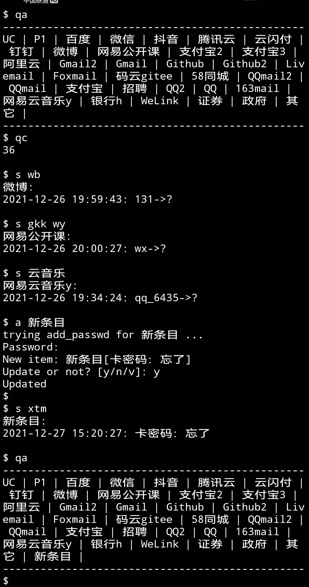

> 密码百八十个，又不便明文记录在手机或本子上，只记提示符时间一长看着一堆简略的提示符也傻眼，市场上的密码管理app虽然界面好看但也不敢用，安卓开发又不hui，索性鼓捣一个命令行工具


<!-- more -->


效果图：




加密/解密：

```python
class MyPass(object):
    def __init__(self, file_passwd='./passwd'):
        self.encrypt_head = bytes('MYPASSWD_HEAD', encoding="utf8")
        self.secret = ''

    def decrypt(self, content, encode=False, decode=True):
        """ bytes -> str
        """
        if len(self.secret) == 0:
            print("Warning: the secret is empty")
        elif decode and not content.startswith(self.encrypt_head):
            print("The content has already been decrypt")
            return content

        content = content[len(self.encrypt_head):]

        from itertools import cycle
        result = bytes()
        temp = cycle(self.secret)
        for ch in content:
            result += bytes(chr(ch ^ ord(next(temp))), encoding="utf8")

        return result.decode(encoding="utf8")

    def encrypt(self, content, encode=True, decode=False):
        """ bytes -> bytes
        """
        if len(self.secret) == 0:
            print("Warning: the secret is empty")
        elif encode and content.startswith(self.encrypt_head):
            print("The content has already been encrypt")
            return content

        from itertools import cycle
        result = self.encrypt_head
        temp = cycle(self.secret)

        for bt in content:
            result += bytes(chr(bt ^ ord(next(temp))), encoding="utf8")

        return result
```


[附件：mypass.py](/assets/files/mypass.py)

