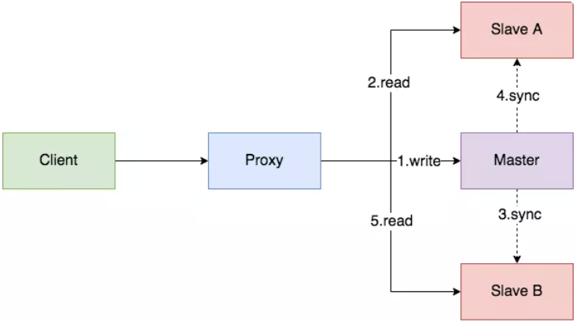
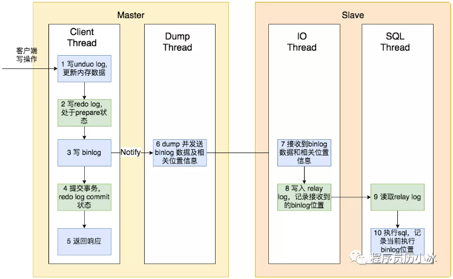
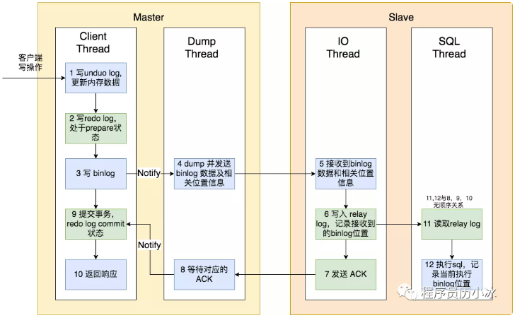
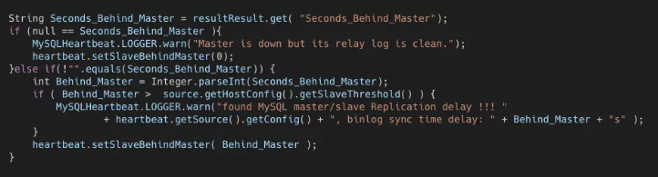
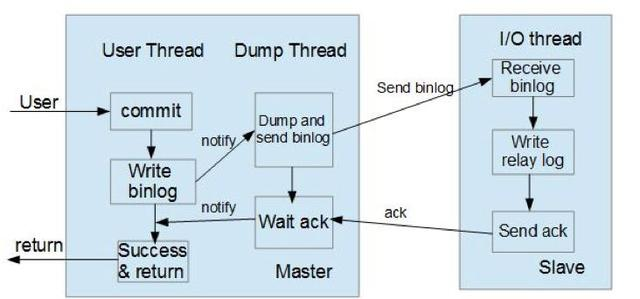

## 主从延迟
主从复制中有两个很重要的日志文件，binlog和relay log，分别位于主库与从库中。其中 binlog 是主从复制的基础，通过将操作事件写入 binlog 通过 I/O 线程传送至从库进行同步。

主从延迟可能的原因：
- 从库中 SQL 线程重放的过程是随机写盘的，并且 SQL 线程是单线程的，因此数据来不及重放的话就会导致主从延迟。
- **主库并发高**会导致写操作不断写入 binlog，对于 SQL 线程说可能会应接不暇，也会产生主从延迟。
- 重放过程中如果遇到**锁等待**也是产生延迟的原因之一。

<!-- more -->

一些处理方法：

**1. 并行复制**
MySQL 5.6 版本后，提供了一种并行复制的方式，通过将 SQL 线程转换为多个 work 线程来进行重放

**2. 降低主库写并发，降低从库读并发**
通过**限流**措施降低读并发、写并发
使用redis降低读从库的压力

**3. 读主库**
配置主库可写可读


---


## 主库查询更新受主从复制的影响

新建备库级联到主库会将主库上大量的binlog拉到本地保存为relaylog，这个阶段会导致主库网络流量非常大，从而引发主库的查询更新等受到影响。

新建slave连到master时，会将主库上大量的binlog（几百G）拉取到本地保存为relay log，会导致两个问题：
- 主库网络带宽被占满 
- 主库的磁盘I/O负载很高


解决思路：
**1. 在备库拉主库binlog的IO线程上做限流，每拉一定数据量M的binlog则sleep时间N**
这个测试效果比较明显，但存在如下几个问题：
- 参数比较难控制 需要DBA根据实际场景调整来获得预期的网络流量，这个过程可能需要多次尝试才可能获取到预期行为
- 存在抖动 在sleep时刻明显能观察到不均匀的网络流量

**2. 在socket的选型上做改进**

**3.考虑到瓶颈在网络带宽和磁盘I/O上，可以改进架构，改为slave级联的架构，但是维护的成本会相应增加，需要权衡场景。**

**4.考虑使用SSD**


*原文：https://blog.51cto.com/laoxu/1413257*


---


## MySQL读写分离：如何解决写完读不到问题

MySQL经典的**一主两从**是大多数创业公司初期使用的主流数据存储方案之一。








上图是默认的**异步同步模式**，我们发现，从主节点提交成功到从节点同步完成，中间间隔了6、7、8、9、10多个步骤，涉及到一次网络传输，多次文件读取和写入的磁盘 IO 操作，以及最后的 SQL 执行的 CPU 操作。

所以，当主从节点间网络传输出现问题，或者从节点性能较低时，主从节点间的同步就会出现延迟，导致写后读不到的问题。在高并发场景，从节点一般要过几十毫秒，甚至几百毫秒才能读到最新的状态。


**常见的解决策略**

一般来讲，大致有如下方案解决写后读不出问题：
- 强制走主库
- 判断主备无延迟
- 等主库位点或 GTID 方案


**1. 强制走主库**
这种方案问题在于将一部分读压力给了主节点，部分违背了读写分离的初衷，降低了整个系统的扩展性。


**2. 判断主备无延迟**
第二种方案是使用 show slave status 语句结果中的部分值来判断主从同步的延迟时间：

```
> show slave status
*************************** 1. row ***************************
Master_Log_File: mysql-bin.001822
Read_Master_Log_Pos: 290072815
Seconds_Behind_Master: 2923
Relay_Master_Log_File: mysql-bin.001821
Exec_Master_Log_Pos: 256529431
Auto_Position: 0
Retrieved_Gtid_Set: 
Executed_Gtid_Set: 
.....
```

- *seconds_behind_master*，表示落后主节点秒数，如果此值为0，则表示主从无延迟；
- *Master_Log_File 和 Read_Master_Log_Pos*，表示的是读到的主库的最新位点，Relay_Master_Log_File 和 Exec_Master_Log_Pos，表示的是备库执行的最新位点。如果这两组值相等，则表示主从无延迟；
- *Auto_Position=1* ，表示使用了 GTID 协议，并且备库收到的所有日志的 GTID 集合 Retrieved_Gtid_Set 和 执行完成的 GTID 集合 Executed_Gtid_Set 相等，则表示主从无延迟。


在进行读操作前，先根据上述方式来判断主从是否有延迟。如果有延迟，则一直等待到无延迟后执行。但是这类方案在判断是否有延迟时存在着假阳和假阴的问题：

- *判断无延迟，其他延迟了*。因为上述判断是基于从节点的状态，当主节点的 Dump Thread 尚未将最新状态发送给从节点的 IO SQL 时，从节点可能会错误的判断自己和主节点无延迟。
- *判断有延迟，但是读操作读取的最新状态已经同步*。因为 MySQL 主从复制是一直在进行的，写后直接读的同时可能还有其他无关写操作，虽然主从有延迟，但是对于第一次写操作的同步已经完成，所以读操作已经可以读到最新的状态。


对于第一个问题，需要使用主从复制的 **semi-sync 模式**，即**半同步模式**，上文中讲解介绍的是默认的异步模式，semi-sync 模式的流程如下图所示：




主节点只需要接收到其中一台从节点的ACK，就会commit，所以对于一主多从的模式，该方案无效。

虽然该方案有种种问题，但是对于一致性要求不那么高的场景也能适用，比如 MyCat 就是用 seconds_behind_master 是否落后主节点过多，如果超过一定阈值，就将其从有效从节点列表中删除，不再将读请求路由到它身上。

在 MyCAT 的用于监听从节点状态，发送心跳的 MySQLDetector 类中，它会读取从节点的 seconds_behind_master，如果其值大于配置的 slaveThreshold，则将打印日志，并将延迟时间设置到心跳信息中。




半同步模式(mysql semi-sync)
这种模式下主节点只需要接收到其中一台从节点的返回信息，就会commit；否则需要等待直到超时时间然后切换成异步模式再提交；这样做的目的可以使主从数据库的数据延迟缩小，可以提高数据安全性，确保了事务提交后，binlog至少传输到了一个从节点上，不能保证从节点将此事务更新到db中。性能上会有一定的降低，响应时间会变长。如下图所示：




半同步模式不是mysql内置的，从mysql 5.5开始集成，需要master 和slave 安装插件开启半同步模式。


**3. 等待GTID**
首先介绍一下 GTID，也就是**全局事务ID**，是一个事务在提交的时候生成的，是这个事务的唯一标识。它由MySQL 实例的 uuid 和一个整数组成，该整数由该实例维护，初始值是 1，每次该实例提交事务后都会加一。

MySQL 提供了一条基于 GTID 的命令，用于在从节点上执行，等待从库同步到了对应的 GTID（binlog文件中会包含 GTID）或者超时返回。

MySQL 在执行完事务后，会将该事务的 GTID 会给客户端，然后客户端可以使用该命令去要执行读操作的从库中执行，等待该GTID，等待成功后，再执行读操作。如果等待超时，则去主库执行读操作，或者再换一个从库执行上述流程。


*来源：程序员历小冰*


---


## 隐式类型转换导致的慢SQL

业务方反馈了一个问题，说是某一服务每次在查询的时候会有0.5s的延迟：

```sql
SELECT * FROM `account` 
WHERE  
`accountid` = 20000000528 
and 
`accounttype` = 1 
and 
`appid`=10005;
```

```sh
mysql--dba_admin 12:59:09>>show create table account\G
*************************** 1. row ***************************
       Table: account
Create Table: CREATE TABLE `account` (
  `appid` int(4) unsigned NOT NULL,
  `uid` bigint(8) unsigned NOT NULL,
  `accountid` char(32) NOT NULL DEFAULT '',
  `accounttype` int(4) unsigned NOT NULL,
  `mtime` bigint(8) unsigned NOT NULL DEFAULT '0',
  `id` bigint(20) NOT NULL,
  PRIMARY KEY (`id`),
  KEY `appid` (`appid`,`accountid`,`accounttype`,`uid`)
) ENGINE=InnoDB DEFAULT CHARSET=utf8
1 row in set (0.00 sec)
```


修改1：

```sql
SELECT uid FROM `account` 
WHERE  
`accountid` = 20000000528 
and 
`accounttype` = 1 
and 
`appid`=10005;
```


业务方反馈说是并没有明显的降低查询时间。时间还是在0.3s左右，还是不能满足需求。开始怀疑这个表的索引创建的是否有问题：

```sh
mysql >>select distinct accounttype from account limit 10;
+-------------+
| accounttype |
+-------------+
|           1 |
+-------------+
1 row in set (0.02 sec)

mysql >>select distinct appid  from account limit 10;
+-------------+
|   appid     |
+-------------+
|       10005 |
+-------------+
1 row in set (0.02 sec)
```


发现appid的值目前只包含一个10005，而accounttype的值也只包含数字1，而accountid和uid的值包含5w左右。

修改索引字段

联合索引：key appid(appid,accountid,accounttype,uid)  不合理，因为appid和accounttype的值基数太小，只有1，所以这个索引应该修改，具体的改法有很多，我是通过修改联合索引的先后顺序，将基数大的字段放在前面，这样扫描的时候能够过滤的更加准确一些。将索引改为：

key 'idx_accid' (accountid,uid,appid,accounttype)

查看执行计划：

```sh
mysql--dba_admin 13:05:51>>explain SELECT uid FROM `account` WHERE  `accountid` = 20000000528;
+----+-------------+---------+-------+---------------+-----------+---------+------+-------+--------------------------+
| id | select_type | table   | type  | possible_keys | key       | key_len | ref  | rows  | Extra                    |
+----+-------------+---------+-------+---------------+-----------+---------+------+-------+--------------------------+
|  1 | SIMPLE      | account | index | idx_accid     | idx_accid | 112     | NULL | 57237 | Using where; Using index |
+----+-------------+---------+-------+---------------+-----------+---------+------+-------+--------------------------+
1 row in set (0.00 sec)
```

发现没走索引。

最终定位到原因是：accountid在表中应该是一个char类型的，但是在SQL语句中写成了整数类型，发生了隐式类型转换，导致索引不可用。

应修改为：

```sql
SELECT uid FROM `account` 
WHERE  
`accountid` = '20000000528'
and 
`accounttype` = 1 
and 
`appid`=10005;
```


总结：
- 索引的创建，应该选择基数多的列作为索引列，这样比较有区分度，可以减少扫描行数；
- 查询SQL，不要返回无用的字段，有可能错失最佳查询路径，例如select * 不能用到覆盖索引；
- 查询SQL中的数据类型一定要匹配，否则一旦产生了隐式转换，就有可能用不到索引。


*来源：DAB随笔，一个慢SQL，一波三折...*


