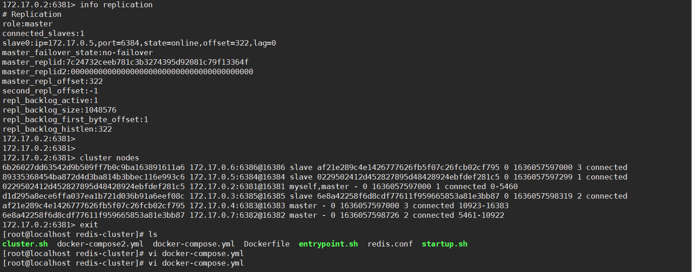
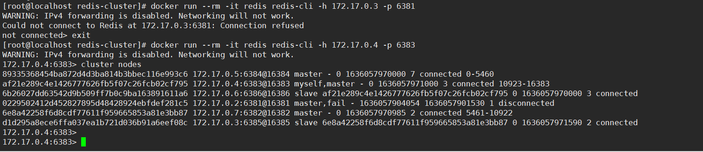
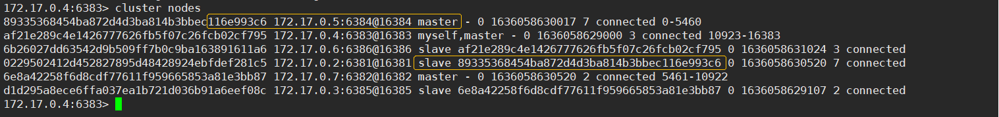

> [Redis笔记01](https://lzzeng.github.io/2021/redis-questions/)


## 线程模型

单线程模型，文件事件处理器通过IO多路复用 监听多个socket（socket执行accept read write close等操作产生文件事件），然后由文件事件处理器处理文件事件。

<!-- more -->


## 持久化方式

rdb：快照

```
save 900 1
save 300 10
save 60 10000
```


aof： 默认配置的是 appendonly no，改成yes打开AOF模式


## 如何连接Redis

1～使用实现了一致性哈希算法的proxy中间件twemproxy
2～Java使用Jedis、ShardedJedis、JedisPool、JedisSentinelPool（哨兵模式）或JedisCluster（Redis cluster模式）连接redis


Jedis 2.9.1存在的一个bug: <https://blog.csdn.net/u013527895/article/details/103121558>

Jedis加载redis集群的第一个节点如果异常不在线，并且redis设置了密码的话，会因连接异常退出不再尝试下一个节点。所谓第一个节点，就是所有redis节点加载到HashSet<HostAndPort>集合后集合里第一个元素。

```java
//src/main/java/redis/clients/jedis/JedisClusterConnectionHandler.java
  private void initializeSlotsCache(Set<HostAndPort> startNodes, GenericObjectPoolConfig poolConfig, int connectionTimeout, int soTimeout, String password, String clientName) {
    for (HostAndPort hostAndPort : startNodes) {
      Jedis jedis = null;
      try {
        jedis = new Jedis(hostAndPort.getHost(), hostAndPort.getPort(), connectionTimeout, soTimeout);
        if (password != null) {
          jedis.auth(password);
        }
        if (clientName != null) {
          jedis.clientSetname(clientName);
        }
        cache.discoverClusterNodesAndSlots(jedis);
        break;
      } catch (JedisConnectionException e) {
        // try next nodes
      } finally {
        if (jedis != null) {
          jedis.close();
        }
      }
    }
  }
```


## Jedis连接Redis代码参考

深入剖析Redis客户端Jedis的特性和原理: <https://baijiahao.baidu.com/s?id=1715292157796722813&wfr=spider&for=pc>


主从模式连接：Jedis

```java
import redis.clients.jedis.Jedis;

public class MasterAndSlaveTest {
    public static void main(String[] args) throws InterruptedException {
        Jedis jedis_M = new Jedis("192.168.248.129",6379); //主机
        Jedis jedis_S = new Jedis("192.168.248.129",6380); //从机
        
        //遵循“配从不配主”的模式
        jedis_S.slaveof("192.168.248.129",6379);
        
        jedis_M.set("class", "8888"); //主机去写
        
        //内存中读写太快，防止读在写之前先完成而出现null的情况，这里做一下延迟
        Thread.sleep(2000);
        String result = jedis_S.get("class"); //从机去读
        System.out.println(result);
    }
}
```


多个redis实例（非cluster）：ShardedJedis，一致性哈希算法

```java
import java.util.ArrayList;
import java.util.List;
import redis.clients.jedis.JedisShardInfo;
import redis.clients.jedis.ShardedJedis;

List<JedisShardInfo> shards = new ArrayList<>();
JedisShardInfo info = null ;
for (String address : addresss.split(",")) {
    String[] hostAndPort = address.split(":");
    info = new JedisShardInfo(hostAndPort[0], Integer.valueOf(hostAndPort[1]));
    shards.add(info);
}
shardedJedis = new ShardedJedis(shards);
shardedJedis.set("a", "123");
shardedJedis.get("a");
```


哨兵模式连接：JedisSentinelPool

```java 
import redis.clients.jedis.JedisPoolConfig;
import redis.clients.jedis.JedisSentinelPool

//1.设置sentinel 各个节点集合
Set<String> sentinelSet = new HashSet<>();
sentinelSet.add("192.168.14.101:26379");
sentinelSet.add("192.168.14.102:26379");
sentinelSet.add("192.168.14.103:26379");

//2.设置jedispool 连接池配置文件
JedisPoolConfig config = new JedisPoolConfig();
config.setMaxTotal(10);
config.setMaxWaitMillis(1000);

//3.设置mastername,sentinelNode集合,配置文件,Redis登录密码
JedisSentinelPool jedisSentinelPool = new JedisSentinelPool("mymaster",sentinelSet,config,"123");
Jedis jedis = null;
try {
    jedis = jedisSentinelPool.getResource();
    //获取Redis中key=hello的值
    String value = jedis.get("hello");
    System.out.println(value);
} catch (Exception e) {
    e.printStackTrace();
} finally {
    if(jedis != null){
        jedis.close();
    }
}
```


cluster模式连接：JedisCluster，哈希槽算法

```java
 import java.util.HashSet;
 import java.util.Set;
 import redis.clients.jedis.HostAndPort;
 import redis.clients.jedis.JedisCluster;

 public class TestJedisCluster {
  public static void main(String[] args) {
    //1、创建jedidsCluster客户端
    //创建一个set集合，用来封装所有redis节点的信息
    Set<HostAndPort> nodes = new HashSet<>();
    
    nodes.add(new HostAndPort("192.168.23.12", 7001));
    nodes.add(new HostAndPort("192.168.23.12", 7002));
    nodes.add(new HostAndPort("192.168.23.12", 7003));
    //...
    
    JedisCluster cluster = new JedisCluster(nodes);
    
    String name = cluster.get("user:id:1:name");
    cluster.set("user:id:1:address", "你好呀");
    String address = cluster.get("user:id:1:address");
    
    System.out.println("name:"+name);
    System.out.println("address:"+address);     
    if(null!=cluster){
        cluster.close();
    }}}
```


## 集群操作

5.0版本之前使用redis-trib.rb ruby脚本操作redis集群，5.0以上统一使用redis-cli操作。

redis cluster半数以下的节点陆续下线后，集群仍可正常提供服务，节点重新上线后，节点上原master变成slave，后面不发生异常的话，不会自动调转过来。


## 创建redis-cluster

哨兵模式可参考：<https://github.com/AliyunContainerService>


多容器创建redis cluster:

Dockerfile:

```yaml
FROM redis

RUN ln -sf /usr/share/zoneinfo/Asia/Shanghai /etc/localtime
RUN echo 'Asia/Shanghai' >/etc/timezone

EXPOSE $REDIS_PORT
# EXPOSE $REDIS_PORT_NODE

COPY entrypoint.sh /usr/local/bin/
COPY redis.conf /usr/local/etc/

RUN chmod 777 /usr/local/etc/redis.conf
RUN chmod +x /usr/local/bin/entrypoint.sh

ENTRYPOINT ["/usr/local/bin/entrypoint.sh"]
CMD ["redis-server", "/usr/local/etc/redis.conf"]
```


redis.conf:

```
#端口
port REDIS_PORT
#开启集群
cluster-enabled yes
#配置文件
cluster-config-file nodes.conf
cluster-node-timeout 5000
#更新操作后进行日志记录
appendonly yes
#设置主服务的连接密码
# masterauth
#设置从服务的连接密码
# requirepass
```


docker-compose.yml:

```yaml
redis1:
 image: redis-cluster
 restart: always
 volumes:
  - /data/redis-cluster/6381/data:/data
 environment:
  - REDIS_PORT=6381
 ports:
   - '6381:6381'
   - '16381:16381'

# 其余5个依次可定6382
...
redis6:
...
```

这里，其实可以让6个容器都保持默认6379端口，但宿主机端口不能重复。


cluster.sh：

```sh
#!/bin/sh

para=""
port=6380
for i in `seq 1 6`
do
  ipaddr=$(docker inspect redis-cluster_redis${i}_1 |jq '.[0].NetworkSettings.Networks.bridge.IPAddress' |sed 's/\"//g')
  let port=port+1
  echo $ipaddr:$port
  para="$para $ipaddr:$port"
done

docker run --rm -it inem0o/redis-trib create --replicas 1 $para
```


entrypoint.sh：

```sh
#!/bin/sh

set -e

# allow the container to be started with `--user`
if [ "$1" = 'redis-server' -a "$(id -u)" = '0' ]; then
    sed -i 's/REDIS_PORT/'$REDIS_PORT'/g' /usr/local/etc/redis.conf
    chown -R redis .
    exec gosu redis "$0" "$@"  #gosu是sudo轻量级”替代品”
fi

exec "$@"
```


构建、启动：

```
[root@localhost redis-cluster]# docker build -t redis-cluster .  
[root@localhost redis-cluster]# docker-compose up -d
[root@localhost redis-cluster]# docker-compose ps
         Name                       Command               State                             Ports                           
----------------------------------------------------------------------------------------------------------------------------
redis-cluster_redis1_1   /usr/local/bin/entrypoint. ...   Up      0.0.0.0:16381->16381/tcp, 6379/tcp, 0.0.0.0:6381->6381/tcp
redis-cluster_redis2_1   /usr/local/bin/entrypoint. ...   Up      0.0.0.0:16382->16382/tcp, 6379/tcp, 0.0.0.0:6382->6382/tcp
redis-cluster_redis3_1   /usr/local/bin/entrypoint. ...   Up      0.0.0.0:16383->16383/tcp, 6379/tcp, 0.0.0.0:6383->6383/tcp
redis-cluster_redis4_1   /usr/local/bin/entrypoint. ...   Up      0.0.0.0:16384->16384/tcp, 6379/tcp, 0.0.0.0:6384->6384/tcp
redis-cluster_redis5_1   /usr/local/bin/entrypoint. ...   Up      0.0.0.0:16385->16385/tcp, 6379/tcp, 0.0.0.0:6385->6385/tcp
redis-cluster_redis6_1   /usr/local/bin/entrypoint. ...   Up      0.0.0.0:16386->16386/tcp, 6379/tcp, 0.0.0.0:6386->6386/tcp
[root@localhost redis-cluster]# 
[root@localhost redis-cluster]# sh cluster.sh 
172.17.0.2:6381
172.17.0.7:6382
172.17.0.4:6383
172.17.0.5:6384
172.17.0.3:6385
172.17.0.6:6386
172.17.0.2:6381 172.17.0.7:6382 172.17.0.4:6383 172.17.0.5:6384 172.17.0.3:6385 172.17.0.6:6386
WARNING: IPv4 forwarding is disabled. Networking will not work.
>>> Creating cluster
>>> Performing hash slots allocation on 6 nodes...
Using 3 masters:
172.17.0.2:6381
172.17.0.7:6382
172.17.0.4:6383
Adding replica 172.17.0.5:6384 to 172.17.0.2:6381
Adding replica 172.17.0.3:6385 to 172.17.0.7:6382
Adding replica 172.17.0.6:6386 to 172.17.0.4:6383
M: 0229502412d452827895d48428924ebfdef281c5 172.17.0.2:6381
   slots:0-5460 (5461 slots) master
M: 6e8a42258f6d8cdf77611f959665853a81e3bb87 172.17.0.7:6382
   slots:5461-10922 (5462 slots) master
M: af21e289c4e1426777626fb5f07c26fcb02cf795 172.17.0.4:6383
   slots:10923-16383 (5461 slots) master
S: 89335368454ba872d4d3ba814b3bbec116e993c6 172.17.0.5:6384
   replicates 0229502412d452827895d48428924ebfdef281c5
S: d1d295a8ece6ffa037ea1b721d036b91a6eef08c 172.17.0.3:6385
   replicates 6e8a42258f6d8cdf77611f959665853a81e3bb87
S: 6b26027dd63542d9b509ff7b0c9ba163891611a6 172.17.0.6:6386
   replicates af21e289c4e1426777626fb5f07c26fcb02cf795
Can I set the above configuration? (type 'yes' to accept): yes
>>> Nodes configuration updated
>>> Assign a different config epoch to each node
>>> Sending CLUSTER MEET messages to join the cluster
Waiting for the cluster to join.
>>> Performing Cluster Check (using node 172.17.0.2:6381)
M: 0229502412d452827895d48428924ebfdef281c5 172.17.0.2:6381
   slots:0-5460 (5461 slots) master
   1 additional replica(s)
S: 6b26027dd63542d9b509ff7b0c9ba163891611a6 172.17.0.6:6386@16386
   slots: (0 slots) slave
   replicates af21e289c4e1426777626fb5f07c26fcb02cf795
S: 89335368454ba872d4d3ba814b3bbec116e993c6 172.17.0.5:6384@16384
   slots: (0 slots) slave
   replicates 0229502412d452827895d48428924ebfdef281c5
S: d1d295a8ece6ffa037ea1b721d036b91a6eef08c 172.17.0.3:6385@16385
   slots: (0 slots) slave
   replicates 6e8a42258f6d8cdf77611f959665853a81e3bb87
M: af21e289c4e1426777626fb5f07c26fcb02cf795 172.17.0.4:6383@16383
   slots:10923-16383 (5461 slots) master
   1 additional replica(s)
M: 6e8a42258f6d8cdf77611f959665853a81e3bb87 172.17.0.7:6382@16382
   slots:5461-10922 (5462 slots) master
   1 additional replica(s)
[OK] All nodes agree about slots configuration.
>>> Check for open slots...
>>> Check slots coverage...
[OK] All 16384 slots covered.
[root@localhost redis-cluster]#
```


连接redis1：

```
[root@localhost redis-cluster]# docker run --rm -it redis redis-cli -h 172.17.0.2 -p 6381
172.17.0.2:6381> info replication
# Replication
role:master
connected_slaves:1
slave0:ip=172.17.0.5,port=6384,state=online,offset=322,lag=0
master_failover_state:no-failover
master_replid:7c24732ceeb781c3b3274395d92081c79f13364f
master_replid2:0000000000000000000000000000000000000000
master_repl_offset:322
second_repl_offset:-1
repl_backlog_active:1
repl_backlog_size:1048576
repl_backlog_first_byte_offset:1
repl_backlog_histlen:322
172.17.0.2:6381> 
172.17.0.2:6381> 
172.17.0.2:6381> cluster nodes
6b26027dd63542d9b509ff7b0c9ba163891611a6 172.17.0.6:6386@16386 slave af21e289c4e1426777626fb5f07c26fcb02cf795 0 1636057597000 3 connected
89335368454ba872d4d3ba814b3bbec116e993c6 172.17.0.5:6384@16384 slave 0229502412d452827895d48428924ebfdef281c5 0 1636057597299 1 connected
0229502412d452827895d48428924ebfdef281c5 172.17.0.2:6381@16381 myself,master - 0 1636057597000 1 connected 0-5460
d1d295a8ece6ffa037ea1b721d036b91a6eef08c 172.17.0.3:6385@16385 slave 6e8a42258f6d8cdf77611f959665853a81e3bb87 0 1636057598319 2 connected
af21e289c4e1426777626fb5f07c26fcb02cf795 172.17.0.4:6383@16383 master - 0 1636057597000 3 connected 10923-16383
6e8a42258f6d8cdf77611f959665853a81e3bb87 172.17.0.7:6382@16382 master - 0 1636057598726 2 connected 5461-10922
172.17.0.2:6381> 
```




stop/restart redis1:

```
[root@localhost redis-cluster]# docker-compose stop redis1
Stopping redis-cluster_redis1_1 ... done
```



master fail一个，对应的slave 172.17.0.5:6384变成新的master了。

重新上线redis1：172.17.0.5:6384，它是新master的slave了。




---

（待续）