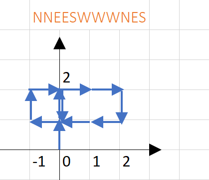

> 小车从原点（0，0）出发，N、E、W、S分别表示向北/东/南/西走一步。
> 示例图为按**NNEESWWWNES**行驶后的路线，共有2个交点。
>
> 输入：NEWS组成的字符串
> 输出：交点的个数




<!-- more -->


## 一

不考虑方向，同向多次经过同一个点即认为是交点：

```java
import java.util.*;

public class Crossing {
    public static void main(String[] main) {
        Solution solution = new Solution();
        int n = solution.getCrossingNum("NWSEN");
        System.out.println(n);
    }
}

class Solution {
    public int getCrossingNum(String s) {
        int count = 0, d;
        Map<Point, Integer> points = walk(s);
        for (Point p : points.keySet()) {
            d = points.get(p);
            if (d >= 2) {
                count++;
            }
        }
        return count;
    }

    public Map<Point, Integer> walk(String s) {
        Map<Point, Integer> points = new HashMap<>();
        Point p0 = new Point(0, 0);
        for (char ch : s.toCharArray()) {
            switch (ch) {
                case 'N':
                    p0.y += 1;
                    break;
                case 'E':
                    p0.x += 1;
                    break;
                case 'S':
                    p0.y -= 1;
                    break;
                case 'W':
                    p0.x -= 1;
                    break;
            }

            Point p = new Point(p0.x, p0.y);
            if (points.containsKey(p)) {
                points.put(p, points.get(p) + 1);
            } else {
                points.put(p, 1);
            }
        }

        return points;
    }
}

class Point {
    int x;
    int y;

    public Point(int x, int y) {
        this.x = x;
        this.y = y;
    }

    @Override
    public boolean equals(Object o) {
        if (this == o) return true;
        if (o == null || getClass() != o.getClass()) return false;
        Point Point = (Point) o;
        return x == Point.x && y == Point.y;
    }

    @Override
    public int hashCode() {
        return Objects.hash(x, y);
    }

    @Override
    public String toString() {
        return String.format("[%d,%d]", x, y);
    }
}
```


## 二

考虑方向，从2个以上不同方向经过同一点为交点：

```java
package top.zlz.practise.cross4;

import java.util.*;

public class Crossing {
    public static void main(String[] main) {
        Solution solution = new Solution();
        int n = solution.getCrossingNum("NWSENEEWW");
        System.out.println("crossing: " + n);
    }
}


class Solution {
    public int getCrossingNum(String s) {
        int count = 0;
        Map<Point, Point> points = walk(s);
        for (Point p : points.keySet()) {
            if (p.isCrossing()) {
                System.out.println("cross at: " + p);
                count++;
            }
        }
        return count;
    }

    public Map<Point, Point> walk(String s) {
        Map<Point, Point> points = new HashMap<>();
        Map<Character, int[]> map = new HashMap<>();
        map.put('N', new int[]{0, 1, 1});
        map.put('S', new int[]{0, -1, 4});
        map.put('E', new int[]{1, 0, 2});
        map.put('W', new int[]{-1, 0, 8});
        Point p0 = new Point(0, 0, 0);
        for (char ch : s.toCharArray()) {
            p0.x += map.get(ch)[0];
            p0.y += map.get(ch)[1];
            p0.din = map.get(ch)[2];
//            switch (ch) {
//                case 'N':
//                    p0.y += 1;
//                    p0.din = 1;
//                    break;
//                case 'E':
//                    p0.x += 1;
//                    p0.din = 2;
//                    break;
//                case 'S':
//                    p0.y -= 1;
//                    p0.din = 4;
//                    break;
//                case 'W':
//                    p0.x -= 1;
//                    p0.din = 8;
//                    break;
//            }
            Point p = new Point(p0.x, p0.y, p0.din);
            if (points.containsKey(p)) {
                points.get(p).din |= p.din;
            } else {
                points.put(p, p);
            }
        }

        return points;
    }
}

class Point {
    int x;
    int y;
    int din;  //1 2 4 8 -> N E S W; 3=1+2=NE; 7=NES; 15=NESW

    public Point(int x, int y, int din) {
        this.x = x;
        this.y = y;
        this.din = din;
    }

    public boolean isCrossing000() {
        return getD() >= 2;
    }

    public boolean isCrossing() {
        int[] notCrossingDinSumArr = {0, 1, 2, 4, 5, 8, 10};  //5,10 同一条直线相对行驶过的点，不认为是交点，因为不是垂直相交
//        int[] notCrossingDinSumArr = {0, 1, 2, 4, 8};  //不考虑是否垂直相交
        return Arrays.binarySearch(notCrossingDinSumArr, din) < 0;
    }

    /* 未使用 */
    public int getD() {
        int count = 0;
        int i = din;
//        while (i != 0) {
//            i = i & (i - 1);
//            count++;
//        }
        while (i != 0) {
            if ((i & 1) == 1) {
                count++;
            }
            i = i >> 1;
        }
        return count;
    }

    @Override
    public boolean equals(Object o) {
        if (this == o) return true;
        if (o == null || getClass() != o.getClass()) return false;
        Point Point = (Point) o;
        return x == Point.x && y == Point.y;
    }

    @Override
    public int hashCode() {
        return Objects.hash(x, y);
    }

    @Override
    public String toString() {
        return String.format("[%d,%d,%d]", x, y, din);
    }
}
```


