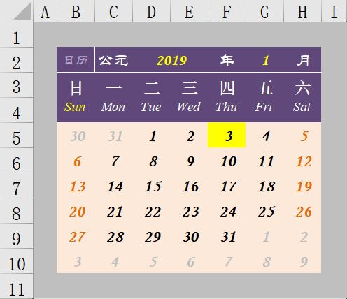
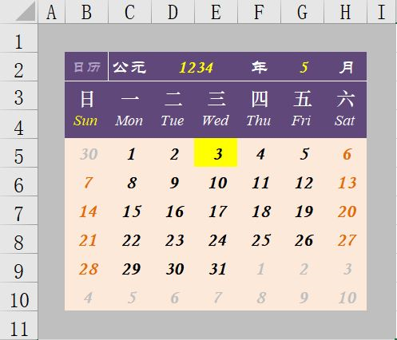
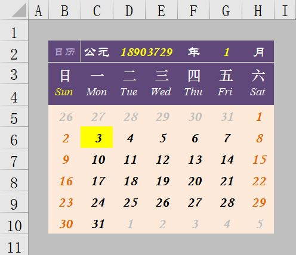
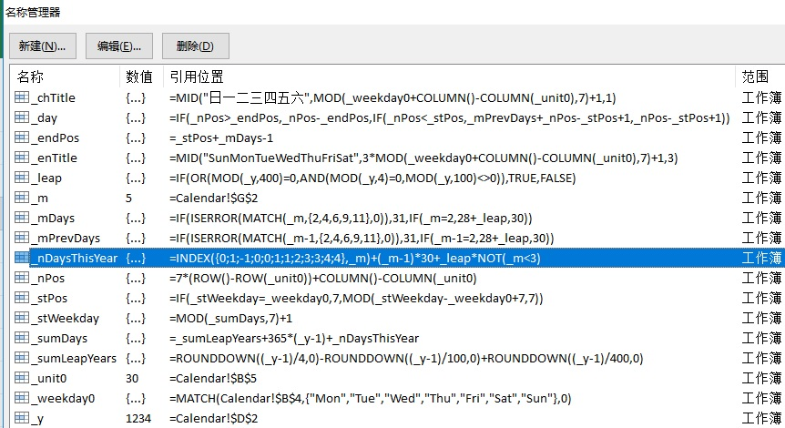

---

Excel版本：V2007以上，不使用VBA

### 效果图

**2019年**

<!-- more -->

**南宋末期公元1234年，蒙古灭金，次年麾兵南下，入侵南宋 ...**

**“地球年：18903729**
**程心把最后一个数字的位数数了三遍，然后默默转身走出穿梭机 ......” —— 《三体 - 死神永生》**

### 实现方法

**一共使用了17个自定义名称，不依赖一行VBA代码。**

这17个名称中，有2个相当于接收输入的参数：\_y对应年，\_m对应月。_unit0是单元格B5的别名。其余14个名称（公式）基于输入的年月，相互关联地完成了自动计算值的过程。

[附件：calendar.xlsx](/assets/files/calendar.xlsx)

---

（End)