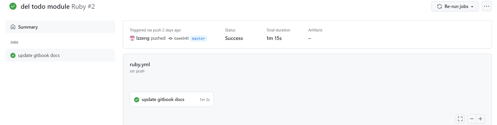
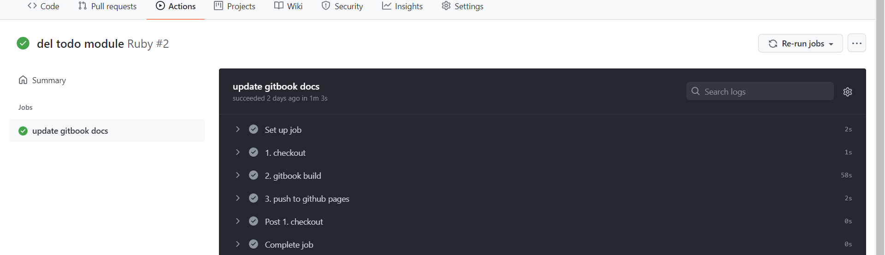
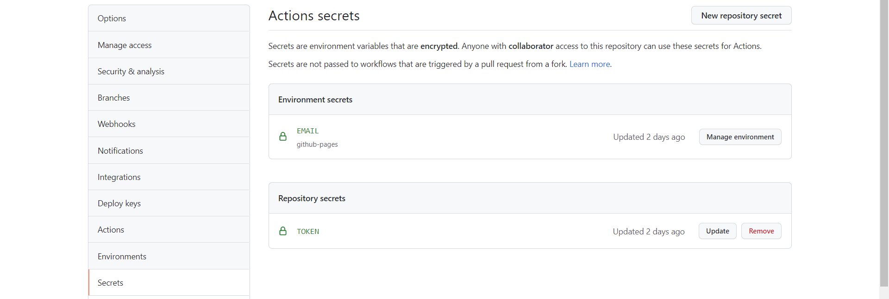
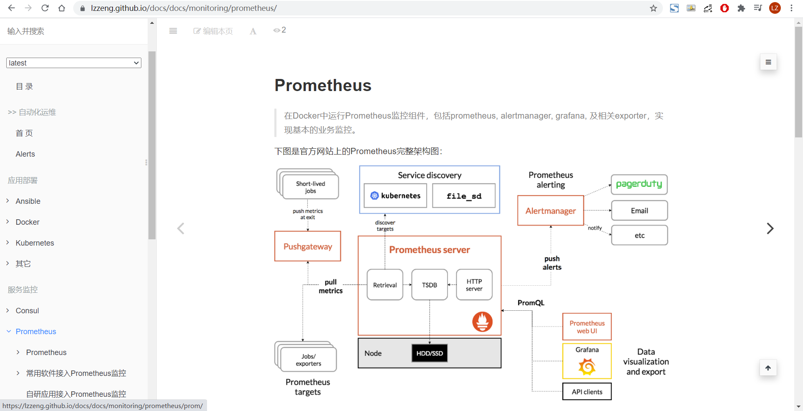

---

> Travis CI 改版后此前配置的CI出问题了，加上有10000 *credits* (1000 linux build minutes)的限制，现改用github actions构建github pages
>
> github actions的workflow文件写法，类似于gitlab的.gitlab-ci.yml，详见[官方文档](https://docs.github.com/en/actions/reference/workflow-syntax-for-github-actions)





<!-- more -->

只划分了一个stage: `update gitbook docs`，所以上图只有一个pipline标签。其中，包含3个step:




.github/workflows/ruby.yml:


```yaml
name: Ruby

on:
  push:
    branches: 
      - master

env:
  TZ: Asia/Shanghai

jobs:
  update-docs:
    name: update gitbook docs
    runs-on: ubuntu-latest
    
    steps:
    - name: 1. checkout
      uses: actions/checkout@v2

    - name: 2. gitbook build
      run: |
        rm -rf _book || exit 0
        docker run --rm -v "$(pwd):/opt/data" lzzeng/node-gitbook-cli:alpine sh -c "gitbook install && gitbook build"
    - name: 3. push to github pages
      env:
        GIT_DEPLOY_REPO: https://${{ secrets.TOKEN }}@github.com/lzzeng/docs.git
        GIT_DEPLOY_DIR: _book
        GIT_DEPLOY_BRANCH: gh-pages
        GIT_DEPLOY_USERNAME: lzzeng
      run: |
        git config --global user.email "${{ secrets.EMAIL }}"
        git config --global user.name "${GIT_DEPLOY_USERNAME}"
        cd _book
        sudo git init
        sudo git add .
        sudo git commit -m "update gh-pages"
        sudo git push --force --quiet "${GIT_DEPLOY_REPO}" master:${GIT_DEPLOY_BRANCH}
```


仓库settings：




发布后的效果：

