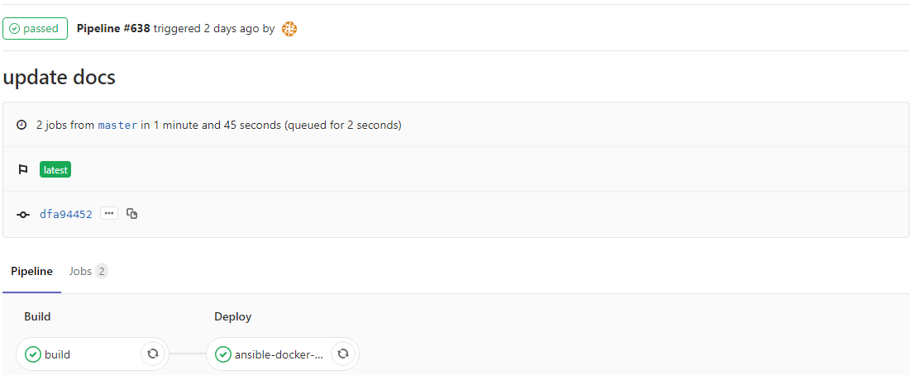

---

> [**GitLab CI/CD**](https://docs.gitlab.com/ce/ci/)是GitLab内置的工具，用于项目持续集成、持续部署。GitLab CI/CD 由位于代码仓库根目录的名为**.gitlab-ci.yml**的文件配置。而此文件中设置的脚本由GitLab Runner执行。
>
> Gitlab CI （持续集成）自动构建任务需编写配置文件 .gitlab-ci.yml

<!-- more -->

[本书](http://git.pro.keep.com/devops/docs) 通过GitLab CI/CD自动发布：




以本书的.gitlab-ci.yml为例：


```yaml
stages:
  - build
  - deploy

build:
  image: docker:stable
  stage: build
  tags:
    - dind-v19
  script:
    - docker info
    - image_name=lzzeng/docs:latest
    - docker build -t $image_name .
    - docker login -u $docker_hub_user -p $docker_hub_pass
    - docker push $image_name
  only:
    - master # this job will affect only the 'master' branch

ansible-docker:
  image: ansible-alpine:2.8.0
  stage: deploy
  tags:
    - dind-v19
  script:
    - echo "GITBOOK_HOST is $GITBOOK_HOST_DEV"
    - echo "$SSH_PRIVATE_KEY_DEV" > ~/.key
    - chmod 600 ~/.key
    - echo "$ANSIBLE_CFG_CONTENT" > ~/.ansible.cfg
    - ansible-playbook -i "$GITBOOK_HOST_DEV," --private-key ~/.key -u root deploy/inDocker.yml
```


其中，

- stages 段落表示有 有两个构建阶段，标识分别是build 和 deploy

- build段落，stage域（或属性）的值为 build, 表示这段脚本是上述build的具体执行过程

- tags域为 dind-v19， 表示本阶段构建选择tag为dind-v19的gitlab runner，这是事先已注册的一个允许构建docker镜像的执行器，且这个执行器自身也是docker容器，即 docker in docker (dind）

- build的script段：docker build 构建镜像 -> docker login 登录Docker Hub-> docker push 推送镜像至Docker Hub

- only master 表示只接受master分支更新后触发CI

- ansible-docker阶段的作用是远程登录目标机器拉取镜像、创建并运行容器


