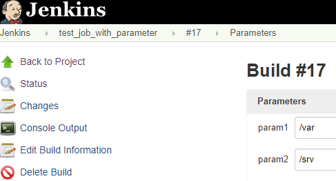
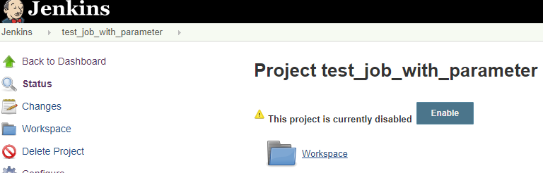

---

环境：Jenkins V2.150.1


### 获取所有job名称

命令：

```sh
# 获取crumb
crumb=$(curl -u "$jenkins_user:$jenkins_password" $jenkins_url/crumbIssuer/api/xml?xpath=concat\(//crumbRequestField,%22:%22,//crumb\))

# 获取job列表
curl -sX GET "$jenkins_url/api/json?pretty=true" -H "$crumb" -u "$jenkins_user:$jenkins_password" |grep '"url"' |grep '/job/' |sed -e 's@^.*job/\(.*\)/.*$@\1@'
```

<!-- more -->

示例：

```tex
[root@lzzeng opt]#curl -sX GET 'http://188.131.xxx.xxx:8088/jenkins/api/json?pretty=true' -H Jenkins-Crumb:a1b3b82a61bf4672e6d9003de37xxxxx -u "$jenkins_user:$jenkins_password" |grep '"url"' |grep '/job/' |sed -e 's@^.*job/\(.*\)/.*$@\1@'
test_job
test_job_with_parameter
```

### 构建job

命令：

```sh
# 无参数构建
curl -sX POST "$jenkins_url/job/$job_name/build" -u "$jenkins_user:$jenkins_password" -H "$crumb"
# 带参数构建
curl -sX POST "$jenkins_url/job/$job_name/buildWithParameters" -u "$jenkins_user:$jenkins_password" -H "$crumb" -d $parameter_name=$parameter_value
```

示例：

```tex
[root@lzzeng opt]# curl -sX POST http://188.131.xxx.xxx:8088/jenkins/job/test_job/build -u "$jenkins_user:$jenkins_password" -H Jenkins-Crumb:a1b3b82a61bf4672e6d9003de37xxxxx
[root@lzzeng opt]# curl -sX POST http://188.131.xxx.xxx:8088/jenkins/job/test_job_with_parameter/buildWithParameters -u "$jenkins_user:$jenkins_password" -H Jenkins-Crumb:a1b3b82a61bf4672e6d9003de37xxxxx -d param1=/var -d param2=/srv
[root@lzzeng opt]#
```

查看Jenkins，可以看到参数传递正确：



### 禁用job

命令：

```sh
curl -sX POST "$jenkins_url/job/$job_name/disable" -u "$jenkins_user:$jenkins_password" -H "$crumb"
```

示例：

```tex
[root@lzzeng opt]# curl -sX POST http://188.131.xxx.xxx:8088/jenkins/job/test_job_with_parameter/disable -u "$jenkins_user:$jenkins_password" -H Jenkins-Crumb:a1b3b82a61bf4672e6d9003de37xxxxx
[root@lzzeng opt]#
```



### 获取构建结果

命令：

```sh
# 最近一次构建结果
curl -sX POST "$jenkins_url/job/$job_name/lastBuild/api/json?pretty=true" -u "$jenkins_user:$jenkins_password" -H "$crumb"

# 最近一次成功的构建结果
curl -sX POST "$jenkins_url/job/$job_name/lastSuccessfulBuild/api/json?pretty=true" -u "$jenkins_user:$jenkins_password" -H "$crumb"
```

示例：

```tex
[root@lzzeng opt]# curl -sX POST http://188.131.xxx.xxx:8088/jenkins/job/test_job_with_parameter/lastBuild/api/json?pretty=true -u "$jenkins_user:$jenkins_password" -H Jenkins-Crumb:a1b3b82a61bf4672e6d9003de37xxxxx
```

如果要获取插件的结果，可以尝试添加请求参数`depth=2`，即变成`api/json?pretty=true&depth=2`

---

(End)

