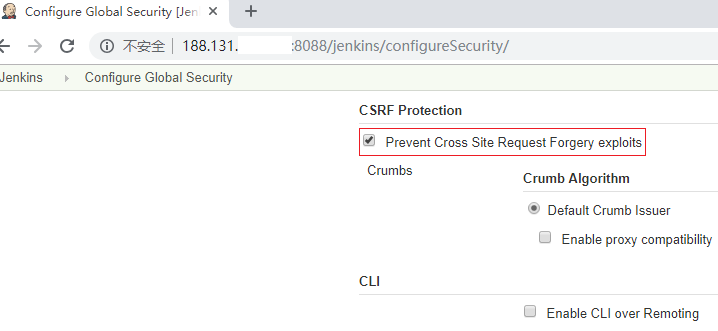

---

环境：Jenkins V2.150.1


### 检测Job是否存在

命令：

```sh
curl -X POST [-H "Content-Type:application/xml"] "$jenkins_url/checkJobName?value=$job_name" --user "$jenkins_user:$jenkins_password"
```

其中，jenkins_password一般是使用jenkins_user的Jenkins API token，直接用密码也可以。

<!-- more -->

示例：

```tex
[root@lzzeng ~]# curl -X POST -H "Content-Type:application/xml" "http://188.131.xxx.xxx:8088/jenkins/checkJobName?value=test_job" --user "$jenkins_user:$jenkins_password"
<!doctype html><html lang="en"><head><title>HTTP Status 403 – Forbidden</title>...</head><body><h1>HTTP Status 403 – Forbidden</h1><hr class="line" /><p><b>Type</b> Status Report</p><p><b>Message</b> No valid crumb was included in the request</p><p><b>Description</b> The server understood the request but refuses to authorize it.</p><hr class="line" /><h3>Apache Tomcat/9.0.14</h3></body></html>
```

显示`HTTP Status 403 – Forbidden`，原因是Jenkins开启了`Prevent Cross Site Request Forgery exploits`，即`防止跨站请求伪造`。



取消勾选，重试：

```tex
[root@lzzeng ~]# curl -X POST -H "Content-Type:application/xml" "http://188.131.xxx.xxx:8088/jenkins/checkJobName?value=test_job" --user "$jenkins_user:$jenkins_password"
<div class=error>A job already exists with the name ‘test_job’</div>
```

可以看出，Jenkins上已存在名称为`test_job`的job。

如果检测的job不存在：

```tex
[root@lzzeng ~]# curl -X POST -H "Content-Type:application/xml" "http://188.131.xxx.xxx:8088/jenkins/checkJobName?value=test_job222" --user "$jenkins_user:$jenkins_password"
<div/>[root@lzzeng ~]#
```

输出为：`<div/>`。

### 检测View是否存在

命令：

```sh
curl -X POST [-H "Content-Type:application/xml"] "$jenkins_url/checkViewName?value=$view_name" --user "$jenkins_user:$jenkins_password"
```

示例：

```tex
[root@lzzeng ~]# curl -X POST -H "Content-Type:application/xml" "http://188.131.xxx.xxx:8088/jenkins/checkViewName?value=test_view" --user "$jenkins_user:$jenkins_password"
<div class=error>A view already exists with the name &quot;test_view&quot;</div>[root@lzzeng ~]#
```

当view不存在时，和job不存在一样也是输出：`<div/>`。

据此，编写一段脚本：

```sh
function checkJobView(){
    # Usage: 
    # 1. checkJobView "job/<job_name>"
    # 2. checkJobView "view/<view_name>"

    para=$1
    prefix=${para%%/*}
    target=${para##*/}
    method=$([ "$prefix" = "job" ] && echo checkJobName || echo checkViewName)
    crumb=$(curl -s -u "$jenkins_user:$jenkins_password" $jenkins_url/crumbIssuer/api/xml?xpath=concat\(//crumbRequestField,%22:%22,//crumb\))
    resp=$(curl -sX POST "$jenkins_url/$method?value=$target" -u "$jenkins_user:$jenkins_password" -H "$crumb")
    test "$resp" != "<div/>"
}
```

作如下调用：

```sh
jenkins_url=http://188.131.xxx.xxx:8088/jenkins
jenkins_user=$jenkins_user
jenkins_password=$jenkins_password

if checkJobView $@; then
  echo "exists"
else
  echo "not exist"
fi
```

脚本文件名为checkJobView.sh，测试结果如下：

```tex
[root@lzzeng opt]# sh checkJobView.sh view/test_view
exists
[root@lzzeng opt]# sh checkJobView.sh view/test_view222
not exist
[root@lzzeng opt]# sh checkJobView.sh job/test_job
exists
[root@lzzeng opt]# sh checkJobView.sh job/test_job222
not exist
```

其中，test_view是已存在的视图，test_job是已存在的任务，所以输出表示正确。

### 备份Job

命令：

```sh
curl -s -X GET "$url_of_job_config_xml" -o "$target_xml" --user "$jenkins_user:$jenkins_password"
```

示例：

```tex
[root@lzzeng opt]# curl -sX GET "http://188.131.xxx.xxx:8088/jenkins/job/test_job/config.xml" -o test_job.xml --user "$jenkins_user:$jenkins_password"
[root@lzzeng opt]# ls -lrt
...
-rw-r--r--  1 root root  837 Dec 30 14:46 checkJobView.sh
-rw-r--r--  1 root root 1442 Dec 30 15:06 test_job.xml
[root@lzzeng opt]# diff /root/.jenkins/jobs/test_job/config.xml test_job.xml 
[root@lzzeng opt]#
```

可以看出，备份下来的test_job.xml与.jenkins配置目录下相应的config.xml一致。

### 还原Job

命令：

```sh
curl -sX POST "$jenkins_url/createItem?name=$job_name" --data_binary "@$target_xml" -H "ContentType:text/xml" --user "$jenkins_user:$jenkins_password"
```

假设Jenkins端已经删除（或移动）了test_job这个任务，还原如下：

```sh
curl -sX POST "http://188.131.xxx.xxx:8088/createItem?name=test_job" --data_binary "@test_job.xml" -H "ContentType:text/xml" --user "$jenkins_user:$jenkins_password"
```

在更低一些的Jenkins版本中，比如V2.72，此命令是生效的。但对于当前所用的Jenkins V2.150.1版本，虽然已经禁用了CSRF安全防护，此命令仍失败，错误信息如下：

```tex
...
Monitor/jenkins.security.csrf.CSRFAdministrativeMonitor/disable"><input name="Submit" type="submit" value="Dismiss" class="submit-button primary" /></form>You have not configured the CSRF issuer. This could be a security issue. For more information, please refer to <a href="https://jenkins.io/redirect/csrf-protection" target="_blank">this page</a>.<p></p>You can change the current configuration using the Security section <a href="/jenkins/configureSecurity">CSRF Protection</a>.</div></div><p style="text-align: center; margin: 10px 0 0 0;"><a onclick="document.location.href='/jenkins/manage';" href="/jenkins/manage">Manage Jenkins</a></p></div></div><script type="text/javascript">
            document.getElementById("header").appendChild(document.getElementById("visible-am-container"));
        </script></div></div></div></footer></body></html>[root@lzzeng opt]#
```

其中提示：`You have not configured the CSRF issuer`。其实，出于安全考虑，禁用`防止跨站请求伪造`并不值得提倡，先恢复【图-1】的默认安全设置再试一次：

```tex
[root@lzzeng opt]# curl -sX POST "http://188.131.xxx.xxx:8088/jenkins/createItem?name=test_job" --data-binary "@test_job.xml" -H "ContentType:text/xml" --user "$jenkins_user:$jenkins_password"
<!doctype html><html lang="en"><head><title>HTTP Status 403 – Forbidden</title>...</head><body><h1>HTTP Status 403 – Forbidden</h1><hr class="line" /><p><b>Type</b> Status Report</p><p><b>Message</b> No valid crumb was included in the request</p><p><b>Description</b> The server understood the request but refuses to authorize it.</p><hr class="line" /><h3>Apache Tomcat/9.0.14</h3></body></html>[root@lzzeng opt]#
```

此时，错误信息变了，提示：`No valid crumb was included in the request`，解决如下：

先**获取crumb **：

命令：

```sh
curl -u "$jenkins_user:$jenkins_password" "http://188.131.xxx.xxx:8088/jenkins/crumbIssuer/api/json"
```

或者

```sh
curl -u "$jenkins_user:$jenkins_password" "http://188.131.xxx.xxx:8088/jenkins/crumbIssuer/api/xml"
```

会有类似如下的输出：

+ json形式

```tex
{"_class":"hudson.security.csrf.DefaultCrumbIssuer","crumb":"a1b3b82a61bf4672e6d9003de37xxxxx","crumbRequestField":"Jenkins-Crumb"}
```
+ xml形式

```tex
<defaultCrumbIssuer _class='hudson.security.csrf.DefaultCrumbIssuer'><crumb>a1b3b82a61bf4672e6d9003de37xxxxx</crumb><crumbRequestField>Jenkins-Crumb</crumbRequestField></defaultCrumbIssuer>
```

记下crumbRequestField字段和crumb字段的值，正确的请求需要添加一个Header：

```
-H "crumbRequestField字段值:crumb字段值"
```

最终修改后的命令如下：

```sh
curl -sX POST "http://188.131.xxx.xxx:8088/jenkins/createItem?name=test_job" --data-binary "@test_job.xml" -H "Jenkins-Crumb:a1b3b82a61bf4672e6d9003de37xxxxx" -H "Content-Type:text/xml" -u "$jenkins_user:$jenkins_password"
```

### 备份View

命令：

```sh
curl -s -X GET "$url_of_view_config_xml" -o "$target_xml" [-H "$crumbRequestField:$crumb"] -u "$jenkins_user:$jenkins_password"
```

示例：

```sh
curl -sX GET "http://188.131.xxx.xxx:8088/jenkins/view/test_view/config.xml" -o test_view.xml -u "$jenkins_user:$jenkins_password"
```

### 还原View

```sh
curl -sX POST "$jenkins_url/createView?name=$view_name" --data-binary "@$target_xml" -H "ContentType:text/xml" -H "$crumbRequestField:$crumb" -u "$jenkins_user:$jenkins_password"
```

示例：

```sh
curl -sX POST "http://188.131.xxx.xxx:8088/jenkins/createView?name=test_view2" --data-binary "@test_view.xml" -H "Jenkins-Crumb:a1b3b82a61bf4672e6d9003de37xxxxx" -H "Content-Type:text/xml" --user "$jenkins_user:$jenkins_password"
```

### 将Job添加到View

命令：

```sh
curl -sX POST "$jenkins_url/view/$view_name/addJobToView?name=$jobName" -H "$crumbRequestField:$crumb" -u "$jenkins_user:$jenkins_password"
```

示例：

```sh
curl -sX POST "http://188.131.xxx.xxx:8088/jenkins/view/test_view2/addJobToView?name=test_job" -u "$jenkins_user:$jenkins_password" -H "Jenkins-Crumb:a1b3b82a61bf4672e6d9003de37xxxxx"
```

### 删除Job

命令：

```sh
curl -sX POST "$jenkins_url/job/$job_name/doDelete" -H "$crumbRequestField:$crumb" -u "$jenkins_user:$jenkins_password"
```

示例：

```sh
curl -sX POST "http://188.131.xxx.xxx:8088/jenkins/job/test_job/doDelete" -u "$jenkins_user:$jenkins_password" -H "Jenkins-Crumb:a1b3b82a61bf4672e6d9003de37xxxxx"
```

### 删除View

命令：

```sh
curl -sX POST "$jenkins_url/view/$view_name/doDelete" -H "$crumbRequestField:$crumb" -u "$jenkins_user:$jenkins_password"
```

示例：

```sh
curl -sX POST "http://188.131.xxx.xxx:8088/jenkins/view/test_view2/doDelete" -u "$jenkins_user:$jenkins_password" -H "Jenkins-Crumb:a1b3b82a61bf4672e6d9003de37xxxxx"
```

删除View的时候，不会删除其中的Job。

---

### 小结

以上命令，汇总如下：

```sh
# 获取crumb
curl -u "$jenkins_user:$jenkins_password" "$jenkins_url/crumbIssuer/api/{xml|json}"

# 打印$crumbRequestField:$crumb
curl -u "$jenkins_user:$jenkins_password" $jenkins_url/crumbIssuer/api/xml?xpath=concat\(//crumbRequestField,%22:%22,//crumb\)  # 请求路径不能加引号，%22是双引号"的urlencode

# 检测job或view
curl -X POST "$jenkins_url/{checkJobName|checkViewName}?value=$target_name" -H "$crumbRequestField:$crumb" -u "$jenkins_user:$jenkins_password"

# 备份job或view
curl -s -X GET "$jenkins_url/{job|view}/$target_name/config.xml" -o "$target_xml_path" [-H "$crumbRequestField:$crumb"] -u "$jenkins_user:$jenkins_password"

# 还原job或view
curl -sX POST "$jenkins_url/{createItem|createView}?name=$target_name" --data-binary "@$target_xml_path" -H "ContentType:text/xml" -H "$crumbRequestField:$crumb" -u "$jenkins_user:$jenkins_password"

# 添加job到view中
curl -sX POST "$jenkins_url/view/$view_name/addJobToView?name=$jobName" -H "$crumbRequestField:$crumb" -u "$jenkins_user:$jenkins_password"

# 删除job或view
curl -sX POST "$jenkins_url/{job|view}/$target_name/doDelete" -H "$crumbRequestField:$crumb" -u "$jenkins_user:$jenkins_password"
```

---

(End)