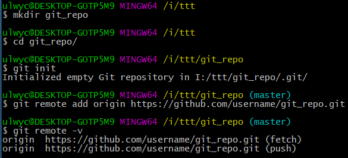
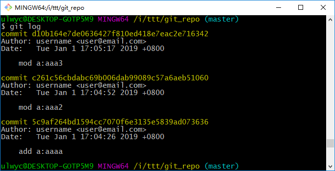
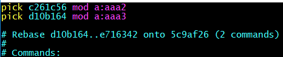
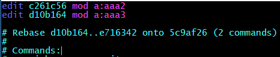
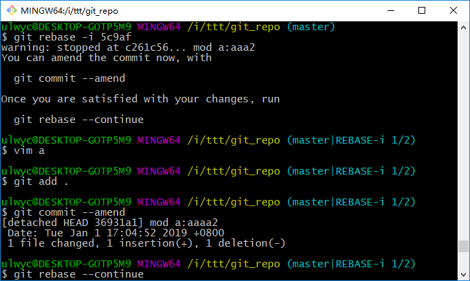
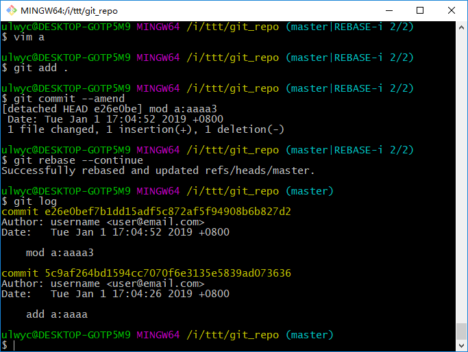

---

### 创建远程仓库

#### init, remote

```sh
# 以github为例，先在github上新建远程仓库git_repo

# 创建本地仓库
mkdir git_repo
cd git_repo
git init

# github上创建的新仓库是默认的远程版本库名称是origin，默认分支master
# 添加远程版本库设置
# git remote add origin https://github.com/<github_user>/git_repo.git
git remote add origin git@github.com:<github_user>/git_repo.git

# 查看远程版本库设置
git remote -v

# 删除远程版本库设置(origin用户)
git remote remove origin

# 也可尝试直接编辑.git里的相应文件来修改设置
```

<!-- more -->



#### add, commit, push

```sh
# 添加文件
# ...
git status
git add .
git commit -m "..."

# 修改文件
# ...
git add .
git status	# 查看状态
git commit -m "..."

# 删除文件
# ...
git add -A
git commit -m "..."

# 继续修改
# ...
# add & commit
git commit -a -m "..."

# push
git push -u origin master
```

### 基于远程仓库修改

#### pull、clone

```sh
# 与远端同步
cd git_repo
git pull

# 不使用本地git_repo
git clone https://github.com/username/git_repo.git
cd git_repo

# 修改 ...
# ...
git commit -a -m "..."
git push
```

### 新建、切换分支

#### checkout

```sh
cd git_repo
# 基于默认分支master，新建名为test的分支，并切换至test分支
git checkout -b test
git push -u origin test

# 已经存在test分支时，不加"-b"切换
git checkout test
```

### 修改历史提交

#### revert

```sh
cd git_repo
git pull
git log

# 撤销上次提交，会产生一次新的提交，与上上次内容的相同
git revert HEAD
```

#### reset

```sh
# 重置到上上次提交
git reset --hard HEAD^

# 重置到指定commit
git reset --hard <commit_id>

# 重置后，滞后于远程版本库，需强制push
git push origin master -f
```

#### rebase

```sh
# 改变基线
git rebase -i <commit_id>
# 修改
# ...
git add .
git commit --amend
git rebase --continue
# ...
git push origin master -f
```

rebase前：



rebase到5c9af：

执行git rebase -i <commit_id>后，会自动打开一个文件，pick表示选取某些提交，edit表示选取并编辑某些提交：







因上面修改了2行为edit，edit第二次：



---

(End)

