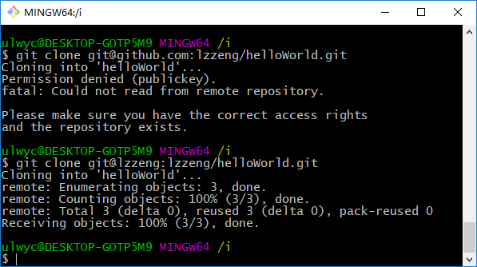

---

假设有2个github账号，mygithub（default）和mygithub2，要在同一个git客户端下使用，可按以下配置。

### 生成SSH Key

`mygithub`的ssh key已按默认生成，对应id_rsa。再生成`mygithub2`账号的ssh key，假设取名为mygithub2：

```sh
cd ~/.ssh
# ssh-keygen -t rsa -b 4096 -C <email> -f mygithub2
ssh-keygen -f mygithub2
```

<!-- more -->

生成ssh密钥对之后，登录github，将公钥记录到mygithub2账户中。

### 添加多账号配置文件

创建文件`~/.ssh/config`

```sh
cd ~/.ssh
cat <<EOF > config
# default
Host github.com
HostName github.com
User mygithub
IdentityFile ~/.ssh/id_rsa

# mygithub2
Host mygithub2
HostName github.com
User mygithub2
IdentityFile ~/.ssh/mygithub2
EOF
```

注意Host、HostName的差异。如果有其它代码托管平台的账号，如`gitlab、gitee`，重新按以上步骤追加，填写相应的HostName、User和ssh key文件，并以不同的Host值区分。

### 使用多账号

使用时，对于默认账号`mygithub`，用法不变：

```sh
# 默认账号mygithub用法不变
git clone git@github.com:mygithub/helloWorld.git
```

对于`mygithub2`，@github.com变成@mygithub2，因`mygithub2`对应的Host是mygithub2。

```sh
git clone git@mygithub2:mygithub2/helloWorld.git
```

如下图，`lzzeng`是我使用的第二github账号：



如果事先已clone下来，可修改远程仓库地址为 @mygithub2格式：

```sh
cd helloWorld
git remote rm origin
git remote add origin git@mygithub2:mygithub2/helloWorld.git
```

此外，因全局默认用户是`mygithub`，如果想切换到`mygithub2`用户的话：

```sh
cd helloWorld
git config --local user.name mygithub2
git config --local user.email <email>
```

### 补充

根据上述内容，可以完成git多账号配置并使用。另外，网上资料有提到`ssh-agent`和`ssh-add`，ssh-agent是一个密钥管理器，运行ssh-agent以后，使用ssh-add将私钥交给ssh-agent保管。

```sh
ssh-agent bash	# 启用ssh-agent shell
ssh-add -l	# 显示ssh-agent中的密钥
ssh-add -D	# 删除所有缓存的密钥
ssh-add  ~/.ssh/id_rsa	# 把私钥添加到ssh-agent中
ssh-copy-id -i ~/.ssh/id_rsa.pub root@vm2	# 将公钥发送给root@vm2，之后可免密登录root@vm2
```


---

(End)