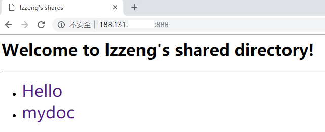
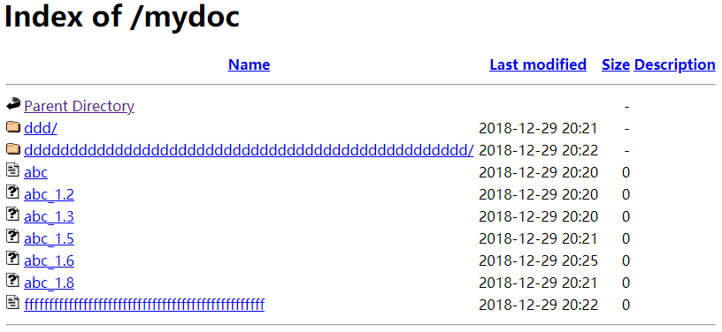

---

系统：CentOS 7.2


### 更新EPEL源

   **[🔗](https://fedoraproject.org/wiki/EPEL?rd=EPEL/en#What_is_Extra_Packages_for_Enterprise_Linux_.28or_EPEL.29.3F) What is Extra Packages for Enterprise Linux (or EPEL)?**

Extra Packages for Enterprise Linux (or EPEL) is a Fedora Special Interest Group that creates, maintains, and manages a high quality set of additional packages for Enterprise Linux, including, but not limited to, [Red Hat Enterprise Linux](https://fedoraproject.org/wiki/Red_Hat_Enterprise_Linux) (RHEL), CentOS and Scientific Linux (SL), Oracle Linux (OL).

**EPEL**（Extra Packages for Enterprise Linux）是由 Fedora 社区打造，为 RHEL 及衍生发行版如 CentOS等提供高质量软件包的项目。

<!-- more -->

  ```sh
  # 如果不能直接yum更新epel
  yum install epel-release -y
  # 尝试
  yum install https://dl.fedoraproject.org/pub/epel/epel-release-latest-7.noarch.rpm
  # 或者
  rpm -Uvh https://dl.fedoraproject.org/pub/epel/epel-release-latest-7.noarch.rpm
  # 或者
  wget -O /etc/yum.repos.d/epel.repo http://mirrors.aliyun.com/repo/epel-7.repo
  ```

### 安装httpd

  ```sh
  yum install -y httpd
  ```

### 开放80端口

  ```sh
  # 如果直接关闭防火墙，则无需针对80端口的特殊设置
  # systemctl stop firewall.service
  
  # 开启防火墙
  # systemctl start firewall.service
  
  # 如果要使用iptables作防火墙
  # yum -y install iptables-services
  
  # 如果是firewall作防火墙，则
  firewall-cmd --zone public --add-port 80/tcp --pernerment
  
  # 如果是iptables作防火墙
  /sbin/iptables -I INPUT -p tcp --dport 80 -j ACCEPT
  /sbin/iptables save
  # 也可尝试用 /etc/init.d/iptables 或 /etc/rc.d/init.d/iptables
  ```

  如果要让Apache使用其它端口，修改`/etc/httpd/conf/httpd.conf` :

  ```ini
  Listen <port>
  ```

  修改默认网站根目录也是在此文件，默认目录是`/var/www/html`。

### 自定义index.html

  ```sh
  mkdir -p /var/www/html/{hello,mydoc}  	#测试创建2个目录
  chmod 755 /var/www/html/{hello,mydoc}
  ```

   添加`/var/www/html/index.html`，内容如下：

  ```html
  <!DOCTYPE html>
  <html>
  <head>
      <meta charset="UTF-8">
      <title>Title</title>
      <style type="text/css">
          a:link, a:visited {
              text-decoration: none;
          }
          a:hover {
              text-decoration: underline;
          }
      </style>
  </head>
  <body>
  <h1>Your page title</h1>
  <hr>
  <ul>
      <li>
          <a href="hello/" style="font-size:32px">Hello</a>
      </li>
      <li>
          <a href="mydoc/" style="font-size:32px">mydoc</a>
      </li>
  </ul>
  </body>
  </html>
  ```

  首页效果：

  

### 调整显示设置

  添加到`/etc/httpd/conf/httpd.conf`：

  ```ini
  IndexOptions NameWidth=60	#Name列宽60
  IndexOptions IconHeight=16	#图标高16
  IndexOptions IconWidth=16	#，宽16
  IndexOptions FoldersFirst	#目录在前
  IndexOptions VersionSort	#版本排序
  ```

  ```sh
  service httpd restart
  ```

  调整后目录显示效果如下：

  

---

(End)