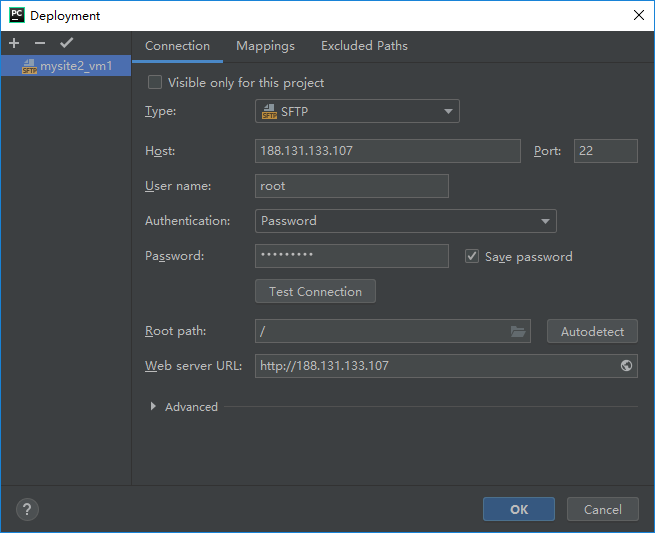
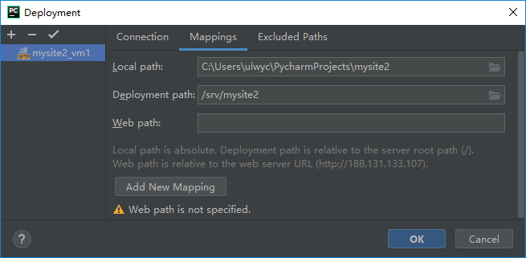
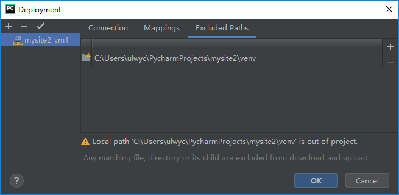
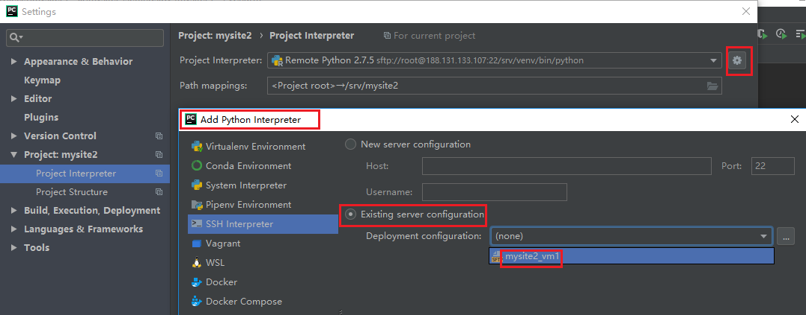
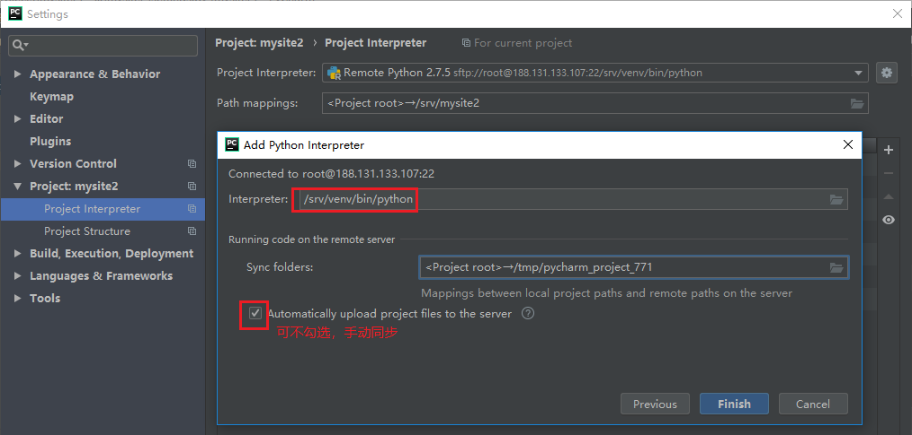
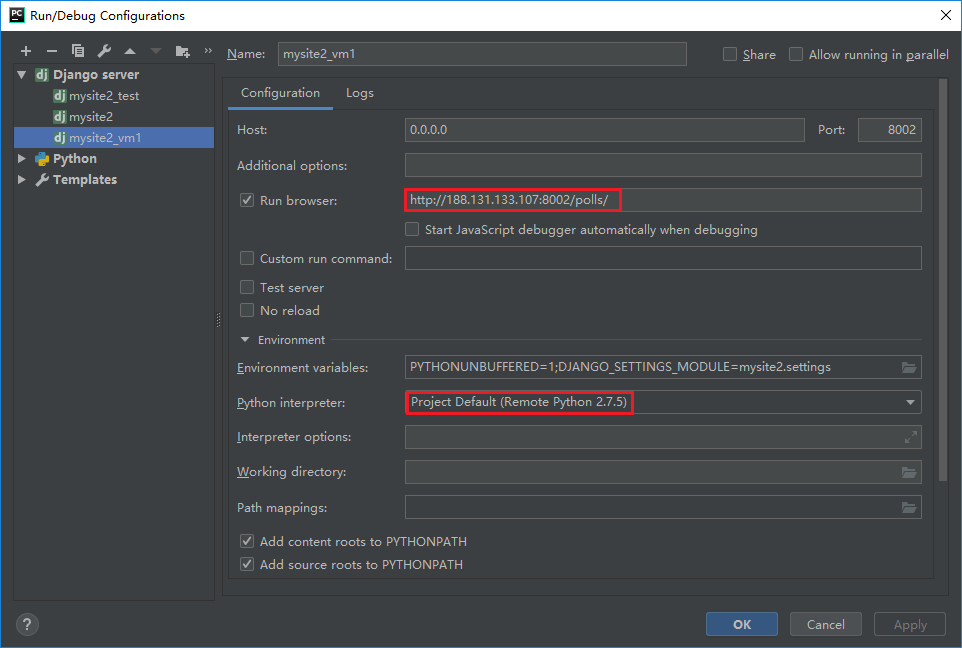
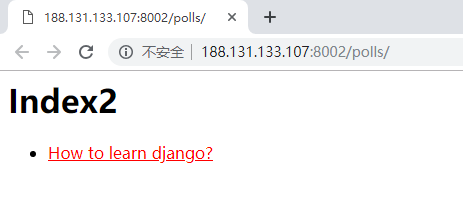

---

软件：PyCharm Professional Edition 2018.3


如果想在Windows系统中使用PyCharm进行Python代码开发，而在Linux机器上部署运行，那么可以使用PyCharm的远程调试功能。这样可以避免因使用不同系统下的Python环境，在Windows上正常运行，而在Linux上报错，需要再次修改代码才能运行。

<!-- more -->

仍以之前的mysite2这个django demo为例，步骤如下：

### 配置Deployment

【Tools】>> 【Deployment】>>【Configuration...】，新建一个Deployment。配置连接、目录映射，并排除不作同步的目录。







配置完成后，手动点击【Tools】>> 【Deployment】 >> 【Upload to...】，将项目代码同步到所设置的Linux主机上。

然后，登录Linux主机，创建虚拟环境：

```sh
cd /srv
virtualenv venv
source venv/bin/activate
# 安装django和MySQL-python
pip install django==1.11
pip install MySQL-python
```

测试一下，从浏览器访问正常即可。

```sh
# 已activate虚拟环境
python /srv/mysite2/manage.py runserver 0.0.0.0:8000
```

### 配置Interpreter

根据上面配置好的部署来配置远程解释器，并选择在Linux主机上创建的虚拟环境venv作远程解释器。





### 配置Run/Debug



至此，Deployment、Remote Interpreter和Run三处配置均完成，可以直接从PyCharm运行调试了：



---

(End)