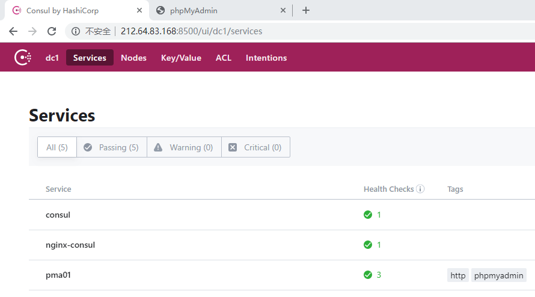
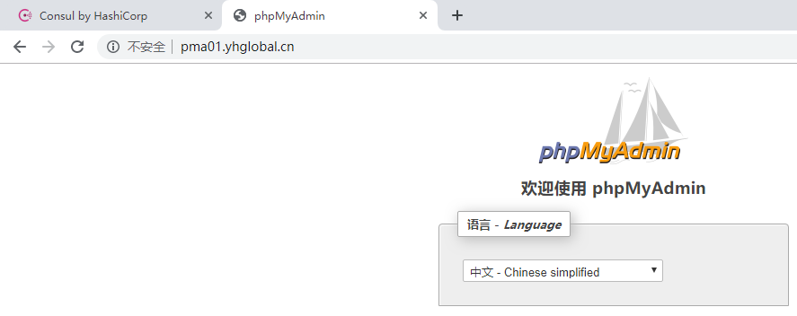

---

> 通过Docker，可以很方便地将Consul、Consul Template、Registrator和Nginx组装成一个可扩展的、高质量、高可用的服务架构体系，在添加和移除服务时不需要重写任何配置，也不需要重启任何服务，从而降低运维成本。

<!-- more -->


### Overview

01.




02.




---

### Configure files

docker-compose.yml:

```yaml
version: '2'

services:
  consul:
    image: consul
    ports:
      - 8400:8400
      - 8500:8500
      - 8600:53/udp
    network_mode: host
    command: agent -server -client=0.0.0.0 -dev -node=node0 -bootstrap-expect=1 -data-dir=/tmp/consul
    labels:
      SERVICE_IGNORE: 'true'

  registrator:
    image: gliderlabs/registrator
    depends_on:
      - consul
    volumes:
       - /var/run/docker.sock:/tmp/docker.sock
    network_mode: host
#    command: -internal consul://consul:8500 # err
    command: -internal consul://127.0.0.1:8500

  nginx-consul:
    image: nginx-consul:v0.3.2
    build: .
    depends_on:
      - consul
      - registrator
    ports:
      - 80:80
    network_mode: host
    command: -consul-addr=127.0.0.1:8500 -wait=5s -template /etc/nginx/nginx.conf.ctmpl:/etc/nginx/conf.d/app.conf:/etc/nginx/nginx.sh
```


nginx-consul-template Dockerfile:

```sh
FROM nginx
 
RUN apt-get update && \
    apt-get install --no-install-recommends --no-install-suggests -y unzip && \
    rm -r /var/lib/apt/lists/*

ENV CONSUL_TEMPLATE_VERSION 0.20.0

ADD https://releases.hashicorp.com/consul-template/${CONSUL_TEMPLATE_VERSION}/consul-template_${CONSUL_TEMPLATE_VERSION}_linux_amd64.zip /tmp/consul-template.zip

ADD nginx.conf.ctmpl nginx.sh /etc/nginx/

RUN unzip /tmp/consul-template.zip -d /usr/bin && \
    chmod +x /usr/bin/consul-template && \
    rm -f /tmp/consul-template.zip && \
    chmod +x /etc/nginx/nginx.sh

WORKDIR /etc/nginx
# CMD ["nginx", "-g", "daemon off;", "&"]
ENTRYPOINT ["/usr/bin/consul-template"]
```


nginx configure template:

```jinja2
{{range services}}
{{$name := .Name}}
{{$service := service .Name}}
{{if in .Tags "http"}}
upstream {{$name}} {
    {{range $service}}server {{.Address}}:{{.Port}};
    {{end}}
}
{{end}}
{{end}}

{{range services}}
{{$name := .Name}}
{{if in .Tags "http"}}
server {
    listen 80;
    server_name	{{$name}}.xxx.com;
    root	html;
    index	index.html index.htm;
    
    access_log	/var/log/nginx/{{$name}}_access.log	main;
    
    location / {
    proxy_pass http://{{$name}};
    proxy_redirect		off;
    proxy_set_header    Host        	$host;
    proxy_set_header    X-Real-IP   	$remote_addr;
    proxy_set_header    X-Forwarded-For $proxy_add_x_forwarded_for;
    }
    
    error_page  500 502 503 504 /50x.html;
    location = /50x.html {
    root	/usr/share/nginx/html;
    }
}
{{end}}
{{end}}
```


nginx.sh:

```sh
#!/bin/bash

if nginx -t>/dev/null; then
    if [[ -s /var/run/nginx.pid ]]; then
        nginx -s reload
        if [[ $? != 0 ]]; then
            rm -f /var/run/nginx.pid
            nginx -c /etc/nginx/nginx.conf
        fi
    else
        nginx -c /etc/nginx/nginx.conf
    fi
fi
```


pma docker-compose.yml:

```yaml
pma:
    image: phpmyadmin/phpmyadmin:4.7.3-1
    environment:
      SERVICE_NAME: pma01
      SERVICE_TAGS: "http,phpmyadmin"
    ports:
      - 80
```


---

### How to test

- run pma

```sh
docker-compose up -d
docker-compose scale pma=3
docker-compose scale pma=1
```


- start nginx-consul

```sh
docker-compose up -d
```

