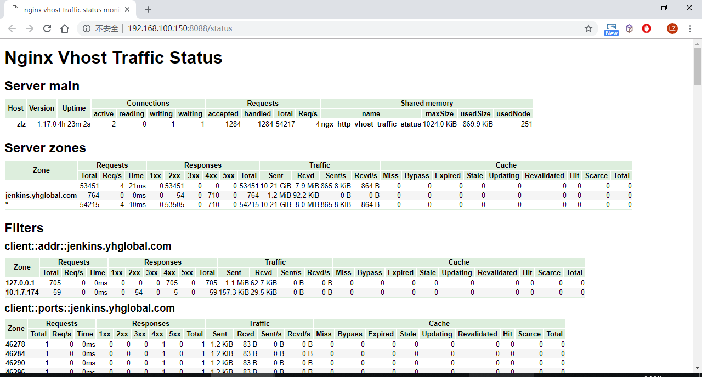
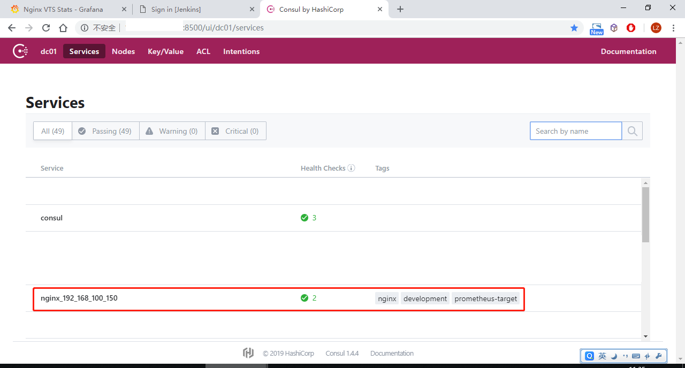
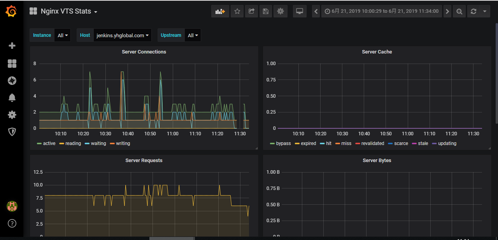

---

> nginx需安装nginx-module-vts模块，然后通过nginx-vts-exporter输出监控指标。

<!-- more -->

## nginx-module-vts模块

```sh
# 获取nginx-module-vts模块源码
cd /opt
git clone https://github.com/vozlt/nginx-module-vts

# nginx源码包
wget https://nginx.org/download/nginx-1.17.0.tar.gz
tar -xf nginx-1.17.0.tar.gz
cd nginx-1.17.0

# 编译nginx，加入nginx-module-vts模块
./configure --add-module=/opt/nginx-module-vts --prefix=/etc/nginx --sbin-path=/usr/sbin/nginx --conf-path=/etc/nginx/nginx.conf --error-log-path=/var/log/nginx/error.log --http-log-path=/var/log/nginx/access.log --pid-path=/var/run/nginx.pid --lock-path=/var/run/nginx.lock --http-client-body-temp-path=/var/cache/nginx/client_temp --http-proxy-temp-path=/var/cache/nginx/proxy_temp --http-fastcgi-temp-path=/var/cache/nginx/fastcgi_temp --http-uwsgi-temp-path=/var/cache/nginx/uwsgi_temp --http-scgi-temp-path=/var/cache/nginx/scgi_temp --user=nginx --group=nginx --with-http_ssl_module --with-http_realip_module --with-http_addition_module --with-http_sub_module --with-http_dav_module --with-http_flv_module --with-http_mp4_module --with-http_gunzip_module --with-http_gzip_static_module --with-http_random_index_module --with-http_secure_link_module --with-http_stub_status_module --with-http_auth_request_module --with-mail --with-mail_ssl_module --with-file-aio --with-ipv6 --with-cc-opt='-O2 -g -pipe -Wp,-D_FORTIFY_SOURCE=2 -fexceptions -fstack-protector --param=ssp-buffer-size=4 -m64 -mtune=generic'

make && make install
```


## 配置nginx

- 修改nginx.conf

```ini
http {
    ...
    vhost_traffic_status_zone;
    server {
        listen 8088;
        location /status {
            vhost_traffic_status_display;
            vhost_traffic_status_display_format html;
        }
    }
    ...
}
```


- server配置示例

```ini
upstream jenkins {
    server 127.0.0.1:8080;
}

server {
    listen 80;
    server_name jenkins.keep.com;

	#uri访问统计
    vhost_traffic_status_filter_by_set_key $uri uri::$server_name;

	# #国家/地区访问统计，无此模块已注释
    # vhost_traffic_status_filter_by_set_key $geoip_country_code country::$server_name;
	# #UserAgent 统计
    # vhost_traffic_status_filter_by_set_key $filter_user_agent agent::$server_name;    
    vhost_traffic_status_filter_by_set_key $status $server_name; #http code统计
    vhost_traffic_status_filter_by_set_key $upstream_addr upstream::backend; #后端转发统计
    vhost_traffic_status_filter_by_set_key $remote_port client::ports::$server_name; #请求端口统计
    vhost_traffic_status_filter_by_set_key $remote_addr client::addr::$server_name;  #请求IP统计
    
    #请求路径统计
    location ~ ^/storage/(.+)/.*$ {
        set $volume $1;
        vhost_traffic_status_filter_by_set_key $volume storage::$server_name;
    }

    location / {
        proxy_pass http://jenkins;
        proxy_redirect default;
    }
}
```


- 添加到系统服务

/etc/systemd/system/nginx.service:

```ini
[Unit]
Description=The nginx HTTP and reverse proxy server
After=network.target remote-fs.target nss-lookup.target

[Service]
Type=forking
PIDFile=/run/nginx.pid
# Nginx will fail to start if /run/nginx.pid already exists but has the wrong
# SELinux context. This might happen when running `nginx -t` from the cmdline.
# https://bugzilla.redhat.com/show_bug.cgi?id=1268621
ExecStartPre=/usr/bin/rm -f /run/nginx.pid
ExecStartPre=/usr/sbin/nginx -t
ExecStart=/usr/sbin/nginx
ExecReload=/bin/kill -s HUP $MAINPID
KillSignal=SIGQUIT
TimeoutStopSec=5
KillMode=process
PrivateTmp=true

[Install]
WantedBy=multi-user.target
```


```sh
ln -s /etc/systemd/system/nginx.service /etc/systemd/system/multi-user.target.wants/
```


- 启动、检查、重新加载

```sh
systemctl start nginx

# 修改过nginx配置后
nginx -t
nginx -s reload
```


- 查看status




##  数据转换

通过[nginx-vts-exporter](https://github.com/hnlq715/nginx-vts-exporter)将由nginx-module-vts模块提供的nginx监控数据转换成prometheus能直接使用的格式。

转换前：<http://192.168.100.150:8088/status/format/json>

转换后：<http://192.168.100.150:9913/metrics>


```sh
wget https://github.com/hnlq715/nginx-vts-exporter/releases/download/v0.10.3/nginx-vts-exporter-0.10.3.linux-amd64.tar.gz
tar -xf nginx-vts-exporter-0.10.3.linux-amd64.tar.gz
chown -R nginx:nginx nginx-vts-exporter-0.10.3.linux-amd64
ln -s /srv/nginx-vts-exporter-0.10.3.linux-amd64/nginx-vts-exporter /usr/bin/
# 测试运行exporter
nohup nginx-vts-exporter -nginx.scrape_uri=http://localhost:8088/status/format/json
```


可通过supervisor保持exporter在后台运行：

```ini
[program:nginx_vts_exporter]
command=/usr/bin/nginx-vts-exporter -nginx.scrape_uri=http://localhost:8088/status/format/json
user=nginx
startsecs=3
redirect_stderr=true
stdout_logfile_maxbytes=50MB
stdout_logfile_backups=3
stdout_logfile=/var/log/nginx_vts_exporter.log
```


## 注册到consul

将nginx监控数据接口注册到consul，使prometheus能获取该target。

curl命令参考：

```sh
curl http://192.168.100.140:8500/v1/agent/service/register -X PUT -i -H "Content-Type:application/json" -d '{
	"ID": "nginx_192.168.100.150",
	"Name": "nginx_192_168_100_150",
	"Tags": ["nginx", "development", "prometheus-target"],
	"Address": "192.168.100.150",
	"Port": 9913,
	"Check": {
		"DeregisterCriticalServiceAfter": "90m",
		"HTTP": "http://192.168.100.150:9913/metrics",
		"Interval": "15s"
	},
	"IsDeleted": false,
	"Meta": {
		"version": "1.0"
	},
	"EnableTagOverride": false
}'
```

**为了统一管控，应按【应用接入说明】记录到配置仓库中。**


注册成功后多了一条service记录：




## 图表



