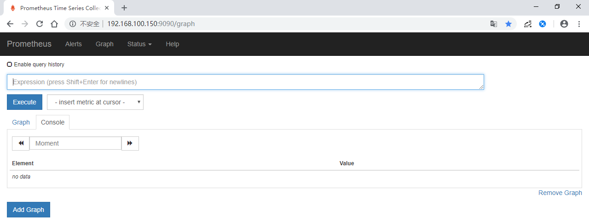
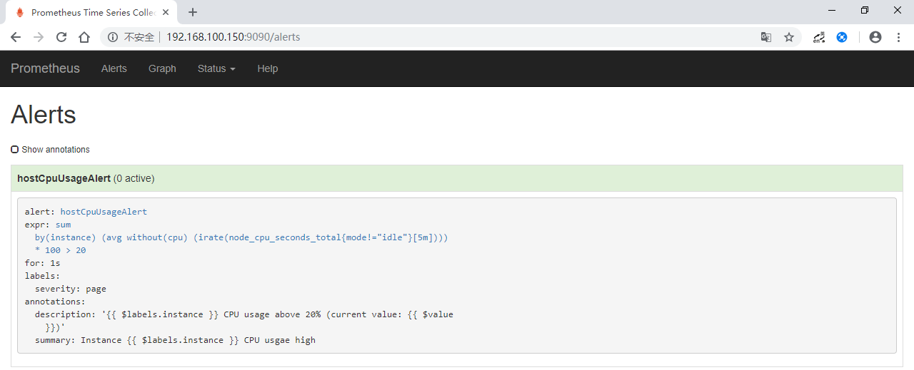
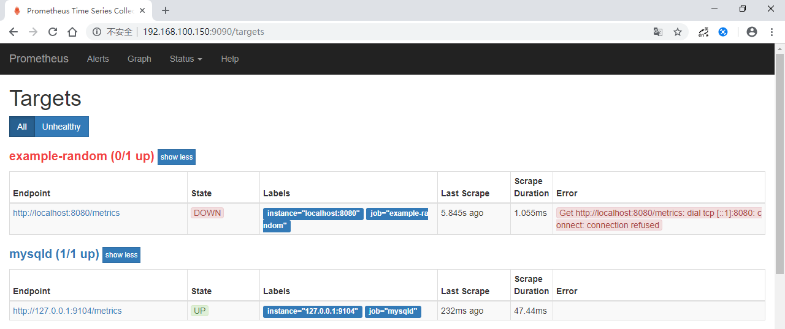
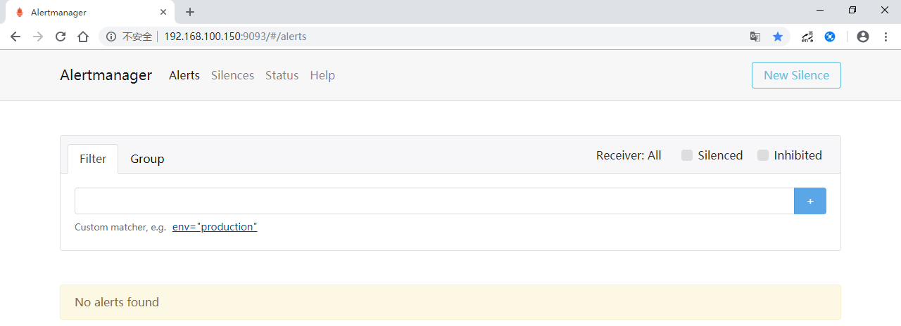
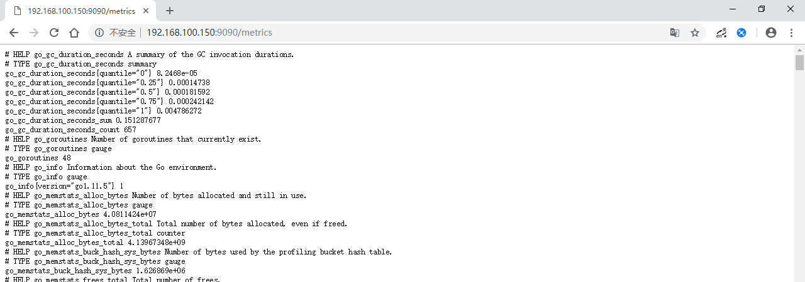
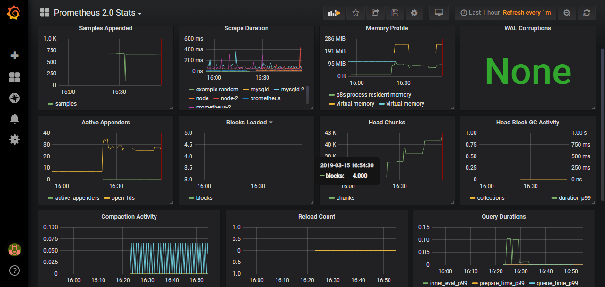
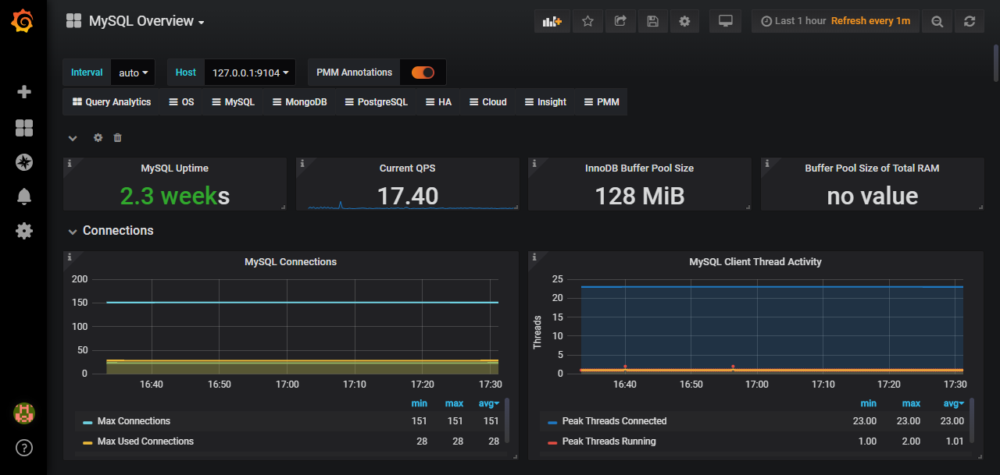
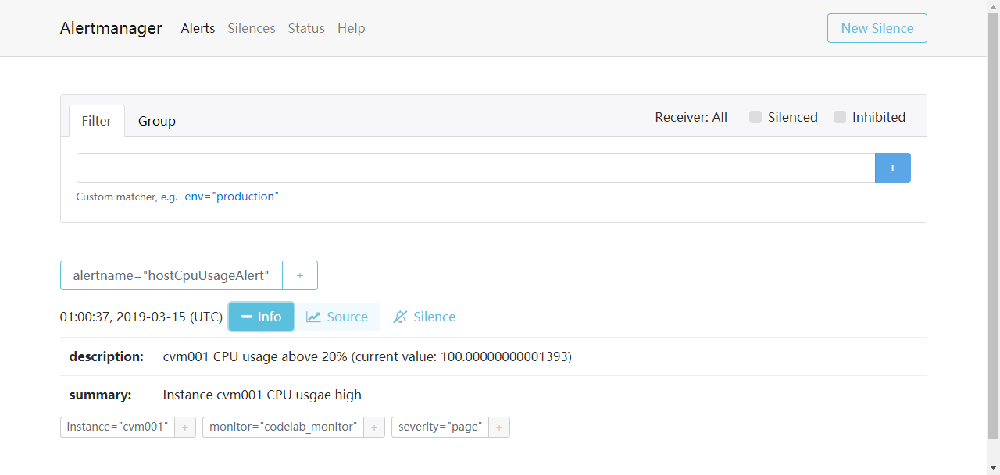

---

>  环境：CentOS Linux release 7.5.1804 (Core)、5.5.60-MariaDB
>
> 运行方式：Prometheus，Grafana和Alertmanager通过docker安装运行，MySQL和exporter直接运行在VM上

<!-- more -->


### 安装

```sh
docker pull prom/prometheus
docker pull grafana/grafana
docker pull prom/alertmanager
[root@VM_0_2_centos config]# docker images
REPOSITORY             TAG                 IMAGE ID            CREATED             SIZE
prom/prometheus        latest              f57ed0abd85c        2 days ago          109MB
grafana/grafana        latest              ffd9c905f698        8 days ago          241MB
prom/alertmanager      latest              02e0d8e930da        6 weeks ago         42.5MB
```


执行prometheus前，先配置好以下文件。

```yaml
[root@zabbix02 ~]# tree config/
config/
├── alertmanager
│   ├── alertmanager.yml
│   └── template
│       └── test.tmpl
└── prometheus
    ├── prometheus.yml
    └── rules.yml

```


- prometheus.yml

```yaml
global:
  scrape_interval: 15s
  evaluation_interval: 15s
  scrape_timeout: 15s
  external_labels:
    monitor: 'codelab_monitor'

# 报警服务，alertmanager默认运行在9093端口
alerting:
  alertmanagers:
  - static_configs:
    - targets: ["localhost:9093"]

# 报警规则
rule_files:
  - "rules.yml"

# 以下定义了可采集的指标数据源
scrape_configs:
# 安装node-exporter并运行后，默认在端口9100对外暴露相关metrics
  - job_name: 'node'
    scrape_interval: 5s
    static_configs:
    - targets: ['localhost:9100']

# prometheus运行时自身也会提供一些metrics
  - job_name: 'prometheus'
    scrape_interval: 5s
    static_configs:
    - targets: ['localhost:9090']

# mysql指标由mysqld-exporter导出，默认9104端口
  - job_name: 'mysqld'
    scrape_interval: 5s
    static_configs:
      - targets: ['localhost:9104']
```


- rules.yml

```yaml
groups:
# 测试规则，当CPU使用率（5分钟）超过20%时，达到报警条件
  - name: test-rules
    rules:
      - alert: hostCpuUsageAlert
        expr: sum(avg without (cpu)(irate(node_cpu_seconds_total{mode!='idle'}[5m]))) by (instance) * 100 > 20
        for: 1s
        labels:
          severity: page
        annotations:
          summary: "Instance {{ $labels.instance }} CPU usgae high"
          description: "{{ $labels.instance }} CPU usage above 20% (current value: {{ $value }})"
```


- alertmanager.yml

```yaml
global:
  resolve_timeout: 5m #处理超时时间，默认为5min
  smtp_smarthost: 'smtp.163.com:465' # 邮箱smtp服务器代理
  smtp_from: 'xxx@163.com' # 发送邮箱名称
  smtp_auth_username: 'xxx@163.com' # 邮箱名称
  smtp_auth_password: 'xxxxxxxx' # 邮箱密码或授权码
  wechat_api_url: 'https://qyapi.weixin.qq.com/cgi-bin/' # 企业微信地址

# 模板
templates:
  - 'template/*.tmpl'

# 路由
route:
  group_by: ['alertname'] # 报警分组依据
  group_wait: 10s # 第一次等待多久时间发送一组警报的通知
  group_interval: 10s # 在发送新警报前的等待时间
  repeat_interval: 1m # 发送重复警报的周期 对于email此项不可以设置过低
  receiver: 'web.hook' # 使用receivers中name为web.hook的报警方式

# 常用的报警通知方式有3种，webhook、email和企业微信
receivers:
# webhook方式
  - name: 'web.hook'
    webhook_configs:
    # 本地webhook打印报警信息。webhook方式可用于测试，或执行某些动作。
    - url: 'http://127.0.0.1:5001/'

# 邮件方式
  - name: 'email'
    email_configs:
    - to: 'xxx@yyy.com' # 收件人
      html: '{{ template "test.html" . }}' # 邮箱内容html模板
      headers: { Subject: "[WARN] 报警邮件"} # 邮件主题

# 企业微信方式
  - name: 'qywx'
    webhook_configs:
    - send_resolved: true
      to_party: '1' # 接收组的id
      agent_id: 'xxxxxx' # 企业微信-->自定应用-->AgentId
      corp_id: 'xxxxxx' # 我的企业-->CorpId[在底部]
      api_secret: 'xxxxxx' # 企业微信-->自定应用-->Secret
      message: '{{ template "test.html" . }}' # 模板设定
```


这里不使用docker方式运行exporter，通过下载安装包安装node_exporter和mysqld_exporter。

- 安装、启动node_exporter

```sh
wget https://github.com/prometheus/node_exporter/releases/download/v0.17.0/node_exporter-0.17.0.linux-amd64.tar.gz
tar -xf node_exporter-0.17.0.linux-amd64.tar.gz
cd node_exporter-0.17.0.linux-amd64/
# 运行node_exporter
nohup ./node_exporter &

# 查看node_exporter监听的端口
[root@zabbix02 node_exporter-0.17.0.linux-amd64]# netstat -alntp |grep node_expo
tcp6       0      0 :::9100                 :::*                    LISTEN      21164/./node_export 
tcp6       0      0 ::1:9100                ::1:57580               ESTABLISHED 21164/./node_export
```


- 安装、启动mysqld_exporter

```sh
wget https://github.com/prometheus/mysqld_exporter/releases/download/v0.11.0/mysqld_exporter-0.11.0.linux-amd64.tar.gz
tar -xf mysqld_exporter-0.11.0.linux-amd64.tar.gz
cd exporter/mysqld_exporter-0.11.0.linux-amd64/
# 本文中，被监控的mysql与prometheus server在同一个机器上
# 将使用mysql中创建的名为exporter的用户查询mysql指标
cat <<EOF >.my.cnf
[client]
user=exporter
password=exporter
EOF

# 需创建mysql exporter用户
CREATE USER 'exporter'@'localhost' IDENTIFIED BY 'exporter';
GRANT PROCESS, REPLICATION CLIENT, SELECT ON *.* TO 'exporter'@'localhost';
# flush privileges;

# 运行mysqld_exporter
nohup ./mysqld_exporter --config.my-cnf="./.my.cnf" &
```


- 运行prometheus

```sh
docker run -d -p 9090:9090 --name prometheus --net=host \
-v /root/config/prometheus/prometheus.yml:/etc/prometheus/prometheus.yml \
-v /root/config/prometheus/rules.yml:/etc/prometheus/rules.yml prom/prometheus
```


- 运行alertmanager

```sh
docker run -d -p 9093:9093 --net=host \
-v /root/config/alertmanager/alertmanager.yml:/etc/alertmanager/config.yml \
--name alertmanager prom/alertmanager
```


- 安装及配置grafana

要通过grafana展示监控数据，见<https://github.com/zlzgithub/docs/blob/master/grafana/grafana-intro.md>


---

以上步骤就绪后，通过浏览器访问看看

- Prometheus首页

http://192.168.100.150:9090/graph




- Alerts页面

<http://192.168.100.150:9090/alerts>，显示了一条报警规则，说明此前的prometheus rules配置正常。




- Targets页面

<http://192.168.100.150:9090/targets>，显示了已在线的metrics。




- Alertmanager

http://192.168.100.150:9093/#/alerts




- metrics

1. prometheus的metrics

http://192.168.100.150:9090/metrics




2. mysql的metrics

http://192.168.100.150:9104/metrics


### 功能测试

---

在Grafana中，导入Prometheus 2.0 Status仪表板，显示如下：




导入Mysql-Overview模板的显示效果：




报警测试：

```sh
# 先运行一个webhook，前提已安装golang
go get github.com/prometheus/alertmanager/examples/webhook
webhook

# 另开一个窗口，人为拉高CPU使用率，观察webhook打印的日志
cat /dev/zero >/dev/null

# 测试完之后，[ctrl]+[c]终止
```


alertmanager webhook在控制台输出的日志：

```tex
[root@VM_0_2_centos alertmanager]# webhook
2019/03/15 10:49:32 {
 >  "receiver": "web\\.hook",
 >  "status": "firing",
 >  "alerts": [
 >    {
 >      "status": "firing",
 >      "labels": {
 >        "alertname": "hostCpuUsageAlert",
 >        "instance": "cvm001",
 >        "monitor": "codelab_monitor",
 >        "severity": "page"
 >      },
 >      "annotations": {
 >        "description": "cvm001 CPU usage above 20% (current value: 99.80000000001382)",
 >        "summary": "Instance cvm001 CPU usgae high"
 >      },
 >      "startsAt": "2019-03-15T02:49:22.839636267Z",
 >      "endsAt": "0001-01-01T00:00:00Z",
 >      "generatorURL": "http://VM_0_2_centos:9090/graph?g0.expr=sum+by%28instance%29+%28avg+without%28cpu%29+%28irate%28node_cpu_seconds_total%7Bmode%21%3D%22idle%22%7D%5B5m%5D%29%29%29+%2A+100+%3E+20\u0026g0.tab=1"
 >    }
 >  ],
 >  "groupLabels": {
 >    "alertname": "hostCpuUsageAlert"
 >  },
 >  "commonLabels": {
 >    "alertname": "hostCpuUsageAlert",
 >    "instance": "cvm001",
 >    "monitor": "codelab_monitor",
 >    "severity": "page"
 >  },
 >  "commonAnnotations": {
 >    "description": "cvm001 CPU usage above 20% (current value: 99.80000000001382)",
 >    "summary": "Instance cvm001 CPU usgae high"
 >  },
 >  "externalURL": "http://VM_0_2_centos:9093",
 >  "version": "4",
 >  "groupKey": "{}:{alertname=\"hostCpuUsageAlert\"}"
 >}

2019/03/15 10:52:52 {
 >  "receiver": "web\\.hook",
 >  "status": "resolved",
 >  "alerts": [
 >    {
 >      "status": "resolved",
 >      "labels": {
 >        "alertname": "hostCpuUsageAlert",
 >        "instance": "cvm001",
 >        "monitor": "codelab_monitor",
 >        "severity": "page"
 >      },
 >      "annotations": {
 >        "description": "cvm001 CPU usage above 20% (current value: 99.79999999999563)",
 >        "summary": "Instance cvm001 CPU usgae high"
 >      },
 >      "startsAt": "2019-03-15T02:49:22.839636267Z",
 >      "endsAt": "2019-03-15T02:52:52.839636267Z",
 >      "generatorURL": "http://VM_0_2_centos:9090/graph?g0.expr=sum+by%28instance%29+%28avg+without%28cpu%29+%28irate%28node_cpu_seconds_total%7Bmode%21%3D%22idle%22%7D%5B5m%5D%29%29%29+%2A+100+%3E+20\u0026g0.tab=1"
 >    }
 >  ],
 >  "groupLabels": {
 >    "alertname": "hostCpuUsageAlert"
 >  },
 >  "commonLabels": {
 >    "alertname": "hostCpuUsageAlert",
 >    "instance": "cvm001",
 >    "monitor": "codelab_monitor",
 >    "severity": "page"
 >  },
 >  "commonAnnotations": {
 >    "description": "cvm001 CPU usage above 20% (current value: 99.79999999999563)",
 >    "summary": "Instance cvm001 CPU usgae high"
 >  },
 >  "externalURL": "http://VM_0_2_centos:9093",
 >  "version": "4",
 >  "groupKey": "{}:{alertname=\"hostCpuUsageAlert\"}"
 >}
```

当CPU使用率高于20%时，Prometheus Alerts页面的报警状态先后变化顺序：in active -> pending -> firing；恢复后，日志显示resolved。


在报警项resolved之前，Alertmanager页面：



通过测试可以看出，webhook方式发出通知是正常的。未测试email和企业微信。


---

(End)