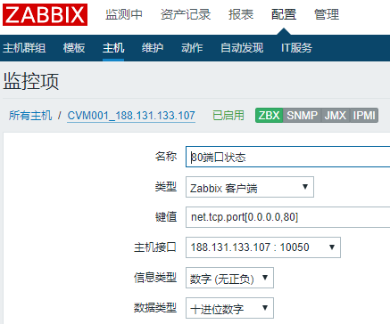
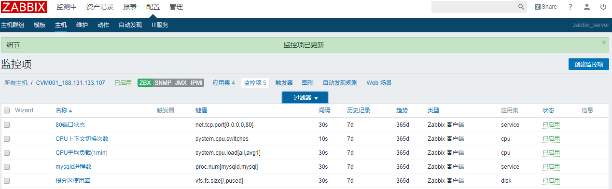
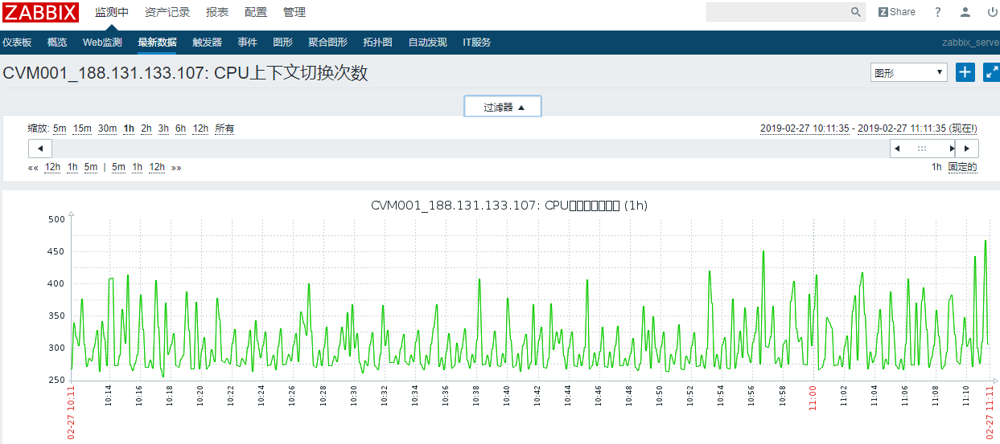
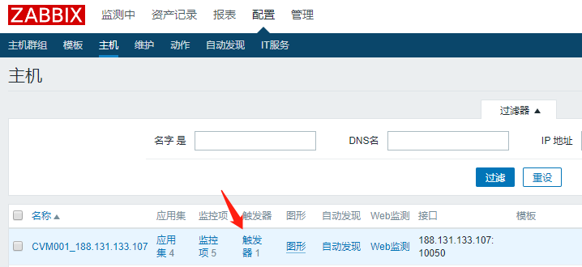
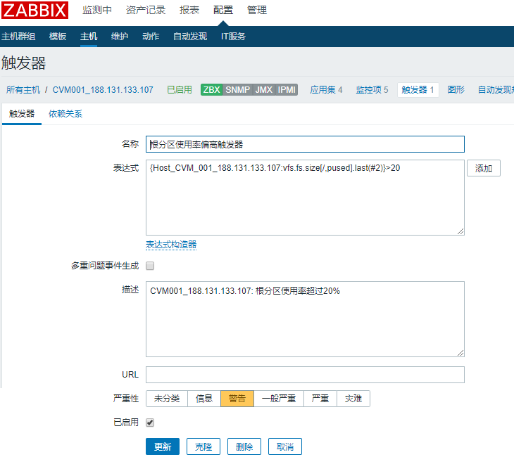
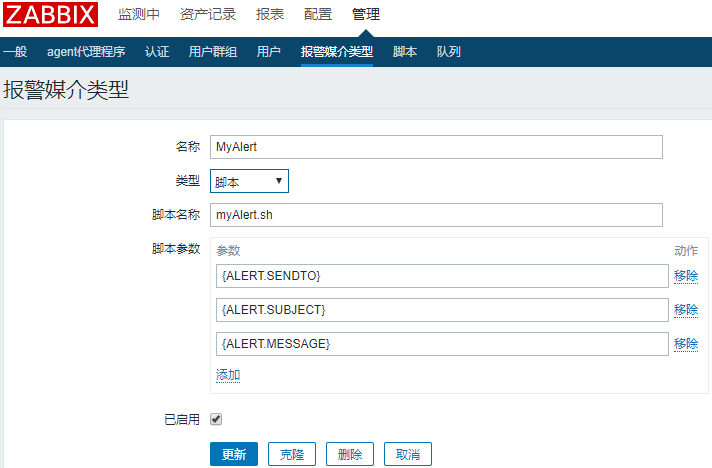
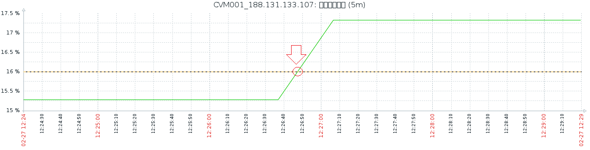
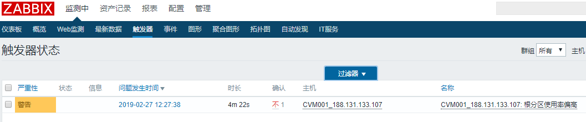

---

> Linux环境：CentOS Linux release 7.5.1804 (Core)


### 1. 安装MySQL

- 安装mariadb

```sh
yum -y install mariadb mariadb-server mariadb-devel
systemctl start mariadb
systemctl enable mariadb
mysql_secure_installation # 通过mysql配置向导完成某些设置，也可通过修改表的方式完成设置
```

<!-- more -->

- 配置字符集

在/etc/my.cnf的[mysqld]下添加：

```ini
init_connect='SET collation_connection = utf8_unicode_ci'
init_connect='SET NAMES utf8'
character-set-server=utf8
collation-server=utf8_unicode_ci
skip-character-set-client-handshake
```

在/etc/my.cnf.d/client.cnf的[client]中添加：

```ini
default-character-set=utf8
```

在/etc/my.cnf.d/[mysql](https://www.centos.bz/tag/mysql-2/)-clients.cnf的[mysql]中添加：

```ini
default-character-set=utf8
```

重启使生效：

```sh
systemctl restart mariadb
```

查看字符集：

```mysql
MariaDB [(none)]> show variables like "%character%";
+--------------------------+----------------------------+
| Variable_name            | Value                      |
+--------------------------+----------------------------+
| character_set_client     | utf8                       |
| character_set_connection | utf8                       |
| character_set_database   | utf8                       |
| character_set_filesystem | binary                     |
| character_set_results    | utf8                       |
| character_set_server     | utf8                       |
| character_set_system     | utf8                       |
| character_sets_dir       | /usr/share/mysql/charsets/ |
+--------------------------+----------------------------+
8 rows in set (0.00 sec)

MariaDB [(none)]> show variables like "%collation%";
+----------------------+-----------------+
| Variable_name        | Value           |
+----------------------+-----------------+
| collation_connection | utf8_general_ci |
| collation_database   | utf8_general_ci |
| collation_server     | utf8_general_ci |
+----------------------+-----------------+
3 rows in set (0.00 sec)
```

MySQL的安装及配置完成。


------

### 2. 安装Zabbix

Zabbix安装步骤见：[CentOS 7安装zabbix 3.0](https://www.zabbix.com/download?zabbix=3.0&os_distribution=centos&os_version=7&db=mysql)，基于RPM方式安装Zabbix 3.0.25。

*如果想通过编译源码安装，可参考[Zabbix源码安装过程记录](https://github.com/zlzgithub/docs/blob/master/zabbix/make-install-zabbix.md)。*

另外，安装zabbix_get以便测试：

```sh
[root@VM_0_6_centos ~]# yum install zabbix-get
# 添加监控项时，可在zabbix_server上通过zabbix_get测试命令是否有效
[root@VM_0_6_centos ~]# zabbix_get -s 188.131.133.107 -k vfs.fs.size[/,pused]
17.268719
```


在安装完zabbix之后，需在MySQL中创建zabbix数据库并导入初始数据表。

安装配置完成并启动所有服务后，以`http://<zabbix_server_ip>/zabbix`访问zabbix控制面板，初始用户名/密码为：Admin/zabbix。

---


### 3. Zabbix监控

以下添加一个**被监控主机**cvm001，监控其cpu、磁盘、80端口等。

| 主机   | 监控项                           |
| ------ | -------------------------------- |
| cvm001 | cpu 平均负载、cpu 上下文切换频率 |
| cvm001 | 根分区剩余空间百分比             |
| cvm001 | 80端口状态（httpd服务）          |
| cvm001 | mysql进程数                      |


#### 3.1 添加主机

【配置】>【主机】>【创建主机】：


#### 3.2 添加监控项

【配置】>【主机】，在刚刚新加的主机所在行，【监控项】>【创建监控项】：


1）CPU负载


设置历史数据保留7天，并为cpu相关的监控定义了一个名为cpu的应用集。


2）CPU上下文切换次数


储存值选择“差量（每秒速率）”：


3）根分区使用率


"pused"表示已使用空间所占百分比。


4）mysql的进程

通过`proc.num[mysqld,mysql]`获取用户mysql的进程mysqld的数目：


5）80端口状态




查看值选择的是Service state，正常状态值是"Up"：


如下图，已添加完上面的5个监控项：




查看最新监控数据如下：


查看cpu上下文切换次数的【图形】：



*图表标题中文字符显示不出来，是字体的原因，可自行替换，此处从略。*


#### 3.3 创建触发器

【配置】>【主机】，主机所在行的【触发器】>【创建触发器】：







#### 3.4 自定义报警媒介




写一个模拟报警脚本如下，放置在`/usr/lib/zabbix/alertscripts/myAlert.sh`:

```sh
#!/bin/sh

alert_path=/var/www/html/myalert
mkdir -p $alert_path

gen_html() {
    echo """<html>
    <head></head>
    <body>
    <h1>Alert</h1>
    <pre>
    """
    echo "SENDTO:$1"
    echo "SUBJECT:$2"
    echo "MESSAGE:$3"
    echo """
    </pre>
    </body>
    </html>"""
}

gen_html $@ > $alert_path/1.html
chmod -R 755 $alert_path
```


并修改/etc/zabbix/zabbix_server.conf配置：

```ini
AllowRoot=1
User=root
```


#### 3.5 用户-告警绑定


#### 3.6 创建动作


#### 3.7 模拟报警

模拟报警条件：

```sh
# 假设当前占用率19%，写一个大小约1GB的文件，使根分区占用率 > 20% 达到触发报警
[root@VM_0_7_centos ~]# dd if=/dev/zero bs=1024 count=1000000 of=/root/1Gb.file
```


查看监控图形（设定的阈值是16%）：




查看触发器状态：




查看事件记录：


查看报警通知结果：


当报警解除后：


经测试，报警机制正常。正式环境中，配置内置的Email或SMS报警媒介，或使用自定义的邮件、微信、短信告警脚本等替代。


---

### 参考资料

[zabbix 3.0 quickstart](https://www.zabbix.com/documentation/3.0/manual/quickstart)

---

（End)