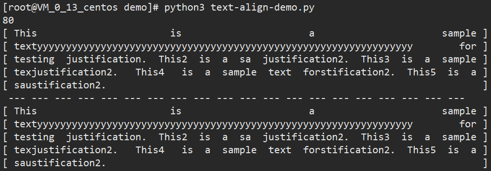

效果图：




<!-- more -->


```python
#!/usr/bin/env python3
# coding=utf8

"""指定行宽，文本段落分散对齐（每行尽量多输出单词，类似两端对齐，末行左对齐）"""

from typing import List


class Solution(object):

    # def full_justify2(self, words: List[str], max_width: int) -> List[str]:
    # def full_justify2(words, max_width):
    def full_justify2(words: List[str], max_width: int) -> List[str]:
        cur = 0
        start = 0
        res = []
        for i in range(len(words)):
            cur += len(words[i]) + 1
            if cur > max_width + 1:  # +1是考虑空格情况，btw，此时可以整理放入res的行不包括words[i]
                space_count = i - start - 1  # [start,i)可以组成一行放入res
                if not space_count:  # 一行只有一个单词的情况
                    res.append(words[i - 1].ljust(max_width, " "))
                else:
                    total_space = max_width - (cur - len(words[i]) - 2) + i - 1 - start  # 注意补上一开始每个space预留的一个空格
                    small_space = total_space // space_count
                    small_space_str = small_space * " "
                    big_space_str = (small_space + 1) * " "
                    big_space_count = total_space - small_space * space_count
                    res.append(big_space_str.join(words[start:start + big_space_count + 1]) + small_space_str.join(
                        [""] + words[start + big_space_count + 1:i]))  # 大小空格连接的字符串中间注意还要有空格，用空字符串坐占位符来补

                cur = len(words[i]) + 1
                start = i
        res.append(" ".join(words[start:]).ljust(max_width, " "))
        return res

    # def fullJustify(self, words, maxWidth):
    def full_justify(words, max_width):  # ? 不用self，语法规范否？
        """
        :type words: List[str]
        :type max_width: int
        :rtype: List[str]
        """
        res = []
        tmp = []
        lg = 0
        for i in words:
            if len(i) + lg <= max_width:
                tmp.append(i)
                lg += len(i) + 1
            else:
                res.append(tmp)
                tmp = [i]
                lg = len(i) + 1
        res.append(tmp)
        for word in res[:-1]:
            lg = sum(len(ws) for ws in word)
            if len(word) == 1:
                word[0] = word[0] + ' ' * (max_width - lg)
            else:
                while lg != max_width:
                    for i in range(len(word) - 1):
                        word[i] = word[i] + ' '
                        lg += 1
                        if lg == max_width:
                            break
        ans = ' '.join(res[-1])
        if len(ans) < max_width:
            ans = ans + " " * (max_width - len(ans))
        # print(ans)
        return [''.join(word) for word in res[:-1]] + [ans]


if __name__ == "__main__":
    txt_list = [
        "This is a sample textyyyyyyyyyyyyyyyyyyyyyyyyyyyyyyyyyyyyyyyyyyyyyyyyyyyyyyyyyyyyyyyyy for testing justification.",
        "This2 is a sa justification2.",
        "This3 is a sample texjustification2.",
        "This4 is a sample text forstification2.",
        "This5 is a saustification2.",
    ]
    txt_list = " ".join(txt_list).split(" ")
    max_len = 80
    # ins = Solution()
    # for line in ins.fullJustify(txt_list, max_len):
    for line in Solution.full_justify(txt_list, max_len):
        print("[", line, "]")
        
    print(" ---" * 20)
    for line in Solution.full_justify2(txt_list, max_len):
        print("[", line, "]")

```


[附件：python-text-align.py](/assets/files/python-text-align.py)