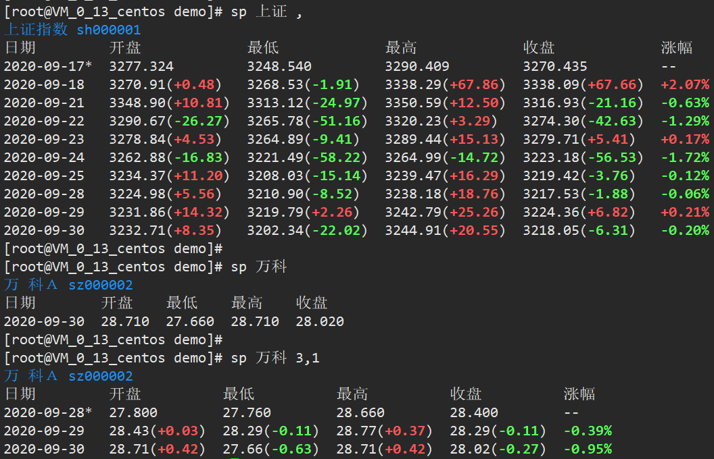

[旧版](../tools-stock-price/)

针对有时输出对不齐作了改进，效果如下：




<!-- more -->


```sh
# 使用：
[root@VM_0_13_centos ~]# cp sp3.py /usr/local/bin/stock-price
[root@VM_0_13_centos ~]# chmod +x /usr/local/bin/stock-price
[root@VM_0_13_centos ~]# cd /usr/local/bin
[root@VM_0_13_centos ~]# ln -s stock-price sp

[root@VM_0_13_centos demo]# sp -h
usage: sp [-h] [-C] [-Z] stock_code [day]

positional arguments:
  stock_code      the stock code or the stock name, e.g. sz000002 or 万科A
  day             which day(s), use the number of days before today, e.g.
                  "3,1" or "1,3" or "3," or ",1" or "3", by default "," is the
                  same as "10,1", and the quotes are not necessary. Maximum
                  days: 137

optional arguments:
  -h, --help      show this help message and exit
  -C, --no-color  if calculate delta, then color, else no color.
  -Z, --en        cancel zh-CN
```


[附件：sp3.py](/assets/files/sp3.py)

