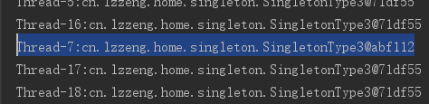

---

### 饿汉式

```java
/**
 * 饿汉式
 */
class SingletonType1 {
    private static SingletonType1 singletonType1 = new SingletonType1();

    private SingletonType1() {
    }

    public static SingletonType1 getInstance() {
        return singletonType1;
    }
}
```

<!-- more -->

测试代码：

```java
import java.util.ArrayList;
import java.util.HashSet;
import java.util.List;
import java.util.Set;

public class SingletonTest {
    public static void main(String[] args) {
        List<Thread> threadList = new ArrayList<>();
        Set<Singleton> singletonSet = new HashSet<>();
        final int SET_MAXSIZE = 100;

        for (int i = 0; i < SET_MAXSIZE; i++) {
            Thread th = new Thread(new Runnable() {
                @Override
                public void run() {
                    SingletonType1 singleton = SingletonType1.getInstance();
                    singletonSet.add(singleton);
                    System.out.println(Thread.currentThread().getName() + ":" + singleton);
                }
            });
            threadList.add(th);
        }

        for (Thread thread : threadList) {
            thread.start();
        }

        try {
            Thread.sleep(500);
        } catch (InterruptedException e) {
            e.printStackTrace();
        }

        System.out.println(singletonSet.size());
    }
}
```

某次运行结果：

```tex
...
Thread-59:cn.lzzeng.home.singleton.SingletonType1@e0614d
Thread-61:cn.lzzeng.home.singleton.SingletonType1@e0614d
Thread-62:cn.lzzeng.home.singleton.SingletonType1@e0614d
Thread-63:cn.lzzeng.home.singleton.SingletonType1@e0614d
3
```

最后一行打印出来的size是3，难道**饿汉式**单例模式非线程安全？再查看前面100行打印的显示对象地址，均相同。其实，size计数不正确是`HashSet`导致的。`HashSet`不是线程安全的，可以用`ConcurrentHashMap`来替代相关代码：

```java
// Set<Singleton> singletonSet = new HashSet<>();
Map<String, String> singletonMap = new ConcurrentHashMap<>();
// singletonSet.add(singleton);
singletonMap.put(singleton.toString(), "");
```

### 懒汉式

1. **懒汉式-非线程同步**

```java
/**
 * 懒汉式-非线程同步
 */
class SingletonType2 {
    private static SingletonType2 singtonType2;

    private SingletonType2() {
    }

    public static SingletonType2 getInstance() {
        if (null == singtonType2) {
            singtonType2 = new SingletonType2();
        }
        return singtonType2;
    }
}
```

再修改测试代码的这一行后再测试：

   ```java
// SingletonType1 singleton = SingletonType1.getInstance();
SingletonType2 singleton = SingletonType2.getInstance();
   ```
某次结果如下：

   ```tex
Thread-2:cn.lzzeng.home.singleton.SingletonType2@11f7d35
Thread-5:cn.lzzeng.home.singleton.SingletonType2@1e9b76c
...
Thread-0:cn.lzzeng.home.singleton.SingletonType2@1e9b76c
2
   ```

从打印的前2行来看，确实出现了获取实例不唯一的现象，可见是非线程安全的。

2. **懒汉式-线程同步**

```java
/**
 * 懒汉式-线程同步
 */
class SingletonType3 {
    private static SingletonType3 singtonType3;

    private SingletonType3() {
    }

    public static synchronized SingletonType3 getInstance() {
        if (null == singtonType3) {
            singtonType3 = new SingletonType3();
        }
        return singtonType3;
    }
}
```

此法使用`synchronized`修饰static方法`getInstance`，实测未见异常。

如果改用类的class对象作为同步监视器对象，即如下：

```java
/**
 * synchronized类名.class
 * synchronized中不加if (null == singtonType3)，测试
 */
public static SingletonType3 getInstance() {
    if (null == singtonType3) {
        synchronized (SingletonType3.class) {
            singtonType3 = new SingletonType3();
        }
    }
    return singtonType3;
}
```

这样看起来似乎没问题，但实测出现如下结果：



这是为什么？上一种synchronized修饰方法的方式中，加锁后，进入方法执行时，首先会判断一次是否已存在单类的实例，而后一种方式synchronized后没有这个判断步骤。也就是说，要想只创建一个实例，**加锁的区域必须包含判断是否已实例化的步骤**。否则，仅仅是保证了多个线程通过new创建实例的过程在时序上不会发生重叠。

正确的写法：

```java
public static SingletonType3 getInstance() {
    if (null == singtonType3) {
        synchronized (SingletonType3.class) {
            if (null == singtonType3) {
                singtonType3 = new SingletonType3();
            }
        }
    }
    return singtonType3;
}
```

### 双重校验锁

```java
/**
 * 双重校验锁
 */
class SingletonType5 {
    private volatile static SingletonType5 SingletonType5;
    private SingletonType5 (){}
    public static SingletonType5 getInstance() {
        if (SingletonType5 == null) {
            synchronized (SingletonType5.class) {
                if (SingletonType5 == null) {
                    SingletonType5 = new SingletonType5();
                }
            }
        }
        return SingletonType5;
    }
}
```

双重校验锁方式采用双锁机制，安全且在多线程情况下能保持高性能。与第二种懒汉式的区别只在于多了一个`volatile`。

### 静态内部类式

```java
/**
 * 静态内部类式
 */
class SingletonType4 {
    private static class SingletonHolder {
        private static final SingletonType4 INSTANCE = new SingletonType4();
    }

    private SingletonType4() {
    }

    public static final SingletonType4 getInstance() {
        return SingletonHolder.INSTANCE;
    }
}
```

这种方式同样利用了类加载机制来保证初始化实例时只有一个线程，它跟**饿汉式**不同的是：饿汉式只要 Singleton类（即`SingletonType1`）被加载了，就会实例化`instance`，没有达到懒加载的效果。而这种方式是Singleton类被加载后，只有显式地调用`getInstance`方法时，才会加载`SingletonHolder`类，从而实例化`instance`。

### 枚举式

```java
/**
 * 传说中的最完美的单例模式
 */
class MySingleton {
    private enum MyEnumSingle {
        INSTANCE;
        private MySingleton singleOne;

        private MyEnumSingle() {
            singleOne = new MySingleton();
        }

        public MySingleton getInstance() {
            return singleOne;
        }
    }

    private MySingleton() {
    }

    public static MySingleton getInstance() {
        return MyEnumSingle.INSTANCE.getInstance();
    }
}
```

枚举方式是Effective Java作者Josh Bloch提倡的方式。特点：

* 避免了多线程同步问题，线程安全
* 支持序列化机制，防止反序列化重新创建新的对象，绝对防止多次实例化
* 可以防止利用反射强行构建单例对象
* 利用内部类实现懒加载

---

（End)