---


> 系统：CentOS 7.2


准备一个Django Demo，运行后效果如下：


<!-- more -->

这是Django官网上的一个简单的投票demo，是使用NginX + supervisord + gunicorn + venv来部署的。现在要做的是把它制作成docker镜像，然后以容器的方式运行它。

---

**步骤如下：**

### 安装docker

我使用的是云主机，已配置yum源，可以直接

```sh
yum install docker
```

因已安装docker，提示更新如下（更新后原有镜像被删除了）：

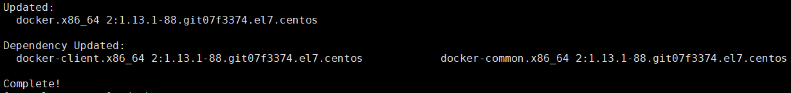

yum源配置如下：

/etc/yum.repos.d/CentOS-Base.repo文件：

```ini
[extras]
gpgcheck=1
gpgkey=http://mirrors.tencentyun.com/centos/RPM-GPG-KEY-CentOS-7
enabled=1
baseurl=http://mirrors.tencentyun.com/centos/$releasever/extras/$basearch/
name=Qcloud centos extras - $basearch
[os]
gpgcheck=1
gpgkey=http://mirrors.tencentyun.com/centos/RPM-GPG-KEY-CentOS-7
enabled=1
baseurl=http://mirrors.tencentyun.com/centos/$releasever/os/$basearch/
name=Qcloud centos os - $basearch
[updates]
gpgcheck=1
gpgkey=http://mirrors.tencentyun.com/centos/RPM-GPG-KEY-CentOS-7
enabled=1
baseurl=http://mirrors.tencentyun.com/centos/$releasever/updates/$basearch/
name=Qcloud centos updates - $basearch
```

/etc/yum.repos.d/CentOS-Epel.repo文件：

```ini
[epel]
name=EPEL for redhat/centos $releasever - $basearch
failovermethod=priority
gpgcheck=1
gpgkey=http://mirrors.tencentyun.com/epel/RPM-GPG-KEY-EPEL-7
enabled=1
baseurl=http://mirrors.tencentyun.com/epel/$releasever/$basearch/
```

---

示例应用根目录是`mysite2`，如下：

```sh
|   |-- mysite2
|   |   |-- fixtures
|   |   |-- manage.py
|   |   |-- mysite2
|   |   |-- polls
|   |   `-- templates
```

为了方便制作docker镜像，重新组织成了下面的样子：

```sh
[root@lzzeng docker_demo]# tree -L 3 .
.
|-- application
|   |-- docker-compose.yml
|   |-- Dockerfile
|   |-- mysite2
|   |   |-- fixtures
|   |   |-- manage.py
|   |   |-- mysite2
|   |   |-- polls
|   |   `-- templates
|   |-- mysite2_nginx.conf
|   |-- mysite2_supervisord.ini
|   |-- requirements.txt
|   |-- start_script
|   `-- wait-for-it.sh
`-- readMe.md
```

`application`目录下的文件`docker-compose.yml`、`Dockerfile`等7个文件是新增的。作用如下：

**docker-compose.yml**：通过docker-compose启动容器的配置，定义了多个容器的启动参数，及容器关联等
**Dockerfile**：制作Docker镜像的脚本编排，类似于Makefile、SPEC文件等
**mysite2_nginx.conf**：事先写好的NginX配置文件
**mysite2_supervisord.ini**：事先写好的Supervisord配置文件
**requirements.txt**：记录制作docker镜像需要安装的依赖，Dockerfile中用到
**start_script**： 容器启动入口，Dockerfile中定义了此脚本为启动入口
**wait-for-it.sh**：等待其它容器（服务）启动完毕的脚本

---

### 编写Dockerfile

```sh
# 基于centos:7
FROM centos:7
MAINTAINER zeng <zeng@abc.com>
ENV TZ "Asia/Shanghai"

# 设置若干环境变量
# Local directory with project source
ENV DOCKER_SRC=mysite2
# Directory in container for all project files
ENV DOCKER_HOME=/srv
# Directory in container for project source files
ENV DOCKER_PROJECT=/srv/webapp  # mysite2下面的文件

# 安装基础镜像中缺失的软件
# Install required packages and remove the apt packages cache when done.
RUN yum -y install epel-release && \
    yum -y install which && \
    yum -y install python-pip && \
    yum -y install supervisor-3.1.4 && \
    yum -y install git nginx gcc gcc-c++ python-devel && \
    yum -y install mysql && \
    yum -y install mysql-devel && \
    yum -y install nc && \
    yum clean all && \
    pip install -U pip

# cd $DOCKER_PROJECT
WORKDIR $DOCKER_PROJECT

# COPY指令将从构建上下文目录中 <源路径> 的文件/目录复制到新的一层的镜像内的 <目标路径> 位置
# 即Dockerfile所在目录下的文件复制到$DOCKER_PROJECT
COPY ./ ./

# Create application subdirectories
WORKDIR $DOCKER_PROJECT
RUN mkdir static log

# 在 Dockerfile 中，可以事先指定某些目录挂载为匿名卷，这样在运行时如果用户不指定挂载，其应用也可以正常运行，不会向容器存储层写入大量数据
VOLUME ["$DOCKER_HOME/media/"]

# RUN pip install -r requirements.txt
RUN pip install -i https://pypi.tuna.tsinghua.edu.cn/simple -r requirements.txt

# 暴露某些端口
EXPOSE 8000

# 指定容器启动入口
RUN chmod u+x start_script
ENTRYPOINT ["./start_script"]
```

构建镜像：

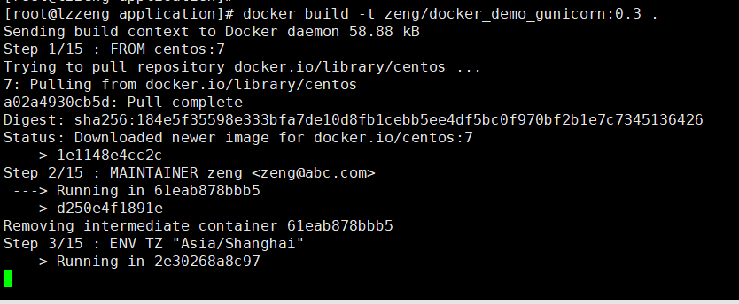

构建成功：

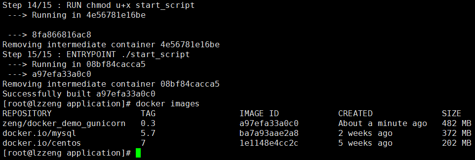

测试容器：

`mysite2`应用中用到了数据库，需要先启动mysql容器：

```sh
docker run --name db -d -e MYSQL_ROOT_PASSWORD=qwerasdf -e MYSQL_DATABASE=mysite2_db -v /root/mysite2_db:/var/lib/mysql mysql:5.7
```

通过`mysql:5.7`镜像创建mysql容器时，会自动创建名为`mysite2_db`的数据库，并设置数据库密码为`qwerasdf`,以备连接。容器中的`/var/lib/mysql`目录会同步到数据卷`/root/mysite2_db`。

执行后如下：

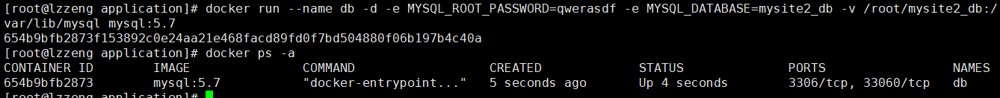

然后，通过已制作好的镜像`zeng/docker_demo_gunicorn:0.3`来启动`mysite2`：

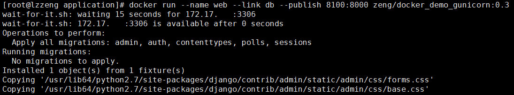

启动成功：

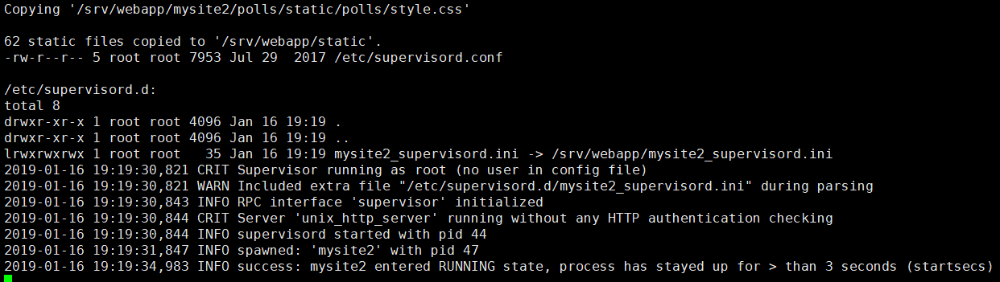

浏览器访问：

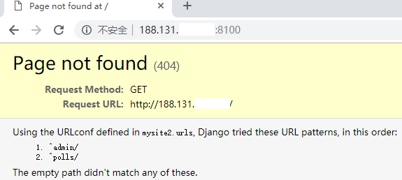

因为`mysite2`没有处理这个请求路径，改为：

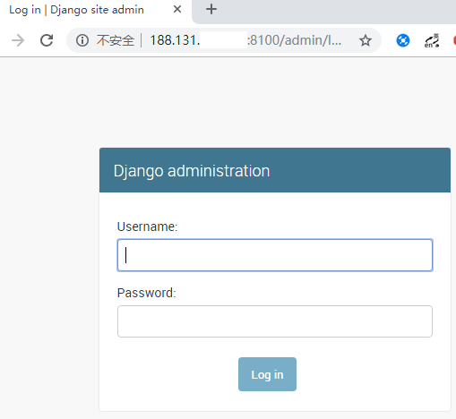

对接mysql时，用户名、密码是在django settings里有如下配置：

```python
DATABASES = {
    'default':{
        'ENGINE': 'django.db.backends.mysql',
        'NAME':'mysite2_db',
        'USER':'root',
        'PASSWORD': os.environ.get('DB_ENV_MYSQL_ROOT_PASSWORD'),
        'HOST':os.environ.get('DB_PORT_3306_TCP_ADDR'),
        'PORT':3306,
    }
}
```

`start_script`：

```sh
#!/bin/bash

# nginx settings
sed -i '/user/{s/nginx/root/}' /etc/nginx/nginx.conf
ln -s /srv/webapp/mysite2_nginx.conf /etc/nginx/conf.d/
nginx

chmod u+x wait-for-it.sh
./wait-for-it.sh $DB_PORT_3306_TCP_ADDR:$DB_PORT_3306_TCP_PORT &
wait

# application settings
export DJANGO_SETTINGS_MODULE=mysite2.settings.server
cd mysite2
./manage.py migrate --noinput
./manage.py loaddata ./fixtures/superuser.json  # 加载root用户信息，见下
./manage.py collectstatic --noinput

# 容器中启动mysite2
ln -s /srv/webapp/mysite2_supervisord.ini /etc/supervisord.d/
supervisord -c /etc/supervisord.conf
```

mysite2/fixtures/superuser.json：

```json
[
    { "model": "auth.user",
        "pk": 1,
        "fields": {
            "username": "root",
            "password": "pbkdf2_sha256$36000$jEzTV4h887Ze$zQQMAMraWN9suHPapbb7LOP6pZ3ADc7KxCUv2oR8Px4=",
            "is_superuser": true,
            "is_staff": true,
            "is_active": true
        }
    }
]
```

其中的password生成方式如下：

```sh
[root@lzzeng mysite2]# export DJANGO_SETTINGS_MODULE=mysite2.settings.server
[root@lzzeng mysite2]# python
Python 2.7.5 (default, Oct 30 2018, 23:45:53) 
[GCC 4.8.5 20150623 (Red Hat 4.8.5-36)] on linux2
Type "help", "copyright", "credits" or "license" for more information.
>>> from django.contrib.auth.hashers import make_password
>>> make_password('qwerasdf')
u'pbkdf2_sha256$36000$jEzTV4h887Ze$zQQMAMraWN9suHPapbb7LOP6pZ3ADc7KxCUv2oR8Px4='
>>>
```

以`root:qwerasdf`登录admin页面添加polls记录后，效果如下：


以上完成了docker镜像制作（未上传到远程镜像库），然后使用镜像运行mysite2的过程。

---

### 使用docker-compose

上面启动了两个容器，比较麻烦。可以使用docker-compose来编排容器，实现微服务架构部署方式。

编写`docker-compose.yml`：

```yaml
web:
    image: zeng/docker_demo_gunicorn:0.3
    links:
      - "db"
    ports:
      - "8100:8000"
#    volumes:
#      - "${DOCKER_VOLUME_PATH}/docker_demo/media:/root/media"
    restart: always

db:
    image: mysql:5.7
    environment:
      TZ: 'Asia/Shanghai'
      MYSQL_ROOT_PASSWORD: qwerasdf
      MYSQL_DATABASE: mysite2_db
    restart: always
    command: ['mysqld', '--character-set-server=utf8']
    volumes:
      - "${DOCKER_VOLUME_PATH}/docker_demo/db:/var/lib/mysql"
```

先停止、删除正在运行的容器：

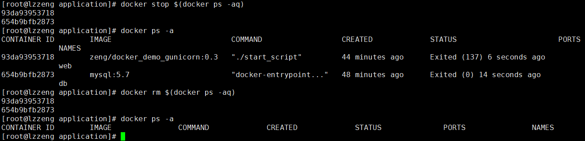

`docker-compose up`：

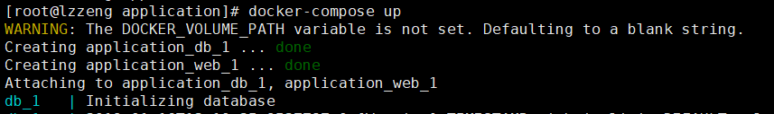

启动成功：

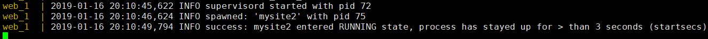

停止：`docker-compose stop`

---

### 参考文档

+ [Docker — 从入门到实践](https://yeasy.gitbooks.io/docker_practice/)

(End)
