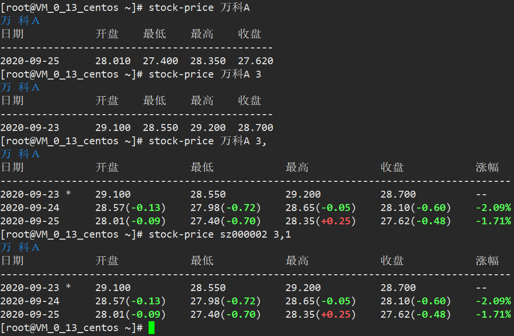

按股票名称查询最新股价、查询 第前3交易日、查询 前3个交易日，按股票代码查询 前3个交易日 效果如下：




<!-- more -->


>兼容python2和python3，只能查询A股，用到了3个新浪股票数据接口：
>
>http://money.finance.sina.com.cn/quotes_service/api/json_v2.php/CN_MarketData.getKLineData
>
>http://hq.sinajs.cn/?list=sz000002
>
>https://suggest3.sinajs.cn/suggest/key=万科A


```sh
# 使用：
[root@VM_0_13_centos ~]# cp stock-price.py /usr/local/bin/stock-price
[root@VM_0_13_centos ~]# chmod +x /usr/local/bin/stock-price
[root@VM_0_13_centos ~]# stock-price -h
```


[附件：stock-price.py](/assets/files/stock-price.py)

